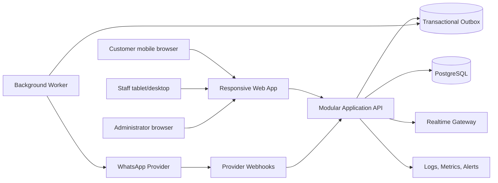

> **Product:** MesaFlow  
> **Architecture baseline:** MVP / Pilot Release  
> **Status:** Proposed architecture baseline  
> **Owner:** Software Architecture  
> **Date:** 2026-07-10  
> **Source baseline:** repository commit `583167147b626b370246dafc440eb961483bda63`

# MesaFlow — Architecture

## 1. Purpose

This document is the architecture entry point for the MesaFlow MVP. It translates the approved strategy, product specification and execution plan into an implementable technical structure without changing the product scope.

## 2. Architectural drivers

1. The product must replace a paper waiting list during a complete restaurant service.
2. Customer participation must require no application installation and no account.
3. Staff must be able to operate the same queue concurrently from tablet or desktop.
4. WhatsApp failure must be visible but must not make the queue unusable.
5. Every material action must remain attributable and auditable.
6. Data from one restaurant must never be visible to another.
7. The MVP must remain inexpensive and operationally simple.
8. Reservations, table inventory, predictive wait times, multiple simultaneous queues and native apps are outside the MVP.

## 3. Architecture summary

MesaFlow shall be implemented as a **responsive web application backed by a modular monolith** and a relational database.

- The browser application serves staff, administrator and public customer flows.
- The application backend exposes authenticated staff APIs and token-protected public APIs.
- PostgreSQL is the system of record.
- Tenant isolation is enforced in application authorization and database policies.
- Queue mutations use database transactions, state-transition validation and optimistic concurrency.
- Live updates use server-sent events or managed WebSocket infrastructure behind an application interface.
- WhatsApp delivery is asynchronous through an outbox and worker.
- External providers are isolated behind adapters.
- Audit records are append-only.
- The initial deployment uses managed infrastructure and one deployable application plus a background worker.

## 4. Container view

## 5. Quality attributes

| Attribute | MVP target |
|---|---|
| Tenant isolation | Mandatory; deny by default |
| Queue consistency | No lost updates; invalid transitions rejected |
| UI responsiveness | Main staff interactions perceived as immediate |
| Availability | Managed platform, health checks and recoverable deployment |
| Degraded operation | Queue usable when WhatsApp or realtime channel fails |
| Auditability | Material staff and system actions attributable |
| Privacy | Data minimisation, retention and deletion controls |
| Cost | One application, one database and one worker initially |
| Evolvability | Clear module boundaries and provider adapters |

## 6. Normative decisions

The decisions in `docs/adr/` are binding for implementation unless superseded by a later ADR. `TECHNOLOGY_STACK.md` distinguishes confirmed recommendations from hypotheses requiring a short technical spike.

## 7. Related documents

- `SYSTEM_CONTEXT.md`
- `ARCHITECTURE_OVERVIEW.md`
- `DOMAIN_MODEL.md`
- `DATA_ARCHITECTURE.md`
- `MULTI_TENANCY.md`
- `AUTHORIZATION_MODEL.md`
- `INTEGRATION_ARCHITECTURE.md`
- `REALTIME_AND_CONCURRENCY.md`
- `SECURITY_ARCHITECTURE.md`
- `TECHNOLOGY_STACK.md`
- `ARCHITECTURE_TRACEABILITY.md`
