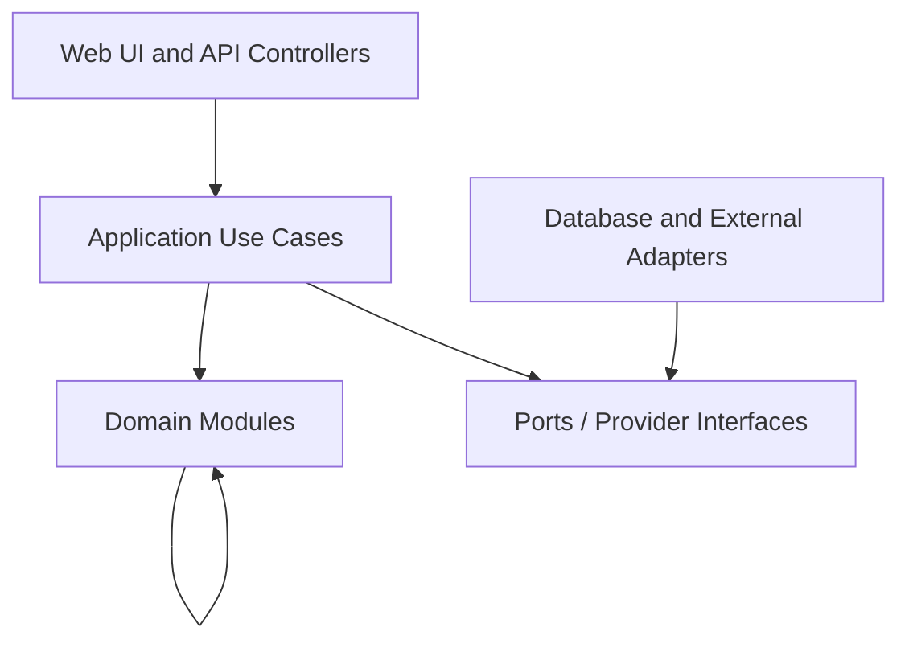

> **Product:** MesaFlow  
> **Architecture baseline:** MVP / Pilot Release  
> **Status:** Proposed architecture baseline  
> **Owner:** Software Architecture  
> **Date:** 2026-07-10  
> **Source baseline:** repository commit `583167147b626b370246dafc440eb961483bda63`

# Architecture Overview

## Chosen style

A **modular monolith** is recommended for the MVP.

It provides one coherent transaction boundary for queue state, capacity and audit records while preserving module ownership. It avoids the deployment, distributed consistency and observability burden of microservices.

## Deployable units

1. **Web/Application service** — page rendering, API, authorization, domain orchestration and realtime publication.
2. **Background worker** — outbox consumption, WhatsApp/email delivery, retries and scheduled timers.
3. **PostgreSQL** — transactional system of record.
4. **Optional managed realtime service** — used only behind `RealtimePublisher`.

The web service and worker may share one codebase and release.

## Layering

Rules:

- Controllers must not contain business rules.
- Domain modules must not import provider SDKs.
- Cross-module writes occur through application use cases.
- Database transactions are opened at application-use-case boundaries.
- External side effects are emitted through the transactional outbox.
- Read models may join modules for operational screens but must not bypass tenant filters.

## Module ownership

See `MODULE_BOUNDARIES.md`. The Queue/Service modules own the central consistency boundary. Messaging may fail independently without rolling back a valid queue transition.

## Review triggers

Reconsider the modular monolith only when independently deployable scaling, team ownership or reliability needs are demonstrated by production evidence.
