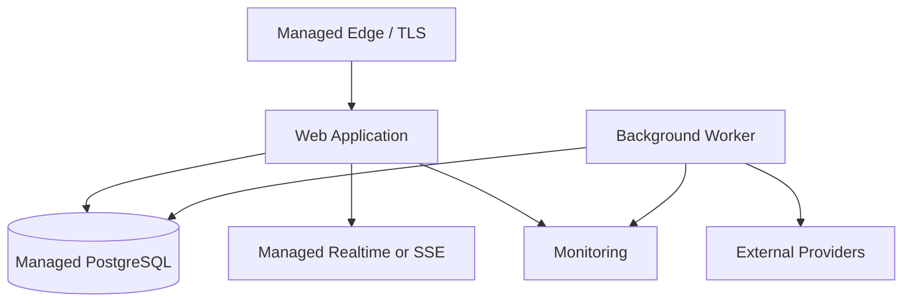

> **Product:** MesaFlow  
> **Architecture baseline:** MVP / Pilot Release  
> **Status:** Proposed architecture baseline  
> **Owner:** Software Architecture  
> **Date:** 2026-07-10  
> **Source baseline:** repository commit `583167147b626b370246dafc440eb961483bda63`

# Deployment Architecture

## Environments

- **Local** — containerised PostgreSQL, provider fakes and deterministic test data.
- **Test/CI** — ephemeral database and automated migrations.
- **Staging** — production-like managed services and provider sandbox.
- **Production** — isolated secrets, database, storage and telemetry.

Production customer data must never be copied into lower environments.

## Deployment model

## Delivery

- Build immutable artefacts in CI.
- Run linting, tests, dependency scanning and migration validation.
- Apply backward-compatible migrations before application rollout.
- Use health checks and rolling or blue/green deployment.
- Roll back application independently of irreversible migrations.
- Feature flags may protect risky integrations, not create hidden product scope.

## Configuration

Environment variables reference secret-manager values. Validate required configuration at startup. Provider credentials and signing secrets must not be present in the repository.

## Backups

Enable automated backups and point-in-time recovery. Define RPO/RTO before pilot; recommended starting objectives are RPO ≤ 15 minutes and RTO ≤ 4 hours, subject to cost approval.
