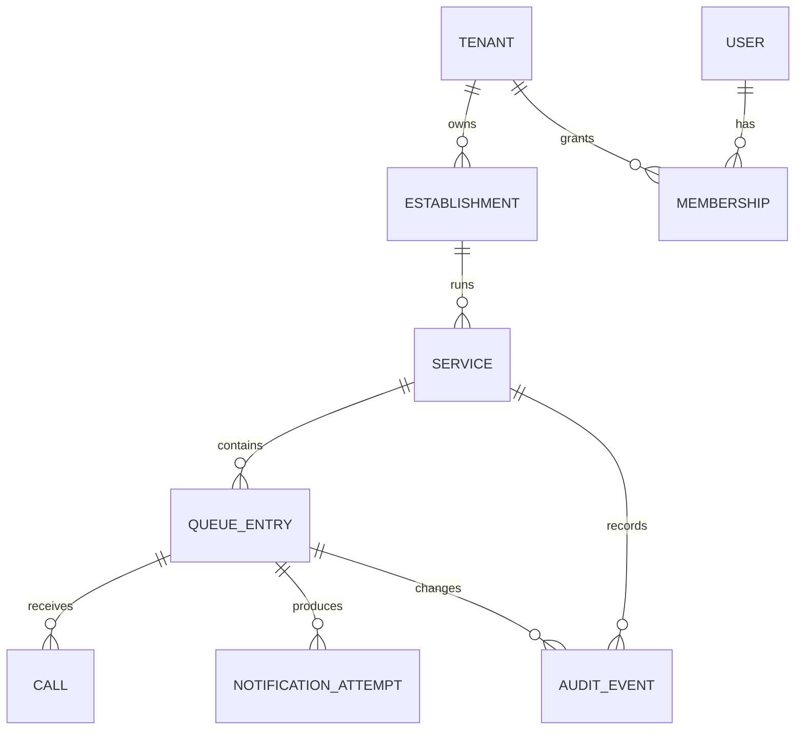

> **Product:** MesaFlow  
> **Architecture baseline:** MVP / Pilot Release  
> **Status:** Proposed architecture baseline  
> **Owner:** Software Architecture  
> **Date:** 2026-07-10  
> **Source baseline:** repository commit `583167147b626b370246dafc440eb961483bda63`

# Domain Model

## Core concepts

## Aggregates

### Tenant and Establishment

- `Tenant` is the security and billing boundary.
- One establishment appears in the MVP UI.
- The data model shall not assume that tenant and establishment are permanently identical.
- Establishment configuration owns call duration, warning threshold, QR limit, capacity and customer-report instruction.

### Service

A Service is a bounded operating session with one active queue. It owns opening, intake state, closure and historical immutability.

Invariants:

- At most one active service per establishment.
- A service cannot close with active entries.
- A closed service is read-only.
- Intake may close and reopen while the service remains active.

### Queue Entry

Primary states are exactly:

`Waiting`, `Called`, `Seated`, `Cancelled`, `NoShow`.

No additional primary state may be introduced without Product approval.

Key attributes include party size, slot weight, source, contact capability, chronological sequence, pass-over count, warning signals, call deadline, final-call flag and outcome metadata.

### Call

A Call records the operational call action, deadline and optional extra time. It is distinct from notification delivery because the queue transition remains valid when WhatsApp fails.

### Notification Attempt

Records channel, provider, template, status, provider reference, attempt number, error classification and timestamps.

### Audit Event

Append-only evidence of material actions with actor, tenant, establishment, service, entity, action, before/after summary, request correlation and timestamp.

## Domain events

- `ServiceOpened`
- `ServiceIntakeClosed`
- `ServiceIntakeReopened`
- `QueueEntryCreated`
- `QueueEntryCalled`
- `FinalCallDue`
- `CallGracePeriodApplied`
- `QueueEntrySeated`
- `QueueEntryCancelled`
- `QueueEntryMarkedNoShow`
- `QueueEntryReactivated`
- `PartySizeChangeRequested`
- `PartySizeChangeApproved`
- `NotificationRequested`
- `NotificationDeliveryUpdated`
- `ServiceClosed`

Events are internal application facts. They do not imply a distributed event platform.
