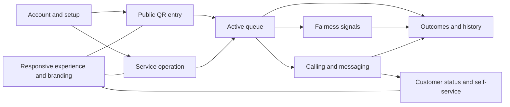

# MesaFlow — Feature Catalog

**Document ID:** PROD-FEAT-001  
**Product:** MesaFlow  
**Release:** MVP / Pilot Release  
**Status:** Approved detailed feature specification  
**Owner:** Product Management  
**Version:** 1.0  
**Last updated:** 2026-07-10

---

## 1. Purpose

This document is the detailed canonical catalogue for every MesaFlow MVP feature.

It answers, for each feature:

- which problem it solves;
- who uses or benefits from it;
- the minimum product outcome;
- required MVP behavior;
- dependencies;
- boundaries and explicit exclusions;
- evidence that the feature is serving its purpose.

The identifiers `FEAT-001` through `FEAT-059` are immutable for this release. Engineering tasks, user stories, acceptance criteria, test cases and product decisions must reference these identifiers rather than creating competing feature names.

This document specifies product behavior. It does not prescribe architecture, technologies, database structures or implementation frameworks.

---

## 2. Catalogue conventions

### 2.1 Priority

Every feature in this catalogue is **P0 for the approved MVP scope**. P0 means the feature belongs to the product contract for the pilot release. It does not mean every feature has equal implementation order or equal failure severity.

Release sequencing and controlled de-scope rules are defined in `FEATURE_PRIORITIES.md`.

### 2.2 Language

- **Must** indicates required MVP behavior.
- **May** indicates an allowed behavior or future-compatible option.
- **Must not** defines a product boundary.
- “Staff” means a user with the Staff role or an Administrator performing operational actions.
- “Active entry” means an entry in `Waiting` or `Called`.

### 2.3 Feature relationship model

---

## 3. Epic summary

| Epic | Name | Feature range | MVP outcome |
|---|---|---:|---|

| EPIC-A | Account, establishment and access | FEAT-001–FEAT-005 | A restaurant can activate the product, protect settings and attribute staff actions. |
| EPIC-B | QR and public entry | FEAT-006–FEAT-014 | Customers can understand queue availability and self-enter without staff help. |
| EPIC-C | Manual entry and queue capacity | FEAT-015–FEAT-019 | The queue includes assisted customers and respects the restaurant’s waiting capacity. |
| EPIC-D | Service operation | FEAT-020–FEAT-027 | A team can run one live service from multiple devices without losing state. |
| EPIC-E | Fairness and prioritization | FEAT-028–FEAT-032 | Long-wait and repeatedly passed groups are visible without blocking staff judgement. |
| EPIC-F | Calling and messaging | FEAT-033–FEAT-042 | A table-ready call reaches the customer or exposes failure clearly. |
| EPIC-G | Customer status and self-service | FEAT-043–FEAT-048 | Customers can monitor and update their entry without an app or account. |
| EPIC-H | Outcomes, correction and history | FEAT-049–FEAT-056 | Every entry is resolved, correctable during service and represented in trustworthy history. |
| EPIC-I | Brand and responsive experience | FEAT-057–FEAT-059 | The operational experience is usable on restaurant devices and customer phones. |

---

## EPIC-A — Account, establishment and access

**Epic outcome:** A restaurant can activate the product, protect settings and attribute staff actions.

### FEAT-001 — Administrator account creation

**Primary user or beneficiary:** Administrator  

**MVP priority:** P0  

**Problem:** The restaurant needs an accountable owner of setup and access.  

**Required product outcome:** A first internal user can create an account and becomes Administrator.  

**Approved boundary:** No custom role creation in MVP.  

#### Required MVP behavior

- The first valid internal account created for a new restaurant context is assigned the Administrator role.
- The user must be able to continue directly into establishment setup.
- Account creation must not expose role or permission complexity that does not exist in the MVP.

#### Dependencies

- No prior MesaFlow product feature; this is a root capability.

#### Explicitly not included

- Custom roles.
- Enterprise identity management.
- Multi-establishment administration.

#### Product evidence

- The feature contributes to this epic outcome: A restaurant can activate the product, protect settings and attribute staff actions.
- During pilot review, the team must be able to demonstrate the complete behavior described above for `FEAT-001` without relying on an undocumented manual workaround.

#### Downstream specification

- User stories and acceptance criteria must reference `FEAT-001`.
- Business-rule conflicts are resolved in favor of the approved CEO strategy, `PRODUCT_PHILOSOPHY.md`, `PRD.md` and the explicit product decision log, in that order.

### FEAT-002 — Establishment profile

**Primary user or beneficiary:** Administrator  

**MVP priority:** P0  

**Problem:** Public and operational experiences require a restaurant context.  

**Required product outcome:** Administrator stores required restaurant identity, contact, language and time-zone information.  

**Approved boundary:** One establishment in MVP UI.  

#### Required MVP behavior

- Required establishment data: restaurant name, address, phone, primary language and time zone.
- Optional identity fields may include logo, website, social links and short description.
- The profile supplies restaurant identity to public screens and approved message fields.

#### Dependencies

- `FEAT-001` — Administrator account creation

#### Explicitly not included

- Custom roles.
- Enterprise identity management.
- Multi-establishment administration.

#### Product evidence

- The feature contributes to this epic outcome: A restaurant can activate the product, protect settings and attribute staff actions.
- During pilot review, the team must be able to demonstrate the complete behavior described above for `FEAT-002` without relying on an undocumented manual workaround.

#### Downstream specification

- User stories and acceptance criteria must reference `FEAT-002`.
- Business-rule conflicts are resolved in favor of the approved CEO strategy, `PRODUCT_PHILOSOPHY.md`, `PRD.md` and the explicit product decision log, in that order.

### FEAT-003 — Guided operational setup

**Primary user or beneficiary:** Administrator  

**MVP priority:** P0  

**Problem:** A configuration-heavy setup would prevent activation.  

**Required product outcome:** The product provides recommended defaults and collects only approved queue settings.  

**Approved success:** Administrator can reach an openable queue without product training.  

#### Required MVP behavior

- The setup covers only queue rules approved for the MVP.
- Recommended values are prefilled and may be accepted without modification.
- The setup includes maximum slots, call duration, long-wait threshold, QR party-size maximum, weighted-capacity cutoff, party-size approval threshold, reporting instruction and displayed restaurant name.
- Completion results in a queue that is ready to open.

#### Dependencies

- `FEAT-002` — Establishment profile

#### Explicitly not included

- Custom roles.
- Enterprise identity management.
- Multi-establishment administration.

#### Product evidence

- The feature contributes to this epic outcome: A restaurant can activate the product, protect settings and attribute staff actions.
- During pilot review, the team must be able to demonstrate the complete behavior described above for `FEAT-003` without relying on an undocumented manual workaround.

#### Downstream specification

- User stories and acceptance criteria must reference `FEAT-003`.
- Business-rule conflicts are resolved in favor of the approved CEO strategy, `PRODUCT_PHILOSOPHY.md`, `PRD.md` and the explicit product decision log, in that order.

### FEAT-004 — Individual staff invitation and access

**Primary user or beneficiary:** Administrator  

**MVP priority:** P0  

**Problem:** Shared access removes accountability.  

**Required product outcome:** Administrator invites individual Staff users.  

**Approved boundary:** No shared PIN workflow.  

#### Required MVP behavior

- The Administrator invites each staff member to an individual account.
- Invited staff receive the Staff role for the establishment.
- Shared credentials and a shared operational PIN are not part of the MVP.
- Removing access must not erase historical attribution.

#### Dependencies

- `FEAT-001` — Administrator account creation
- `FEAT-002` — Establishment profile

#### Explicitly not included

- Custom roles.
- Enterprise identity management.
- Multi-establishment administration.

#### Product evidence

- The feature contributes to this epic outcome: A restaurant can activate the product, protect settings and attribute staff actions.
- During pilot review, the team must be able to demonstrate the complete behavior described above for `FEAT-004` without relying on an undocumented manual workaround.

#### Downstream specification

- User stories and acceptance criteria must reference `FEAT-004`.
- Business-rule conflicts are resolved in favor of the approved CEO strategy, `PRODUCT_PHILOSOPHY.md`, `PRD.md` and the explicit product decision log, in that order.

### FEAT-005 — Permissions

**Primary user or beneficiary:** Administrator and Staff  

**MVP priority:** P0  

**Problem:** Structural settings should not be changed accidentally during service.  

**Required product outcome:** Administrator and Staff permissions follow Section 11.  

#### Required MVP behavior

- Administrator can configure structural rules and perform all operational actions.
- Staff can operate services and entries but cannot alter structural settings.
- Permission differences must be reflected in both available actions and enforcement.
- The MVP has no custom roles or permission builder.

#### Dependencies

- `FEAT-001` — Administrator account creation
- `FEAT-004` — Individual staff invitation and access

#### Explicitly not included

- Custom roles.
- Enterprise identity management.
- Multi-establishment administration.

#### Product evidence

- The feature contributes to this epic outcome: A restaurant can activate the product, protect settings and attribute staff actions.
- During pilot review, the team must be able to demonstrate the complete behavior described above for `FEAT-005` without relying on an undocumented manual workaround.

#### Downstream specification

- User stories and acceptance criteria must reference `FEAT-005`.
- Business-rule conflicts are resolved in favor of the approved CEO strategy, `PRODUCT_PHILOSOPHY.md`, `PRD.md` and the explicit product decision log, in that order.

---

## EPIC-B — QR and public entry

**Epic outcome:** Customers can understand queue availability and self-enter without staff help.

### FEAT-006 — Permanent establishment QR

**Primary user or beneficiary:** Administrator  

**MVP priority:** P0  

**Problem:** Restaurant needs a reusable entry point.  

**Required product outcome:** One permanent public QR points to the current establishment queue state.  

#### Required MVP behavior

- One public QR entry point is associated with the establishment.
- The QR remains valid across service openings and closures until explicitly regenerated.
- Scanning always resolves to the current public queue state rather than to a stale service-specific page.

#### Dependencies

- `FEAT-002` — Establishment profile

#### Explicitly not included

- Remote marketplace discovery.
- Customer account creation.
- Predicted waiting time.

#### Product evidence

- The feature contributes to this epic outcome: Customers can understand queue availability and self-enter without staff help.
- During pilot review, the team must be able to demonstrate the complete behavior described above for `FEAT-006` without relying on an undocumented manual workaround.

#### Downstream specification

- User stories and acceptance criteria must reference `FEAT-006`.
- Business-rule conflicts are resolved in favor of the approved CEO strategy, `PRODUCT_PHILOSOPHY.md`, `PRD.md` and the explicit product decision log, in that order.

### FEAT-007 — QR download

**Primary user or beneficiary:** Administrator  

**MVP priority:** P0  

**Problem:** Restaurant must deploy the QR physically.  

**Required product outcome:** Administrator can obtain a printable asset.  

#### Required MVP behavior

- Administrator can obtain the current QR in a form suitable for printing.
- The output must preserve scan reliability at normal restaurant display sizes.
- Downloading the QR does not open or close a service.

#### Dependencies

- `FEAT-006` — Permanent establishment QR

#### Explicitly not included

- Remote marketplace discovery.
- Customer account creation.
- Predicted waiting time.

#### Product evidence

- The feature contributes to this epic outcome: Customers can understand queue availability and self-enter without staff help.
- During pilot review, the team must be able to demonstrate the complete behavior described above for `FEAT-007` without relying on an undocumented manual workaround.

#### Downstream specification

- User stories and acceptance criteria must reference `FEAT-007`.
- Business-rule conflicts are resolved in favor of the approved CEO strategy, `PRODUCT_PHILOSOPHY.md`, `PRD.md` and the explicit product decision log, in that order.

### FEAT-008 — QR regeneration

**Primary user or beneficiary:** Administrator  

**MVP priority:** P0  

**Problem:** Public access may be misused or exposed.  

**Required product outcome:** Administrator can invalidate the old entry link and issue a new QR after warning and confirmation.  

#### Required MVP behavior

- Only an Administrator can regenerate the QR.
- The product warns that previously printed QRs will stop accepting new entries.
- Existing accepted queue entries and their private status links remain valid.
- Regeneration is recorded as a material action.

#### Dependencies

- `FEAT-006` — Permanent establishment QR
- `FEAT-005` — Permissions

#### Explicitly not included

- Remote marketplace discovery.
- Customer account creation.
- Predicted waiting time.

#### Product evidence

- The feature contributes to this epic outcome: Customers can understand queue availability and self-enter without staff help.
- During pilot review, the team must be able to demonstrate the complete behavior described above for `FEAT-008` without relying on an undocumented manual workaround.

#### Downstream specification

- User stories and acceptance criteria must reference `FEAT-008`.
- Business-rule conflicts are resolved in favor of the approved CEO strategy, `PRODUCT_PHILOSOPHY.md`, `PRD.md` and the explicit product decision log, in that order.

### FEAT-009 — Public welcome and state screen

**Primary user or beneficiary:** Customer and restaurant team  

**MVP priority:** P0  

**Problem:** Customers need trust and context before entering data.  

**Required product outcome:** Show restaurant identity, current queue state and appropriate next action.  

#### Required MVP behavior

- The first public screen identifies the restaurant and explains the current queue state.
- When intake is available, the primary action is to join the queue.
- When unavailable, the screen distinguishes no active service, intake closed and queue full.
- The screen does not promise a waiting-time estimate in the MVP.

#### Dependencies

- `FEAT-002` — Establishment profile
- `FEAT-006` — Permanent establishment QR
- `FEAT-020` — Open service
- `FEAT-021` — Close/reopen entries

#### Explicitly not included

- Remote marketplace discovery.
- Customer account creation.
- Predicted waiting time.

#### Product evidence

- The feature contributes to this epic outcome: Customers can understand queue availability and self-enter without staff help.
- During pilot review, the team must be able to demonstrate the complete behavior described above for `FEAT-009` without relying on an undocumented manual workaround.

#### Downstream specification

- User stories and acceptance criteria must reference `FEAT-009`.
- Business-rule conflicts are resolved in favor of the approved CEO strategy, `PRODUCT_PHILOSOPHY.md`, `PRD.md` and the explicit product decision log, in that order.

### FEAT-010 — Customer queue-entry form

**Primary user or beneficiary:** Customer  

**MVP priority:** P0  

**Problem:** Customer self-entry must remove staff work.  

**Required product outcome:** Collect name, phone and party size with mobile-friendly validation.  

#### Required MVP behavior

- Required fields are name, phone number and party size.
- The form is short, mobile-first and uses clear field-level validation.
- Submission revalidates service and capacity state at the moment of acceptance.
- A successful submission immediately creates one active entry and shows confirmation.

#### Dependencies

- `FEAT-009` — Public welcome and state screen
- `FEAT-020` — Open service

#### Explicitly not included

- Remote marketplace discovery.
- Customer account creation.
- Predicted waiting time.

#### Product evidence

- The feature contributes to this epic outcome: Customers can understand queue availability and self-enter without staff help.
- During pilot review, the team must be able to demonstrate the complete behavior described above for `FEAT-010` without relying on an undocumented manual workaround.

#### Downstream specification

- User stories and acceptance criteria must reference `FEAT-010`.
- Business-rule conflicts are resolved in favor of the approved CEO strategy, `PRODUCT_PHILOSOPHY.md`, `PRD.md` and the explicit product decision log, in that order.

### FEAT-011 — Optional seating needs

**Primary user or beneficiary:** Customer  

**MVP priority:** P0  

**Problem:** Some groups have relevant constraints.  

**Required product outcome:** Capture approved optional preferences without making them mandatory.  

#### Required MVP behavior

- Optional fields are interior/terrace preference, baby chair, accessibility requirement and customer note.
- Optional needs must never block submission merely because they are absent.
- Preferences are advisory to staff and do not guarantee accommodation.
- Sensitive or irrelevant profile collection is excluded.

#### Dependencies

- `FEAT-010` — Customer queue-entry form

#### Explicitly not included

- Remote marketplace discovery.
- Customer account creation.
- Predicted waiting time.

#### Product evidence

- The feature contributes to this epic outcome: Customers can understand queue availability and self-enter without staff help.
- During pilot review, the team must be able to demonstrate the complete behavior described above for `FEAT-011` without relying on an undocumented manual workaround.

#### Downstream specification

- User stories and acceptance criteria must reference `FEAT-011`.
- Business-rule conflicts are resolved in favor of the approved CEO strategy, `PRODUCT_PHILOSOPHY.md`, `PRD.md` and the explicit product decision log, in that order.

### FEAT-012 — Duplicate prevention

**Primary user or beneficiary:** Customer  

**MVP priority:** P0  

**Problem:** Accidental duplicate entries distort capacity and fairness.  

**Required product outcome:** Block a second active entry for the same phone in the same queue.  

#### Required MVP behavior

- A phone number cannot have two active entries in the same establishment queue.
- The duplicate check applies to Waiting and Called entries.
- Terminal historical entries do not permanently block later participation.
- The product must not silently create a duplicate when simultaneous submissions occur.

#### Dependencies

- `FEAT-010` — Customer queue-entry form

#### Explicitly not included

- Remote marketplace discovery.
- Customer account creation.
- Predicted waiting time.

#### Product evidence

- The feature contributes to this epic outcome: Customers can understand queue availability and self-enter without staff help.
- During pilot review, the team must be able to demonstrate the complete behavior described above for `FEAT-012` without relying on an undocumented manual workaround.

#### Downstream specification

- User stories and acceptance criteria must reference `FEAT-012`.
- Business-rule conflicts are resolved in favor of the approved CEO strategy, `PRODUCT_PHILOSOPHY.md`, `PRD.md` and the explicit product decision log, in that order.

### FEAT-013 — Maximum QR party size

**Primary user or beneficiary:** Customer  

**MVP priority:** P0  

**Problem:** Oversized groups need direct staff assessment.  

**Required product outcome:** Block self-entry above the configured size and direct the customer to staff.  

#### Required MVP behavior

- Administrator configures the largest party size accepted through self-entry.
- A party above that size is directed to speak with staff.
- Staff may still create or retain the group manually after operational assessment.
- The rule controls QR self-entry, not an absolute restaurant ban.

#### Dependencies

- `FEAT-003` — Guided operational setup
- `FEAT-010` — Customer queue-entry form

#### Explicitly not included

- Remote marketplace discovery.
- Customer account creation.
- Predicted waiting time.

#### Product evidence

- The feature contributes to this epic outcome: Customers can understand queue availability and self-enter without staff help.
- During pilot review, the team must be able to demonstrate the complete behavior described above for `FEAT-013` without relying on an undocumented manual workaround.

#### Downstream specification

- User stories and acceptance criteria must reference `FEAT-013`.
- Business-rule conflicts are resolved in favor of the approved CEO strategy, `PRODUCT_PHILOSOPHY.md`, `PRD.md` and the explicit product decision log, in that order.

### FEAT-014 — Full and closed states

**Primary user or beneficiary:** Customer and restaurant team  

**MVP priority:** P0  

**Problem:** Customers need a clear explanation when they cannot join.  

**Required product outcome:** Show distinct no-service, intake-closed and queue-full states.  

#### Required MVP behavior

- Queue full is based on weighted active capacity, not merely visible group count.
- Intake closed means the restaurant deliberately stopped new entries while serving the existing queue.
- No active service means the restaurant has not opened a current operational session.
- Opening a form does not reserve capacity; final submission determines acceptance.

#### Dependencies

- `FEAT-009` — Public welcome and state screen
- `FEAT-018` — Maximum slots
- `FEAT-019` — Capacity recalculation
- `FEAT-021` — Close/reopen entries

#### Explicitly not included

- Remote marketplace discovery.
- Customer account creation.
- Predicted waiting time.

#### Product evidence

- The feature contributes to this epic outcome: Customers can understand queue availability and self-enter without staff help.
- During pilot review, the team must be able to demonstrate the complete behavior described above for `FEAT-014` without relying on an undocumented manual workaround.

#### Downstream specification

- User stories and acceptance criteria must reference `FEAT-014`.
- Business-rule conflicts are resolved in favor of the approved CEO strategy, `PRODUCT_PHILOSOPHY.md`, `PRD.md` and the explicit product decision log, in that order.

---

## EPIC-C — Manual entry and queue capacity

**Epic outcome:** The queue includes assisted customers and respects the restaurant’s waiting capacity.

### FEAT-015 — Manual entry

**Primary user or beneficiary:** Staff  

**MVP priority:** P0  

**Problem:** QR cannot be mandatory.  

**Required product outcome:** Staff can add a group with name and party size; phone is optional.  

#### Required MVP behavior

- Staff can create an entry using name and party size as the minimum.
- Phone and customer preferences are optional.
- Manual entries enter the same chronological queue and follow the same fairness model.
- The interface must support rapid entry during a busy service.

#### Dependencies

- `FEAT-020` — Open service
- `FEAT-023` — Waiting section

#### Explicitly not included

- Automatic table assignment.
- Unlimited weighting tiers.
- Mandatory phone for assisted entry.

#### Product evidence

- The feature contributes to this epic outcome: The queue includes assisted customers and respects the restaurant’s waiting capacity.
- During pilot review, the team must be able to demonstrate the complete behavior described above for `FEAT-015` without relying on an undocumented manual workaround.

#### Downstream specification

- User stories and acceptance criteria must reference `FEAT-015`.
- Business-rule conflicts are resolved in favor of the approved CEO strategy, `PRODUCT_PHILOSOPHY.md`, `PRD.md` and the explicit product decision log, in that order.

### FEAT-016 — No-contact handling

**Primary user or beneficiary:** Staff  

**MVP priority:** P0  

**Problem:** Staff must not assume a manual group received a message.  

**Required product outcome:** Clearly label no-contact entries and suppress automated attempts.  

#### Required MVP behavior

- An entry without a phone number is clearly marked as No contact.
- No WhatsApp attempt is made for a no-contact entry.
- The entry remains fully operable and must be called in person.
- Adding a valid phone later enables subsequent operational messaging.

#### Dependencies

- `FEAT-015` — Manual entry
- `FEAT-038` — WhatsApp messages

#### Explicitly not included

- Automatic table assignment.
- Unlimited weighting tiers.
- Mandatory phone for assisted entry.

#### Product evidence

- The feature contributes to this epic outcome: The queue includes assisted customers and respects the restaurant’s waiting capacity.
- During pilot review, the team must be able to demonstrate the complete behavior described above for `FEAT-016` without relying on an undocumented manual workaround.

#### Downstream specification

- User stories and acceptance criteria must reference `FEAT-016`.
- Business-rule conflicts are resolved in favor of the approved CEO strategy, `PRODUCT_PHILOSOPHY.md`, `PRD.md` and the explicit product decision log, in that order.

### FEAT-017 — Weighted capacity

**Primary user or beneficiary:** Administrator  

**MVP priority:** P0  

**Problem:** Large groups create more queue load.  

**Required product outcome:** Use one- or two-slot weighting with a configurable cutoff.  

#### Required MVP behavior

- Capacity uses one-slot and two-slot group weights.
- Default: parties up to 6 use one slot; parties of 7 or more use two.
- Administrator can configure the cutoff to match the restaurant.
- Weighting affects intake capacity but does not automatically determine seating order.

#### Dependencies

- `FEAT-003` — Guided operational setup

#### Explicitly not included

- Automatic table assignment.
- Unlimited weighting tiers.
- Mandatory phone for assisted entry.

#### Product evidence

- The feature contributes to this epic outcome: The queue includes assisted customers and respects the restaurant’s waiting capacity.
- During pilot review, the team must be able to demonstrate the complete behavior described above for `FEAT-017` without relying on an undocumented manual workaround.

#### Downstream specification

- User stories and acceptance criteria must reference `FEAT-017`.
- Business-rule conflicts are resolved in favor of the approved CEO strategy, `PRODUCT_PHILOSOPHY.md`, `PRD.md` and the explicit product decision log, in that order.

### FEAT-018 — Maximum slots

**Primary user or beneficiary:** Administrator  

**MVP priority:** P0  

**Problem:** Restaurant needs to cap waiting-list load.  

**Required product outcome:** Administrator sets maximum active slots.  

#### Required MVP behavior

- Administrator configures the maximum number of active weighted slots.
- Waiting and Called entries consume slots.
- Seated, Cancelled and No-show entries do not consume slots.
- Existing entries are not removed if the configured limit is reduced below current usage.

#### Dependencies

- `FEAT-003` — Guided operational setup
- `FEAT-017` — Weighted capacity

#### Explicitly not included

- Automatic table assignment.
- Unlimited weighting tiers.
- Mandatory phone for assisted entry.

#### Product evidence

- The feature contributes to this epic outcome: The queue includes assisted customers and respects the restaurant’s waiting capacity.
- During pilot review, the team must be able to demonstrate the complete behavior described above for `FEAT-018` without relying on an undocumented manual workaround.

#### Downstream specification

- User stories and acceptance criteria must reference `FEAT-018`.
- Business-rule conflicts are resolved in favor of the approved CEO strategy, `PRODUCT_PHILOSOPHY.md`, `PRD.md` and the explicit product decision log, in that order.

### FEAT-019 — Capacity recalculation

**Primary user or beneficiary:** Administrator and Staff  

**MVP priority:** P0  

**Problem:** State and party-size changes alter availability.  

**Required product outcome:** Recalculate consistently and update public intake state.  

#### Required MVP behavior

- Capacity recalculates after accepted entry, approved party-size change, seating, cancellation, no-show and reactivation.
- The current public full/available state updates from the recalculated value.
- Capacity must use approved current party size, not an unapproved requested size.
- The same rules apply across all staff devices and public submission checks.

#### Dependencies

- `FEAT-017` — Weighted capacity
- `FEAT-018` — Maximum slots
- `FEAT-049` — Mark Seated
- `FEAT-050` — Cancel with actor/reason
- `FEAT-051` — Mark No-show

#### Explicitly not included

- Automatic table assignment.
- Unlimited weighting tiers.
- Mandatory phone for assisted entry.

#### Product evidence

- The feature contributes to this epic outcome: The queue includes assisted customers and respects the restaurant’s waiting capacity.
- During pilot review, the team must be able to demonstrate the complete behavior described above for `FEAT-019` without relying on an undocumented manual workaround.

#### Downstream specification

- User stories and acceptance criteria must reference `FEAT-019`.
- Business-rule conflicts are resolved in favor of the approved CEO strategy, `PRODUCT_PHILOSOPHY.md`, `PRD.md` and the explicit product decision log, in that order.

---

## EPIC-D — Service operation

**Epic outcome:** A team can run one live service from multiple devices without losing state.

### FEAT-020 — Open service

**Primary user or beneficiary:** Staff  

**MVP priority:** P0  

**Problem:** Queue activity needs a bounded operational session.  

**Required product outcome:** Authorized staff opens a new service.  

#### Required MVP behavior

- Authorized staff explicitly opens a new service.
- A service is a bounded operational session such as lunch or dinner.
- Only one active service exists for the establishment in the MVP.
- Opening enables queue intake unless staff immediately closes new entries.

#### Dependencies

- `FEAT-002` — Establishment profile
- `FEAT-003` — Guided operational setup

#### Explicitly not included

- Multiple simultaneous queues.
- Table-map management.
- Staff scheduling.

#### Product evidence

- The feature contributes to this epic outcome: A team can run one live service from multiple devices without losing state.
- During pilot review, the team must be able to demonstrate the complete behavior described above for `FEAT-020` without relying on an undocumented manual workaround.

#### Downstream specification

- User stories and acceptance criteria must reference `FEAT-020`.
- Business-rule conflicts are resolved in favor of the approved CEO strategy, `PRODUCT_PHILOSOPHY.md`, `PRD.md` and the explicit product decision log, in that order.

### FEAT-021 — Close/reopen entries

**Primary user or beneficiary:** Staff  

**MVP priority:** P0  

**Problem:** Restaurant may stop intake while serving current groups.  

**Required product outcome:** Toggle customer self-entry without resolving existing groups.  

#### Required MVP behavior

- Staff can close new entries without affecting Waiting or Called groups.
- Staff can reopen intake during the same active service.
- The public state updates immediately to explain whether joining is allowed.
- This control is distinct from ending the service.

#### Dependencies

- `FEAT-020` — Open service

#### Explicitly not included

- Multiple simultaneous queues.
- Table-map management.
- Staff scheduling.

#### Product evidence

- The feature contributes to this epic outcome: A team can run one live service from multiple devices without losing state.
- During pilot review, the team must be able to demonstrate the complete behavior described above for `FEAT-021` without relying on an undocumented manual workaround.

#### Downstream specification

- User stories and acceptance criteria must reference `FEAT-021`.
- Business-rule conflicts are resolved in favor of the approved CEO strategy, `PRODUCT_PHILOSOPHY.md`, `PRD.md` and the explicit product decision log, in that order.

### FEAT-022 — Safe service closure

**Primary user or beneficiary:** Staff  

**MVP priority:** P0  

**Problem:** Ending with active groups would orphan customers.  

**Required product outcome:** Block closure until no Waiting or Called entries remain.  

#### Required MVP behavior

- End service is blocked while Waiting or Called entries remain.
- Staff must resolve active entries before closure.
- Closure freezes service records and generates the approved history summary.
- Ending a service does not invalidate customers’ ability to see their final outcome.

#### Dependencies

- `FEAT-020` — Open service
- `FEAT-049` — Mark Seated
- `FEAT-050` — Cancel with actor/reason
- `FEAT-051` — Mark No-show

#### Explicitly not included

- Multiple simultaneous queues.
- Table-map management.
- Staff scheduling.

#### Product evidence

- The feature contributes to this epic outcome: A team can run one live service from multiple devices without losing state.
- During pilot review, the team must be able to demonstrate the complete behavior described above for `FEAT-022` without relying on an undocumented manual workaround.

#### Downstream specification

- User stories and acceptance criteria must reference `FEAT-022`.
- Business-rule conflicts are resolved in favor of the approved CEO strategy, `PRODUCT_PHILOSOPHY.md`, `PRD.md` and the explicit product decision log, in that order.

### FEAT-023 — Waiting section

**Primary user or beneficiary:** Staff  

**MVP priority:** P0  

**Problem:** Staff needs a trusted view of active waiting groups.  

**Required product outcome:** Show chronological list and approved operational indicators.  

#### Required MVP behavior

- Waiting entries are shown in chronological arrival order by default.
- Each row exposes name, party size, entry time, elapsed wait, contact status, relevant preferences, large-group status, pass-over count and warning state.
- Operational filters do not rewrite canonical order.
- The section must support direct approved actions without opening unnecessary layers.

#### Dependencies

- `FEAT-020` — Open service
- `FEAT-027` — Multi-device synchronization

#### Explicitly not included

- Multiple simultaneous queues.
- Table-map management.
- Staff scheduling.

#### Product evidence

- The feature contributes to this epic outcome: A team can run one live service from multiple devices without losing state.
- During pilot review, the team must be able to demonstrate the complete behavior described above for `FEAT-023` without relying on an undocumented manual workaround.

#### Downstream specification

- User stories and acceptance criteria must reference `FEAT-023`.
- Business-rule conflicts are resolved in favor of the approved CEO strategy, `PRODUCT_PHILOSOPHY.md`, `PRD.md` and the explicit product decision log, in that order.

### FEAT-024 — Called section

**Primary user or beneficiary:** Staff  

**MVP priority:** P0  

**Problem:** Active calls require focused timing and delivery visibility.  

**Required product outcome:** Show independent timers and call actions.  

#### Required MVP behavior

- Called entries are separated from Waiting.
- Each entry shows remaining time, message state, acknowledgement state and available resolution actions.
- Multiple entries may be Called concurrently.
- Expiry does not automatically invent a terminal outcome; staff resolves the entry.

#### Dependencies

- `FEAT-033` — Call group
- `FEAT-034` — Individual countdown
- `FEAT-027` — Multi-device synchronization

#### Explicitly not included

- Multiple simultaneous queues.
- Table-map management.
- Staff scheduling.

#### Product evidence

- The feature contributes to this epic outcome: A team can run one live service from multiple devices without losing state.
- During pilot review, the team must be able to demonstrate the complete behavior described above for `FEAT-024` without relying on an undocumented manual workaround.

#### Downstream specification

- User stories and acceptance criteria must reference `FEAT-024`.
- Business-rule conflicts are resolved in favor of the approved CEO strategy, `PRODUCT_PHILOSOPHY.md`, `PRD.md` and the explicit product decision log, in that order.

### FEAT-025 — Recently completed

**Primary user or beneficiary:** Staff  

**MVP priority:** P0  

**Problem:** Staff needs short-term awareness and error correction.  

**Required product outcome:** Show current-service terminal entries without dominating active work.  

#### Required MVP behavior

- Current-service Seated, Cancelled and No-show entries remain accessible for recent context.
- The section does not dominate active queue work.
- Eligible outcome correction is available according to role and service state.
- Historical services are accessed through history, not an endlessly growing live list.

#### Dependencies

- `FEAT-049` — Mark Seated
- `FEAT-050` — Cancel with actor/reason
- `FEAT-051` — Mark No-show

#### Explicitly not included

- Multiple simultaneous queues.
- Table-map management.
- Staff scheduling.

#### Product evidence

- The feature contributes to this epic outcome: A team can run one live service from multiple devices without losing state.
- During pilot review, the team must be able to demonstrate the complete behavior described above for `FEAT-025` without relying on an undocumented manual workaround.

#### Downstream specification

- User stories and acceptance criteria must reference `FEAT-025`.
- Business-rule conflicts are resolved in favor of the approved CEO strategy, `PRODUCT_PHILOSOPHY.md`, `PRD.md` and the explicit product decision log, in that order.

### FEAT-026 — Party-size filtering

**Primary user or beneficiary:** Staff  

**MVP priority:** P0  

**Problem:** Staff needs to find groups compatible with an available table.  

**Required product outcome:** Filter without changing canonical order.  

#### Required MVP behavior

- Staff can narrow the Waiting view by party size or useful size range.
- Filtering does not change queue position or customer-facing groups-ahead calculation.
- Removing the filter returns the canonical chronological view.
- The feature supports table compatibility without pretending to manage tables.

#### Dependencies

- `FEAT-023` — Waiting section

#### Explicitly not included

- Multiple simultaneous queues.
- Table-map management.
- Staff scheduling.

#### Product evidence

- The feature contributes to this epic outcome: A team can run one live service from multiple devices without losing state.
- During pilot review, the team must be able to demonstrate the complete behavior described above for `FEAT-026` without relying on an undocumented manual workaround.

#### Downstream specification

- User stories and acceptance criteria must reference `FEAT-026`.
- Business-rule conflicts are resolved in favor of the approved CEO strategy, `PRODUCT_PHILOSOPHY.md`, `PRD.md` and the explicit product decision log, in that order.

### FEAT-027 — Multi-device synchronization

**Primary user or beneficiary:** Administrator and Staff  

**MVP priority:** P0  

**Problem:** Multiple employees must not act on stale queue data.  

**Required product outcome:** Propagate queue changes rapidly and prevent conflicting valid transitions.  

#### Required MVP behavior

- Accepted changes propagate across simultaneously open staff devices without manual refresh.
- Conflicting actions cannot both become valid final transitions.
- A device returning from temporary disconnection reconciles with current state.
- Users receive a clear indication when an attempted action is no longer valid.

#### Dependencies

- `FEAT-023` — Waiting section
- `FEAT-024` — Called section
- `FEAT-025` — Recently completed

#### Explicitly not included

- Multiple simultaneous queues.
- Table-map management.
- Staff scheduling.

#### Product evidence

- The feature contributes to this epic outcome: A team can run one live service from multiple devices without losing state.
- During pilot review, the team must be able to demonstrate the complete behavior described above for `FEAT-027` without relying on an undocumented manual workaround.

#### Downstream specification

- User stories and acceptance criteria must reference `FEAT-027`.
- Business-rule conflicts are resolved in favor of the approved CEO strategy, `PRODUCT_PHILOSOPHY.md`, `PRD.md` and the explicit product decision log, in that order.

---

## EPIC-E — Fairness and prioritization

**Epic outcome:** Long-wait and repeatedly passed groups are visible without blocking staff judgement.

### FEAT-028 — Elapsed wait

**Primary user or beneficiary:** Staff  

**MVP priority:** P0  

**Problem:** Arrival time alone is hard to interpret under pressure.  

**Required product outcome:** Show continuously understandable elapsed wait.  

#### Required MVP behavior

- Every active entry displays understandable elapsed waiting time.
- Elapsed wait derives from accepted entry time and continues while Waiting.
- Staff can still see original entry time for context.
- The display remains readable during long services and across midnight.

#### Dependencies

- `FEAT-023` — Waiting section

#### Explicitly not included

- Algorithmic seating enforcement.
- Automatic prioritization.
- Guaranteed strict FIFO.

#### Product evidence

- The feature contributes to this epic outcome: Long-wait and repeatedly passed groups are visible without blocking staff judgement.
- During pilot review, the team must be able to demonstrate the complete behavior described above for `FEAT-028` without relying on an undocumented manual workaround.

#### Downstream specification

- User stories and acceptance criteria must reference `FEAT-028`.
- Business-rule conflicts are resolved in favor of the approved CEO strategy, `PRODUCT_PHILOSOPHY.md`, `PRD.md` and the explicit product decision log, in that order.

### FEAT-029 — Large-group label

**Primary user or beneficiary:** Staff  

**MVP priority:** P0  

**Problem:** Operationally difficult groups need visibility.  

**Required product outcome:** Apply label according to configured weighting cutoff or approved large-group rule.  

#### Required MVP behavior

- A visible label identifies groups at or above the configured large-group/weighting cutoff.
- The label does not automatically move the group or force priority.
- Party-size changes update the label after approval.
- The visual treatment must not rely only on color.

#### Dependencies

- `FEAT-017` — Weighted capacity
- `FEAT-023` — Waiting section

#### Explicitly not included

- Algorithmic seating enforcement.
- Automatic prioritization.
- Guaranteed strict FIFO.

#### Product evidence

- The feature contributes to this epic outcome: Long-wait and repeatedly passed groups are visible without blocking staff judgement.
- During pilot review, the team must be able to demonstrate the complete behavior described above for `FEAT-029` without relying on an undocumented manual workaround.

#### Downstream specification

- User stories and acceptance criteria must reference `FEAT-029`.
- Business-rule conflicts are resolved in favor of the approved CEO strategy, `PRODUCT_PHILOSOPHY.md`, `PRD.md` and the explicit product decision log, in that order.

### FEAT-030 — Pass-over count

**Primary user or beneficiary:** Staff  

**MVP priority:** P0  

**Problem:** Later seating can silently disadvantage earlier groups.  

**Required product outcome:** Count qualifying later-seated groups.  

#### Required MVP behavior

- A pass-over is counted when a later-arriving group reaches Seated while the earlier group remains active.
- Later cancellation or no-show does not count as a pass-over.
- The counter is visible to staff and retained in service records.
- Corrections must recalculate the counter when the qualifying seating outcome changes.

#### Dependencies

- `FEAT-023` — Waiting section
- `FEAT-049` — Mark Seated

#### Explicitly not included

- Algorithmic seating enforcement.
- Automatic prioritization.
- Guaranteed strict FIFO.

#### Product evidence

- The feature contributes to this epic outcome: Long-wait and repeatedly passed groups are visible without blocking staff judgement.
- During pilot review, the team must be able to demonstrate the complete behavior described above for `FEAT-030` without relying on an undocumented manual workaround.

#### Downstream specification

- User stories and acceptance criteria must reference `FEAT-030`.
- Business-rule conflicts are resolved in favor of the approved CEO strategy, `PRODUCT_PHILOSOPHY.md`, `PRD.md` and the explicit product decision log, in that order.

### FEAT-031 — Long-wait warning

**Primary user or beneficiary:** Staff  

**MVP priority:** P0  

**Problem:** Long-wait entries may be overlooked.  

**Required product outcome:** Highlight at one of four configured thresholds.  

#### Required MVP behavior

- Administrator selects 20, 30, 45 or 60 minutes.
- An active Waiting entry is highlighted when it reaches the threshold.
- The warning remains until the entry leaves Waiting.
- The warning indicates attention is required but does not force a specific action.

#### Dependencies

- `FEAT-003` — Guided operational setup
- `FEAT-028` — Elapsed wait

#### Explicitly not included

- Algorithmic seating enforcement.
- Automatic prioritization.
- Guaranteed strict FIFO.

#### Product evidence

- The feature contributes to this epic outcome: Long-wait and repeatedly passed groups are visible without blocking staff judgement.
- During pilot review, the team must be able to demonstrate the complete behavior described above for `FEAT-031` without relying on an undocumented manual workaround.

#### Downstream specification

- User stories and acceptance criteria must reference `FEAT-031`.
- Business-rule conflicts are resolved in favor of the approved CEO strategy, `PRODUCT_PHILOSOPHY.md`, `PRD.md` and the explicit product decision log, in that order.

### FEAT-032 — Protected pass-over reason

**Primary user or beneficiary:** Staff  

**MVP priority:** P0  

**Problem:** Flexibility needs accountability.  

**Required product outcome:** Require a quick reason in protected cases without blocking the action.  

#### Required MVP behavior

- A quick reason is required when staff seats a later group while bypassing a protected earlier group.
- Approved reasons include table incompatibility, zone preference, accessibility, operational decision and Other.
- The reason is recorded with actor and time.
- The product never blocks the seating decision after a reason is supplied.

#### Dependencies

- `FEAT-030` — Pass-over count
- `FEAT-031` — Long-wait warning

#### Explicitly not included

- Algorithmic seating enforcement.
- Automatic prioritization.
- Guaranteed strict FIFO.

#### Product evidence

- The feature contributes to this epic outcome: Long-wait and repeatedly passed groups are visible without blocking staff judgement.
- During pilot review, the team must be able to demonstrate the complete behavior described above for `FEAT-032` without relying on an undocumented manual workaround.

#### Downstream specification

- User stories and acceptance criteria must reference `FEAT-032`.
- Business-rule conflicts are resolved in favor of the approved CEO strategy, `PRODUCT_PHILOSOPHY.md`, `PRD.md` and the explicit product decision log, in that order.

---

## EPIC-F — Calling and messaging

**Epic outcome:** A table-ready call reaches the customer or exposes failure clearly.

### FEAT-033 — Call group

**Primary user or beneficiary:** Staff  

**MVP priority:** P0  

**Problem:** Staff needs one clear action to indicate table readiness.  

**Required product outcome:** Move entry to Called, begin timer and attempt notification.  

#### Required MVP behavior

- Calling changes the entry from Waiting to Called.
- The action starts the configured timer and attempts the table-ready message when contact exists.
- No table number is required.
- A concurrent stale call attempt cannot create a second active timer.

#### Dependencies

- `FEAT-023` — Waiting section
- `FEAT-038` — WhatsApp messages

#### Explicitly not included

- Automatic paid SMS fallback.
- Automated voice calls.
- Marketing campaigns.

#### Product evidence

- The feature contributes to this epic outcome: A table-ready call reaches the customer or exposes failure clearly.
- During pilot review, the team must be able to demonstrate the complete behavior described above for `FEAT-033` without relying on an undocumented manual workaround.

#### Downstream specification

- User stories and acceptance criteria must reference `FEAT-033`.
- Business-rule conflicts are resolved in favor of the approved CEO strategy, `PRODUCT_PHILOSOPHY.md`, `PRD.md` and the explicit product decision log, in that order.

### FEAT-034 — Individual countdown

**Primary user or beneficiary:** Staff  

**MVP priority:** P0  

**Problem:** Multiple called groups need independent deadlines.  

**Required product outcome:** Show synchronized remaining time per entry.  

#### Required MVP behavior

- Each Called entry has its own synchronized countdown.
- Remaining time is visible on staff and customer views.
- Timer state survives normal page closing and reopening.
- The timer is not paused by delivery delay or customer acknowledgement.

#### Dependencies

- `FEAT-033` — Call group
- `FEAT-027` — Multi-device synchronization

#### Explicitly not included

- Automatic paid SMS fallback.
- Automated voice calls.
- Marketing campaigns.

#### Product evidence

- The feature contributes to this epic outcome: A table-ready call reaches the customer or exposes failure clearly.
- During pilot review, the team must be able to demonstrate the complete behavior described above for `FEAT-034` without relying on an undocumented manual workaround.

#### Downstream specification

- User stories and acceptance criteria must reference `FEAT-034`.
- Business-rule conflicts are resolved in favor of the approved CEO strategy, `PRODUCT_PHILOSOPHY.md`, `PRD.md` and the explicit product decision log, in that order.

### FEAT-035 — Final call

**Primary user or beneficiary:** Staff  

**MVP priority:** P0  

**Problem:** A last warning reduces missed returns.  

**Required product outcome:** Attempt the final-call message one minute before the original deadline.  

#### Required MVP behavior

- The final-call event occurs one minute before the original configured call period expires.
- The message is attempted only when an eligible contact exists.
- The product records the attempt and outcome.
- Retrying messages does not schedule another final-call event.

#### Dependencies

- `FEAT-034` — Individual countdown
- `FEAT-038` — WhatsApp messages

#### Explicitly not included

- Automatic paid SMS fallback.
- Automated voice calls.
- Marketing campaigns.

#### Product evidence

- The feature contributes to this epic outcome: A table-ready call reaches the customer or exposes failure clearly.
- During pilot review, the team must be able to demonstrate the complete behavior described above for `FEAT-035` without relying on an undocumented manual workaround.

#### Downstream specification

- User stories and acceptance criteria must reference `FEAT-035`.
- Business-rule conflicts are resolved in favor of the approved CEO strategy, `PRODUCT_PHILOSOPHY.md`, `PRD.md` and the explicit product decision log, in that order.

### FEAT-036 — Grace period

**Primary user or beneficiary:** Staff  

**MVP priority:** P0  

**Problem:** Final call should provide a consistent opportunity to return.  

**Required product outcome:** Add two minutes exactly once.  

#### Required MVP behavior

- The final-call event adds exactly two minutes to the deadline.
- The extension occurs once even when message delivery fails.
- All active views show the revised deadline.
- The grace period is a product rule, not a customer-controlled action.

#### Dependencies

- `FEAT-035` — Final call

#### Explicitly not included

- Automatic paid SMS fallback.
- Automated voice calls.
- Marketing campaigns.

#### Product evidence

- The feature contributes to this epic outcome: A table-ready call reaches the customer or exposes failure clearly.
- During pilot review, the team must be able to demonstrate the complete behavior described above for `FEAT-036` without relying on an undocumented manual workaround.

#### Downstream specification

- User stories and acceptance criteria must reference `FEAT-036`.
- Business-rule conflicts are resolved in favor of the approved CEO strategy, `PRODUCT_PHILOSOPHY.md`, `PRD.md` and the explicit product decision log, in that order.

### FEAT-037 — Manual additional time

**Primary user or beneficiary:** Staff  

**MVP priority:** P0  

**Problem:** Staff needs to handle real exceptions.  

**Required product outcome:** Staff extends a timer and all views update.  

#### Required MVP behavior

- Staff can add further time to an active Called entry.
- The revised deadline updates for all users.
- The action is attributed in the audit trail.
- Manual extra time does not reset or repeat the automatic final-call rule.

#### Dependencies

- `FEAT-034` — Individual countdown

#### Explicitly not included

- Automatic paid SMS fallback.
- Automated voice calls.
- Marketing campaigns.

#### Product evidence

- The feature contributes to this epic outcome: A table-ready call reaches the customer or exposes failure clearly.
- During pilot review, the team must be able to demonstrate the complete behavior described above for `FEAT-037` without relying on an undocumented manual workaround.

#### Downstream specification

- User stories and acceptance criteria must reference `FEAT-037`.
- Business-rule conflicts are resolved in favor of the approved CEO strategy, `PRODUCT_PHILOSOPHY.md`, `PRD.md` and the explicit product decision log, in that order.

### FEAT-038 — WhatsApp messages

**Primary user or beneficiary:** Customer and restaurant team  

**MVP priority:** P0  

**Problem:** Customer should not remain at the door.  

**Required product outcome:** Use WhatsApp for approved operational calls where contact exists.  

#### Required MVP behavior

- The approved operational message set covers entry confirmation where commercially enabled, table-ready call, final call and cancellation/removal.
- WhatsApp is the primary automated channel.
- The queue remains operable when messaging is unavailable.
- No automatic paid SMS or voice fallback is included.

#### Dependencies

- `FEAT-010` — Customer queue-entry form
- `FEAT-015` — Manual entry

#### Explicitly not included

- Automatic paid SMS fallback.
- Automated voice calls.
- Marketing campaigns.

#### Product evidence

- The feature contributes to this epic outcome: A table-ready call reaches the customer or exposes failure clearly.
- During pilot review, the team must be able to demonstrate the complete behavior described above for `FEAT-038` without relying on an undocumented manual workaround.

#### Downstream specification

- User stories and acceptance criteria must reference `FEAT-038`.
- Business-rule conflicts are resolved in favor of the approved CEO strategy, `PRODUCT_PHILOSOPHY.md`, `PRD.md` and the explicit product decision log, in that order.

### FEAT-039 — Template personalization

**Primary user or beneficiary:** Administrator  

**MVP priority:** P0  

**Problem:** Restaurant identity and reporting instruction vary.  

**Required product outcome:** Allow constrained approved fields, not unlimited automation.  

#### Required MVP behavior

- Administrator uses product-controlled templates with limited editable fields.
- Editable content may include restaurant name, greeting and where to report.
- Required operational meaning cannot be removed.
- The MVP does not include a free-form campaign or automation editor.

#### Dependencies

- `FEAT-003` — Guided operational setup
- `FEAT-038` — WhatsApp messages

#### Explicitly not included

- Automatic paid SMS fallback.
- Automated voice calls.
- Marketing campaigns.

#### Product evidence

- The feature contributes to this epic outcome: A table-ready call reaches the customer or exposes failure clearly.
- During pilot review, the team must be able to demonstrate the complete behavior described above for `FEAT-039` without relying on an undocumented manual workaround.

#### Downstream specification

- User stories and acceptance criteria must reference `FEAT-039`.
- Business-rule conflicts are resolved in favor of the approved CEO strategy, `PRODUCT_PHILOSOPHY.md`, `PRD.md` and the explicit product decision log, in that order.

### FEAT-040 — Delivery visibility

**Primary user or beneficiary:** Administrator and Staff  

**MVP priority:** P0  

**Problem:** Hidden failure destroys trust.  

**Required product outcome:** Show truthful provider-supported status.  

#### Required MVP behavior

- Staff sees truthful states supported by the messaging service, such as attempted, sent, delivered or failed.
- The product does not invent read status.
- A delayed provider update does not block queue operation.
- No-contact and not-attempted states are distinguishable from failure.

#### Dependencies

- `FEAT-038` — WhatsApp messages

#### Explicitly not included

- Automatic paid SMS fallback.
- Automated voice calls.
- Marketing campaigns.

#### Product evidence

- The feature contributes to this epic outcome: A table-ready call reaches the customer or exposes failure clearly.
- During pilot review, the team must be able to demonstrate the complete behavior described above for `FEAT-040` without relying on an undocumented manual workaround.

#### Downstream specification

- User stories and acceptance criteria must reference `FEAT-040`.
- Business-rule conflicts are resolved in favor of the approved CEO strategy, `PRODUCT_PHILOSOPHY.md`, `PRD.md` and the explicit product decision log, in that order.

### FEAT-041 — Retry

**Primary user or beneficiary:** Staff  

**MVP priority:** P0  

**Problem:** Transient failure must be recoverable.  

**Required product outcome:** Staff retries without duplicating grace periods or state transitions.  

#### Required MVP behavior

- Staff may retry a failed eligible message.
- A retry is recorded as a separate attempt for consumption measurement.
- Retry does not duplicate state transition, countdown or grace period.
- The most recent result and attempt history remain understandable.

#### Dependencies

- `FEAT-040` — Delivery visibility

#### Explicitly not included

- Automatic paid SMS fallback.
- Automated voice calls.
- Marketing campaigns.

#### Product evidence

- The feature contributes to this epic outcome: A table-ready call reaches the customer or exposes failure clearly.
- During pilot review, the team must be able to demonstrate the complete behavior described above for `FEAT-041` without relying on an undocumented manual workaround.

#### Downstream specification

- User stories and acceptance criteria must reference `FEAT-041`.
- Business-rule conflicts are resolved in favor of the approved CEO strategy, `PRODUCT_PHILOSOPHY.md`, `PRD.md` and the explicit product decision log, in that order.

### FEAT-042 — Consumption measurement

**Primary user or beneficiary:** Administrator and Staff  

**MVP priority:** P0  

**Problem:** Pricing and margins depend on actual usage.  

**Required product outcome:** Count message attempts and outcomes per establishment.  

#### Required MVP behavior

- Message attempts and available outcomes are counted per establishment and service.
- Counts distinguish message purpose where operationally useful.
- The data supports later pricing and margin validation.
- The feature does not itself define packages, overages or invoices.

#### Dependencies

- `FEAT-038` — WhatsApp messages
- `FEAT-040` — Delivery visibility

#### Explicitly not included

- Automatic paid SMS fallback.
- Automated voice calls.
- Marketing campaigns.

#### Product evidence

- The feature contributes to this epic outcome: A table-ready call reaches the customer or exposes failure clearly.
- During pilot review, the team must be able to demonstrate the complete behavior described above for `FEAT-042` without relying on an undocumented manual workaround.

#### Downstream specification

- User stories and acceptance criteria must reference `FEAT-042`.
- Business-rule conflicts are resolved in favor of the approved CEO strategy, `PRODUCT_PHILOSOPHY.md`, `PRD.md` and the explicit product decision log, in that order.

---

## EPIC-G — Customer status and self-service

**Epic outcome:** Customers can monitor and update their entry without an app or account.

### FEAT-043 — Private status page

**Primary user or beneficiary:** Customer and restaurant team  

**MVP priority:** P0  

**Problem:** Customer needs access without an account.  

**Required product outcome:** Provide an unguessable entry-specific web link.  

#### Required MVP behavior

- Every accepted customer entry receives an unguessable entry-specific link.
- The link does not expose the phone number.
- The customer can close and reopen the page while the link remains valid.
- After service closure the page shows a safe final or expired state.

#### Dependencies

- `FEAT-010` — Customer queue-entry form

#### Explicitly not included

- Customer account.
- Native app.
- Customer-controlled timer extension.

#### Product evidence

- The feature contributes to this epic outcome: Customers can monitor and update their entry without an app or account.
- During pilot review, the team must be able to demonstrate the complete behavior described above for `FEAT-043` without relying on an undocumented manual workaround.

#### Downstream specification

- User stories and acceptance criteria must reference `FEAT-043`.
- Business-rule conflicts are resolved in favor of the approved CEO strategy, `PRODUCT_PHILOSOPHY.md`, `PRD.md` and the explicit product decision log, in that order.

### FEAT-044 — Groups-ahead position

**Primary user or beneficiary:** Customer and restaurant team  

**MVP priority:** P0  

**Problem:** Customer needs clarity without false waiting-time precision.  

**Required product outcome:** Show groups ahead and the order-variation explanation.  

#### Required MVP behavior

- The customer sees the number of active groups ahead.
- Supporting copy explains that order may vary by party size and available tables.
- The MVP does not show a predicted wait time.
- The displayed value recalculates after relevant queue changes.

#### Dependencies

- `FEAT-043` — Private status page
- `FEAT-023` — Waiting section

#### Explicitly not included

- Customer account.
- Native app.
- Customer-controlled timer extension.

#### Product evidence

- The feature contributes to this epic outcome: Customers can monitor and update their entry without an app or account.
- During pilot review, the team must be able to demonstrate the complete behavior described above for `FEAT-044` without relying on an undocumented manual workaround.

#### Downstream specification

- User stories and acceptance criteria must reference `FEAT-044`.
- Business-rule conflicts are resolved in favor of the approved CEO strategy, `PRODUCT_PHILOSOPHY.md`, `PRD.md` and the explicit product decision log, in that order.

### FEAT-045 — Customer edit

**Primary user or beneficiary:** Customer and restaurant team  

**MVP priority:** P0  

**Problem:** Minor mistakes should not require staff.  

**Required product outcome:** Allow name and preference edits; phone remains staff-controlled.  

#### Required MVP behavior

- The customer may directly edit name and approved optional preferences.
- Phone-number changes require staff intervention.
- Edits update the operational view and are attributable where material.
- The customer cannot edit internal notes or outcomes.

#### Dependencies

- `FEAT-043` — Private status page

#### Explicitly not included

- Customer account.
- Native app.
- Customer-controlled timer extension.

#### Product evidence

- The feature contributes to this epic outcome: Customers can monitor and update their entry without an app or account.
- During pilot review, the team must be able to demonstrate the complete behavior described above for `FEAT-045` without relying on an undocumented manual workaround.

#### Downstream specification

- User stories and acceptance criteria must reference `FEAT-045`.
- Business-rule conflicts are resolved in favor of the approved CEO strategy, `PRODUCT_PHILOSOPHY.md`, `PRD.md` and the explicit product decision log, in that order.

### FEAT-046 — Party-size change

**Primary user or beneficiary:** Customer and restaurant team  

**MVP priority:** P0  

**Problem:** Group attendance changes while waiting.  

**Required product outcome:** Apply reductions and low-risk increases automatically; route larger increases for approval.  

#### Required MVP behavior

- Party-size reductions apply automatically.
- Increases below the configured approval threshold apply automatically.
- Increases at or above the threshold remain pending until staff approves or rejects.
- Default: +1 automatic; +2 or more requires approval.
- Approved changes recalculate capacity, labels and any capacity conflict.

#### Dependencies

- `FEAT-043` — Private status page
- `FEAT-017` — Weighted capacity
- `FEAT-019` — Capacity recalculation

#### Explicitly not included

- Customer account.
- Native app.
- Customer-controlled timer extension.

#### Product evidence

- The feature contributes to this epic outcome: Customers can monitor and update their entry without an app or account.
- During pilot review, the team must be able to demonstrate the complete behavior described above for `FEAT-046` without relying on an undocumented manual workaround.

#### Downstream specification

- User stories and acceptance criteria must reference `FEAT-046`.
- Business-rule conflicts are resolved in favor of the approved CEO strategy, `PRODUCT_PHILOSOPHY.md`, `PRD.md` and the explicit product decision log, in that order.

### FEAT-047 — Confirmed leave

**Primary user or beneficiary:** Customer and restaurant team  

**MVP priority:** P0  

**Problem:** Accidental exit would create a poor experience.  

**Required product outcome:** Require explicit confirmation before customer cancellation.  

#### Required MVP behavior

- Leave queue first opens a clear confirmation step.
- Confirmation produces Cancelled by customer.
- Cancellation frees capacity and updates queue positions.
- The action cannot be reversed by the customer; staff may handle exceptional correction during the active service.

#### Dependencies

- `FEAT-043` — Private status page
- `FEAT-050` — Cancel with actor/reason

#### Explicitly not included

- Customer account.
- Native app.
- Customer-controlled timer extension.

#### Product evidence

- The feature contributes to this epic outcome: Customers can monitor and update their entry without an app or account.
- During pilot review, the team must be able to demonstrate the complete behavior described above for `FEAT-047` without relying on an undocumented manual workaround.

#### Downstream specification

- User stories and acceptance criteria must reference `FEAT-047`.
- Business-rule conflicts are resolved in favor of the approved CEO strategy, `PRODUCT_PHILOSOPHY.md`, `PRD.md` and the explicit product decision log, in that order.

### FEAT-048 — “I’m on my way”

**Primary user or beneficiary:** Customer and restaurant team  

**MVP priority:** P0  

**Problem:** Staff benefits from knowing that the customer saw the call.  

**Required product outcome:** Record acknowledgement without extending time.  

#### Required MVP behavior

- The action is available to a Called customer.
- Selecting it records a visible acknowledgement for staff.
- It does not pause, reset or extend the timer.
- Repeated selections do not create repeated operational effects.

#### Dependencies

- `FEAT-033` — Call group
- `FEAT-043` — Private status page

#### Explicitly not included

- Customer account.
- Native app.
- Customer-controlled timer extension.

#### Product evidence

- The feature contributes to this epic outcome: Customers can monitor and update their entry without an app or account.
- During pilot review, the team must be able to demonstrate the complete behavior described above for `FEAT-048` without relying on an undocumented manual workaround.

#### Downstream specification

- User stories and acceptance criteria must reference `FEAT-048`.
- Business-rule conflicts are resolved in favor of the approved CEO strategy, `PRODUCT_PHILOSOPHY.md`, `PRD.md` and the explicit product decision log, in that order.

---

## EPIC-H — Outcomes, correction and history

**Epic outcome:** Every entry is resolved, correctable during service and represented in trustworthy history.

### FEAT-049 — Mark Seated

**Primary user or beneficiary:** Staff  

**MVP priority:** P0  

**Problem:** Successful outcome must free capacity and complete the loop.  

**Required product outcome:** Allow from Waiting or Called and update all dependent information.  

#### Required MVP behavior

- Staff can mark a Waiting or Called entry Seated.
- The entry becomes terminal, frees capacity and moves to Recently completed.
- Queue positions and pass-over calculations update.
- The action records actor and time.

#### Dependencies

- `FEAT-023` — Waiting section
- `FEAT-024` — Called section
- `FEAT-019` — Capacity recalculation

#### Explicitly not included

- Advanced business intelligence.
- Post-closure editing.
- Revenue attribution.

#### Product evidence

- The feature contributes to this epic outcome: Every entry is resolved, correctable during service and represented in trustworthy history.
- During pilot review, the team must be able to demonstrate the complete behavior described above for `FEAT-049` without relying on an undocumented manual workaround.

#### Downstream specification

- User stories and acceptance criteria must reference `FEAT-049`.
- Business-rule conflicts are resolved in favor of the approved CEO strategy, `PRODUCT_PHILOSOPHY.md`, `PRD.md` and the explicit product decision log, in that order.

### FEAT-050 — Cancel with actor/reason

**Primary user or beneficiary:** Staff  

**MVP priority:** P0  

**Problem:** Customer and restaurant cancellations have different meaning.  

**Required product outcome:** Preserve cancellation source.  

#### Required MVP behavior

- Staff cancellation distinguishes cancelled by customer and cancelled by restaurant.
- No-show remains its own terminal outcome.
- Cancellation frees capacity and may trigger an approved customer notice.
- The source is retained in history and audit.

#### Dependencies

- `FEAT-023` — Waiting section
- `FEAT-024` — Called section
- `FEAT-019` — Capacity recalculation

#### Explicitly not included

- Advanced business intelligence.
- Post-closure editing.
- Revenue attribution.

#### Product evidence

- The feature contributes to this epic outcome: Every entry is resolved, correctable during service and represented in trustworthy history.
- During pilot review, the team must be able to demonstrate the complete behavior described above for `FEAT-050` without relying on an undocumented manual workaround.

#### Downstream specification

- User stories and acceptance criteria must reference `FEAT-050`.
- Business-rule conflicts are resolved in favor of the approved CEO strategy, `PRODUCT_PHILOSOPHY.md`, `PRD.md` and the explicit product decision log, in that order.

### FEAT-051 — Mark No-show

**Primary user or beneficiary:** Staff  

**MVP priority:** P0  

**Problem:** Absent groups must stop consuming capacity.  

**Required product outcome:** Staff explicitly resolves the entry as No-show.  

#### Required MVP behavior

- Staff explicitly marks a group No-show.
- The entry frees capacity and leaves active sections.
- Timer expiry alone does not silently mark no-show.
- The outcome is included in service history.

#### Dependencies

- `FEAT-024` — Called section
- `FEAT-019` — Capacity recalculation

#### Explicitly not included

- Advanced business intelligence.
- Post-closure editing.
- Revenue attribution.

#### Product evidence

- The feature contributes to this epic outcome: Every entry is resolved, correctable during service and represented in trustworthy history.
- During pilot review, the team must be able to demonstrate the complete behavior described above for `FEAT-051` without relying on an undocumented manual workaround.

#### Downstream specification

- User stories and acceptance criteria must reference `FEAT-051`.
- Business-rule conflicts are resolved in favor of the approved CEO strategy, `PRODUCT_PHILOSOPHY.md`, `PRD.md` and the explicit product decision log, in that order.

### FEAT-052 — Reactivate No-show

**Primary user or beneficiary:** Staff  

**MVP priority:** P0  

**Problem:** Staff may need to correct or accommodate a returning group.  

**Required product outcome:** Return it to Waiting at the queue end.  

#### Required MVP behavior

- Staff may reactivate a current-service No-show.
- The group returns to Waiting at the end of the current queue.
- Current capacity must permit or clearly surface the operational conflict.
- The original no-show and reactivation remain in audit history.

#### Dependencies

- `FEAT-051` — Mark No-show
- `FEAT-019` — Capacity recalculation

#### Explicitly not included

- Advanced business intelligence.
- Post-closure editing.
- Revenue attribution.

#### Product evidence

- The feature contributes to this epic outcome: Every entry is resolved, correctable during service and represented in trustworthy history.
- During pilot review, the team must be able to demonstrate the complete behavior described above for `FEAT-052` without relying on an undocumented manual workaround.

#### Downstream specification

- User stories and acceptance criteria must reference `FEAT-052`.
- Business-rule conflicts are resolved in favor of the approved CEO strategy, `PRODUCT_PHILOSOPHY.md`, `PRD.md` and the explicit product decision log, in that order.

### FEAT-053 — Internal notes

**Primary user or beneficiary:** Staff  

**MVP priority:** P0  

**Problem:** Temporary context should not create more states.  

**Required product outcome:** Staff can add non-customer-visible operational notes.  

#### Required MVP behavior

- Staff can attach internal operational text to an entry.
- Notes are not visible to the customer.
- Notes do not create new lifecycle states or pause time.
- The product should keep note entry optional and lightweight.

#### Dependencies

- `FEAT-023` — Waiting section
- `FEAT-024` — Called section

#### Explicitly not included

- Advanced business intelligence.
- Post-closure editing.
- Revenue attribution.

#### Product evidence

- The feature contributes to this epic outcome: Every entry is resolved, correctable during service and represented in trustworthy history.
- During pilot review, the team must be able to demonstrate the complete behavior described above for `FEAT-053` without relying on an undocumented manual workaround.

#### Downstream specification

- User stories and acceptance criteria must reference `FEAT-053`.
- Business-rule conflicts are resolved in favor of the approved CEO strategy, `PRODUCT_PHILOSOPHY.md`, `PRD.md` and the explicit product decision log, in that order.

### FEAT-054 — Outcome correction

**Primary user or beneficiary:** Staff  

**MVP priority:** P0  

**Problem:** Human errors occur during service.  

**Required product outcome:** Permit an Administrator to correct a completed outcome during the current service, with recalculation and audit.  

#### Required MVP behavior

- An Administrator may correct a terminal outcome during the same active service.
- The correction recalculates capacity, queue-derived values and metrics.
- The original and corrected values remain in the audit trail.
- No correction is allowed after service closure.

#### Dependencies

- `FEAT-025` — Recently completed
- `FEAT-055` — Audit trail

#### Explicitly not included

- Advanced business intelligence.
- Post-closure editing.
- Revenue attribution.

#### Product evidence

- The feature contributes to this epic outcome: Every entry is resolved, correctable during service and represented in trustworthy history.
- During pilot review, the team must be able to demonstrate the complete behavior described above for `FEAT-054` without relying on an undocumented manual workaround.

#### Downstream specification

- User stories and acceptance criteria must reference `FEAT-054`.
- Business-rule conflicts are resolved in favor of the approved CEO strategy, `PRODUCT_PHILOSOPHY.md`, `PRD.md` and the explicit product decision log, in that order.

### FEAT-055 — Audit trail

**Primary user or beneficiary:** Administrator and Staff  

**MVP priority:** P0  

**Problem:** Trust and diagnosis require action history.  

**Required product outcome:** Preserve material events and actors.  

#### Required MVP behavior

- Material actions retain actor, timestamp, action and relevant before/after context.
- The trail includes configuration changes, service controls, calls, extensions, outcomes, corrections, pass-over reasons and QR regeneration.
- Audit supports trust and diagnosis without becoming the primary live interface.
- Historical attribution survives staff deactivation.

#### Dependencies

- `FEAT-001` — Administrator account creation
- `FEAT-004` — Individual staff invitation and access

#### Explicitly not included

- Advanced business intelligence.
- Post-closure editing.
- Revenue attribution.

#### Product evidence

- The feature contributes to this epic outcome: Every entry is resolved, correctable during service and represented in trustworthy history.
- During pilot review, the team must be able to demonstrate the complete behavior described above for `FEAT-055` without relying on an undocumented manual workaround.

#### Downstream specification

- User stories and acceptance criteria must reference `FEAT-055`.
- Business-rule conflicts are resolved in favor of the approved CEO strategy, `PRODUCT_PHILOSOPHY.md`, `PRD.md` and the explicit product decision log, in that order.

### FEAT-056 — Closed-service history

**Primary user or beneficiary:** Administrator and Staff  

**MVP priority:** P0  

**Problem:** Owner needs proof of use and basic outcomes.  

**Required product outcome:** Provide the approved summary and read-only records.  

#### Required MVP behavior

- Closed services show date/time, received, seated, cancellations, no-shows, average and maximum wait, pass-overs, messages sent and messages failed.
- Closed records are read-only.
- The history remains basic and operational rather than an advanced BI suite.
- Metrics use consistent definitions documented with the product.

#### Dependencies

- `FEAT-022` — Safe service closure
- `FEAT-055` — Audit trail

#### Explicitly not included

- Advanced business intelligence.
- Post-closure editing.
- Revenue attribution.

#### Product evidence

- The feature contributes to this epic outcome: Every entry is resolved, correctable during service and represented in trustworthy history.
- During pilot review, the team must be able to demonstrate the complete behavior described above for `FEAT-056` without relying on an undocumented manual workaround.

#### Downstream specification

- User stories and acceptance criteria must reference `FEAT-056`.
- Business-rule conflicts are resolved in favor of the approved CEO strategy, `PRODUCT_PHILOSOPHY.md`, `PRD.md` and the explicit product decision log, in that order.

---

## EPIC-I — Brand and responsive experience

**Epic outcome:** The operational experience is usable on restaurant devices and customer phones.

### FEAT-057 — Discreet branding

**Primary user or beneficiary:** Customer and restaurant team  

**MVP priority:** P0  

**Problem:** MesaFlow benefits from organic awareness without disrupting restaurant identity.  

**Required product outcome:** Show small MesaFlow branding on customer pages in the initial plan.  

#### Required MVP behavior

- Customer-facing public and status pages show a small MesaFlow mark in the footer.
- Restaurant identity remains visually primary.
- The initial plan does not allow removal.
- Future commercial plans may revisit white-label capability.

#### Dependencies

- `FEAT-009` — Public welcome and state screen
- `FEAT-043` — Private status page

#### Explicitly not included

- White-label removal in initial plan.
- Native staff application.
- Device-specific feature divergence.

#### Product evidence

- The feature contributes to this epic outcome: The operational experience is usable on restaurant devices and customer phones.
- During pilot review, the team must be able to demonstrate the complete behavior described above for `FEAT-057` without relying on an undocumented manual workaround.

#### Downstream specification

- User stories and acceptance criteria must reference `FEAT-057`.
- Business-rule conflicts are resolved in favor of the approved CEO strategy, `PRODUCT_PHILOSOPHY.md`, `PRD.md` and the explicit product decision log, in that order.

### FEAT-058 — Tablet and desktop staff experience

**Primary user or beneficiary:** Administrator and Staff  

**MVP priority:** P0  

**Problem:** Restaurants commonly operate on both.  

**Required product outcome:** Primary staff workflows are fully usable on both form factors.  

#### Required MVP behavior

- All primary staff operations are usable on common tablet and desktop dimensions.
- The product does not assume a mouse-only workflow.
- Critical information remains readable during a busy service.
- Responsive adaptation must preserve action meaning and current state.

#### Dependencies

- `FEAT-023` — Waiting section
- `FEAT-024` — Called section
- `FEAT-025` — Recently completed

#### Explicitly not included

- White-label removal in initial plan.
- Native staff application.
- Device-specific feature divergence.

#### Product evidence

- The feature contributes to this epic outcome: The operational experience is usable on restaurant devices and customer phones.
- During pilot review, the team must be able to demonstrate the complete behavior described above for `FEAT-058` without relying on an undocumented manual workaround.

#### Downstream specification

- User stories and acceptance criteria must reference `FEAT-058`.
- Business-rule conflicts are resolved in favor of the approved CEO strategy, `PRODUCT_PHILOSOPHY.md`, `PRD.md` and the explicit product decision log, in that order.

### FEAT-059 — Mobile-first customer experience

**Primary user or beneficiary:** Customer and restaurant team  

**MVP priority:** P0  

**Problem:** QR entry happens primarily on phones.  

**Required product outcome:** All public and status flows are designed for common mobile screens.  

#### Required MVP behavior

- Public welcome, form, confirmation and status flows are designed primarily for mobile browsers.
- No app installation or customer account is required.
- Touch targets, validation and content hierarchy support one-handed use.
- The experience remains usable when reopened from a WhatsApp link.

#### Dependencies

- `FEAT-009` — Public welcome and state screen
- `FEAT-010` — Customer queue-entry form
- `FEAT-043` — Private status page

#### Explicitly not included

- White-label removal in initial plan.
- Native staff application.
- Device-specific feature divergence.

#### Product evidence

- The feature contributes to this epic outcome: The operational experience is usable on restaurant devices and customer phones.
- During pilot review, the team must be able to demonstrate the complete behavior described above for `FEAT-059` without relying on an undocumented manual workaround.

#### Downstream specification

- User stories and acceptance criteria must reference `FEAT-059`.
- Business-rule conflicts are resolved in favor of the approved CEO strategy, `PRODUCT_PHILOSOPHY.md`, `PRD.md` and the explicit product decision log, in that order.

---

## 4. Catalogue completeness rule

A feature is not considered implemented merely because a screen or control exists.

For each P0 feature, release readiness requires:

1. the required state or action is available to the correct role;
2. the behavior works in the full end-to-end flow;
3. failure and unavailable states are understandable;
4. derived queue information remains consistent;
5. multi-device behavior does not create contradictory valid outcomes;
6. the relevant material actions are measurable or auditable;
7. the feature remains within its explicit exclusions.

## 5. Feature-change control

Changes to a canonical feature require a recorded product decision when they:

- alter who can use it;
- add a new lifecycle state;
- change capacity or fairness calculations;
- change customer-facing position semantics;
- change call timing or grace-period rules;
- add a paid communication path;
- move a future feature into the MVP;
- weaken an explicit exclusion;
- introduce an additional establishment, queue or role model.

Minor copy, visual hierarchy and interaction refinements do not require a new feature ID when they preserve approved behavior.
