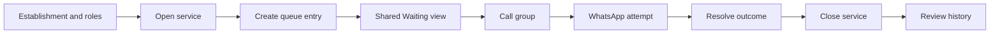

# MesaFlow — Feature Priorities

**Document ID:** PROD-PRIO-001  
**Product:** MesaFlow  
**Release:** MVP / Pilot Release  
**Status:** Approved prioritization and release-sequencing model  
**Owner:** Product Management  
**Version:** 1.0  
**Last updated:** 2026-07-10

---

## 1. Purpose

This document defines how MesaFlow features are prioritized and sequenced.

The canonical feature catalogue marks `FEAT-001`–`FEAT-059` as P0 because all belong to the approved MVP contract. That does not mean they should be implemented simultaneously or that every defect has equal severity.

The prioritization model must protect the product from:

- building attractive extensions before the queue is trustworthy;
- treating messaging as the entire product while core state remains weak;
- treating visual polish as a substitute for operational completeness;
- removing fairness, audit or failure visibility because they are less visible in a demo;
- allowing technical convenience to redefine the MVP.

---

## 2. Priority principles

Features are ordered by these questions:

1. Can a restaurant create and trust the queue?
2. Can a customer join or be added without exclusion?
3. Can staff operate the queue safely from more than one device?
4. Can a customer be called and can failure be seen?
5. Can every entry be resolved without corrupting capacity or history?
6. Can the restaurant validate value and cost during pilot?
7. Does the experience remain fast enough to replace paper?

The primary prioritization principle is:

> Trustworthy operational flow before breadth.

---

## 3. Release priority levels

### P0 — MVP contract

Required for the approved pilot release unless an explicit Product Management decision temporarily de-scopes a feature.

All `FEAT-001`–`FEAT-059` are P0.

### P1 — Post-pilot hardening and optimization

Improves adoption or operational efficiency after the core product is validated. P1 must not be used to hide an incomplete P0 behavior.

Examples:

- richer onboarding education;
- additional language support;
- downloadable reports;
- more flexible visual branding;
- refined service-history comparison;
- saved restaurant presets;
- deeper product analytics.

### P2 — Product expansion

Extends MesaFlow beyond the single-establishment, single-queue MVP.

Examples:

- multiple queues;
- multiple establishments;
- reservations;
- table map;
- predictive wait time.

### P3 — Ecosystem expansion

Moves MesaFlow toward a broader platform.

Examples:

- POS integrations;
- CRM and loyalty;
- marketplace;
- demand forecasting;
- staffing recommendations.

---

## 4. P0 implementation sequence

### Wave 0 — Product foundations

**Purpose:** Establish identity, roles, establishment context and canonical state semantics.

| Order | Features | Outcome |
|---:|---|---|
| 0.1 | FEAT-001–FEAT-005 | Account, establishment and role model |
| 0.2 | FEAT-020, FEAT-022 | Service boundary and safe closure semantics |
| 0.3 | FEAT-049–FEAT-051 | Core terminal outcomes |
| 0.4 | FEAT-055 | Material action attribution foundation |

This wave is not a user-complete release. It establishes product truth used by later waves.

### Wave 1 — Replace the paper list

**Purpose:** Allow a restaurant to create, see and resolve a basic operational queue.

| Order | Features | Outcome |
|---:|---|---|
| 1.1 | FEAT-015, FEAT-023, FEAT-025 | Manual queue and recent outcomes |
| 1.2 | FEAT-018–FEAT-019 | Capacity limit and recalculation |
| 1.3 | FEAT-021 | Stop and resume intake |
| 1.4 | FEAT-027 | Shared current state |
| 1.5 | FEAT-054 | Correct human outcome errors |

**Internal gate:** A team can run a scripted manual-only service without paper.

### Wave 2 — Customer self-entry

**Purpose:** Remove normal intake work from staff.

| Order | Features | Outcome |
|---:|---|---|
| 2.1 | FEAT-006–FEAT-010 | Permanent QR, welcome and required form |
| 2.2 | FEAT-011–FEAT-014 | Optional needs, duplicate, size and unavailable states |
| 2.3 | FEAT-017 | Weighted capacity |
| 2.4 | FEAT-043–FEAT-045 | Private status, groups ahead and low-risk edits |
| 2.5 | FEAT-059 | Mobile-first public completeness |

**Internal gate:** An eligible customer can join and monitor without staff assistance.

### Wave 3 — Call in the customer’s pocket

**Purpose:** Deliver the core differentiated value over paper.

| Order | Features | Outcome |
|---:|---|---|
| 3.1 | FEAT-033–FEAT-034 | Call action and independent timer |
| 3.2 | FEAT-038, FEAT-040 | WhatsApp attempt and visible result |
| 3.3 | FEAT-035–FEAT-037 | Final call, grace period and manual extension |
| 3.4 | FEAT-041–FEAT-042 | Retry and consumption measurement |
| 3.5 | FEAT-048 | “I’m on my way” |
| 3.6 | FEAT-039 | Constrained template personalization |

**Internal gate:** Staff can call multiple groups and understand communication failure.

### Wave 4 — Fairness and operational adaptation

**Purpose:** Preserve human flexibility while protecting neglected groups.

| Order | Features | Outcome |
|---:|---|---|
| 4.1 | FEAT-026, FEAT-028–FEAT-029 | Size filtering, elapsed wait and large-group label |
| 4.2 | FEAT-030–FEAT-032 | Pass-over, long-wait and reason capture |
| 4.3 | FEAT-046 | Controlled party-size change |
| 4.4 | FEAT-053 | Internal notes |
| 4.5 | FEAT-016 | Complete no-contact treatment |

**Internal gate:** Large and long-wait groups cannot be silently ignored.

### Wave 5 — Completion, history and pilot readiness

**Purpose:** Close operational gaps and produce trustworthy evidence.

| Order | Features | Outcome |
|---:|---|---|
| 5.1 | FEAT-047, FEAT-050, FEAT-052 | Confirmed leave, cancellation source and reactivation |
| 5.2 | FEAT-056 | Closed-service history |
| 5.3 | FEAT-057–FEAT-058 | Branding and full staff device support |
| 5.4 | Cross-feature hardening | Edge cases, failure copy, permissions, audit and consistency |

**Pilot gate:** The complete MVP definition of done in `MVP_SCOPE.md` is satisfied.

---

## 5. Critical path

The shortest path to a meaningful MesaFlow experience is:

A release that lacks any link in this chain is not a complete restaurant waiting-list product.

---

## 6. Severity within P0

### S0 — Data or operational integrity blocker

Examples:

- an entry disappears;
- two incompatible transitions both succeed;
- capacity is incorrect;
- a service closes with active entries;
- a private status link exposes another customer;
- a closed service remains editable;
- one staff device overwrites newer queue state.

S0 blocks pilot use.

### S1 — Core flow blocker

Examples:

- customer cannot join despite valid availability;
- staff cannot call or resolve a group;
- QR points to an unusable state;
- no-contact entry triggers a false message assumption;
- call timer or final grace period behaves incorrectly;
- Administrator and Staff permissions are not enforced.

S1 blocks the affected end-to-end scenario and normally blocks release.

### S2 — Serious trust or adoption issue

Examples:

- delivery failure is hidden;
- long-wait warning is missing;
- pass-over count is wrong;
- history totals are wrong but live operation remains safe;
- primary tablet action is impractical;
- customer cannot understand groups ahead.

S2 must be resolved before broad pilot unless Product Management accepts a narrow controlled workaround.

### S3 — Non-blocking refinement

Examples:

- minor copy inconsistency;
- low-impact visual alignment;
- optional field ordering;
- non-critical empty-state polish.

S3 may be scheduled during pilot when it does not damage trust or comprehension.

---

## 7. No “easy feature first” rule

Implementation effort does not determine product priority.

A feature must not move ahead merely because it is:

- visually impressive;
- technically easy;
- requested by one prospect without evidence;
- useful for a demo;
- common in competitor products;
- interesting to build.

Similarly, fairness, audit and failure visibility must not be postponed merely because they are less marketable.

---

## 8. Controlled de-scope order

If a constrained pilot requires temporary reduction, the product team must remove convenience before truth.

### 8.1 Candidates that may be simplified first

Only with explicit Product Management approval:

1. optional restaurant profile fields;
2. non-essential template personalization fields;
3. visual richness of history;
4. convenience filters beyond party size;
5. cosmetic brand customization;
6. optional confirmation-message automation when cost or provider constraints require on-screen confirmation only.

### 8.2 Features that must not be removed from a live pilot

- one trusted active queue;
- manual entry;
- QR entry;
- clear unavailable states;
- duplicate protection;
- capacity truth;
- shared multi-device state;
- call action and independent timer;
- visible messaging failure;
- final grace-period rule;
- terminal outcomes;
- safe service closure;
- individual staff accountability;
- private status access;
- long-wait visibility;
- basic history;
- no-contact handling.

### 8.3 Forbidden false de-scopes

These are not acceptable simplifications:

- using paper as the source of truth;
- manually refreshing every device;
- silently ignoring failed messages;
- treating timer expiry as automatic no-show;
- displaying an invented wait estimate;
- allowing staff to share one unaudited account;
- replacing the private status link with phone number in the URL;
- allowing corrections after closure;
- removing fairness because staff “can remember”.

---

## 9. Post-MVP priority candidates

| Candidate | Provisional level | Evidence required before promotion |
|---|---|---|
| Predictive wait time | P2 | Sufficient reliable historical data and demonstrated customer need |
| Multiple queues | P2 | Repeated operational need that preferences cannot solve |
| Multiple establishments | P2 | Paying restaurant group requires centralized management |
| Reservations | P2 | Core waitlist retention is proven and demand is validated |
| Table map | P2 | Strong evidence that manual table knowledge limits value |
| Multilingual customer flow | P1 | Repeated pilot usage across languages |
| Advanced reporting | P1 | Administrators regularly use current history to make decisions |
| White-label removal | P1/P2 commercial | Proven willingness to pay for branding control |
| POS integration | P3 | Specific integration creates measurable adoption or retention |
| CRM and loyalty | P3 | Queue product is established and consent/value model is clear |
| Marketplace | P3 | MesaFlow has meaningful supply, demand and operating capacity |

---

## 10. Priority review cadence

Priority may be reviewed:

- after each pilot onboarding;
- after meaningful live-service incidents;
- after the 30-day pilot cohort;
- when communication cost materially challenges the business model;
- when a prospect request repeats across the target segment;
- when a feature threatens product simplicity or staff adoption.

A priority review does not automatically change the canonical MVP. Changes require an updated product decision and affected documents.

---

## 11. Final prioritization test

Before approving work, ask:

1. Does this help a restaurant replace paper?
2. Does it reduce staff stress or customer uncertainty?
3. Does it protect operational truth?
4. Is the problem validated for the initial target?
5. Can the MVP work without it?
6. Does it introduce a broader product category?
7. Will staff notice more steps than value?
8. What approved work would be delayed?

The correct priority is the one that maximizes the chance that a real restaurant trusts MesaFlow during its busiest service.
