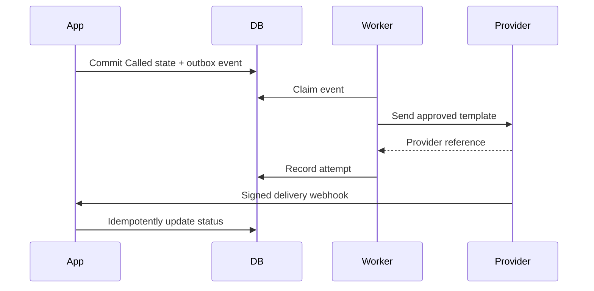

> **Product:** MesaFlow  
> **Architecture baseline:** MVP / Pilot Release  
> **Status:** Proposed architecture baseline  
> **Owner:** Software Architecture  
> **Date:** 2026-07-10  
> **Source baseline:** repository commit `583167147b626b370246dafc440eb961483bda63`

# Integration Architecture

## Principles

- Provider SDKs remain outside domain modules.
- Every outbound integration is invoked through a port.
- Queue transactions never wait for WhatsApp delivery.
- Requests and webhooks are idempotent.
- Provider-specific statuses are mapped to MesaFlow statuses.
- External payloads are minimised and redacted from logs.

## WhatsApp

Interface:

```text
MessagingProvider.sendOperationalMessage(request) -> providerReference
MessagingProvider.verifyWebhook(headers, body) -> verifiedEvent
MessagingProvider.mapDeliveryStatus(event) -> DeliveryStatus
```

Flow:



Delivery statuses should be normalised to `Queued`, `Submitted`, `Delivered`, `Failed`, `Unknown`.

Retry only transient failures with capped exponential backoff. Permanent failures are surfaced to staff.

## Email

Staff invitations and account-related emails use the same asynchronous pattern but a distinct adapter and queue category.

## Payments

No payment workflow is required for the pilot product. Subscription entities may be prepared conceptually, but payment provider integration is deferred.

## Analytics

Use first-party event capture with pseudonymous tenant and user references. Product analytics must not receive customer phone numbers or free-text notes.

## Provider selection

WhatsApp provider selection is a reversible implementation decision after a short spike confirming Portuguese availability, template approval flow, webhook quality, sandbox support, pricing and data-processing terms.
