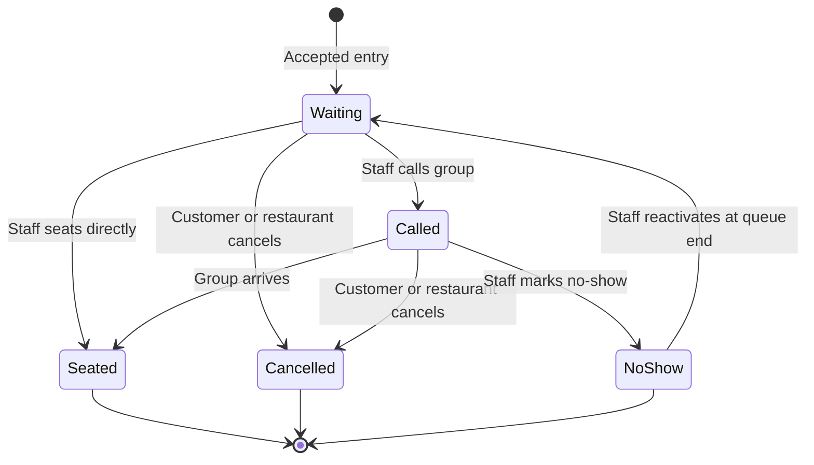

# MesaFlow — MVP Scope

**Document ID:** PROD-SCOPE-001  
**Product:** MesaFlow  
**Release:** MVP / Pilot Release  
**Status:** Approved scope contract  
**Owner:** Product Management  
**Version:** 1.0  
**Last updated:** 2026-07-10

---

## 1. Purpose

This document defines the contractual boundary of the MesaFlow MVP.

Its purpose is to prevent two opposite failures:

1. shipping an incomplete queue that cannot safely replace paper during a real service;
2. expanding into reservations, table management or broader restaurant software before the core queue is validated.

The MVP is not a demonstration prototype. It is the smallest product that a pilot restaurant can use as its operational waiting list during a complete real-world service.

---

## 2. Scope statement

The MesaFlow MVP is:

> A single-establishment, single-queue, browser-based restaurant waiting-list product that allows customers to join on site through a permanent QR code, allows staff to add and operate entries manually, calls customers through WhatsApp, exposes communication failure, protects queue fairness and records basic service outcomes without requiring a customer application.

---

## 3. Primary outcome

A pilot restaurant must be able to stop using its paper waiting list for a complete lunch or dinner service and use MesaFlow as the trusted operational source.

The MVP succeeds when:

- customers can enter without installing an app;
- staff can assist customers who cannot use QR;
- all active groups are visible;
- staff can choose table-compatible groups without losing fairness visibility;
- customers receive a table-ready call or staff sees that the attempt failed;
- every entry reaches a meaningful outcome;
- the service closes without orphaned entries;
- the Administrator can inspect a basic trustworthy record.

---

## 4. Scope unit

The MVP supports:

| Dimension | Approved MVP scope |
|---|---|
| Account | One restaurant operating context |
| Establishment | One establishment in the product UI |
| Queue | One active queue |
| Service | One active service at a time |
| Internal roles | Administrator and Staff |
| Staff identity | Individual accounts |
| Customer identity | No account; entry-specific private link |
| Entry methods | On-site QR and manual staff entry |
| Primary communication | WhatsApp operational messaging |
| Staff form factors | Tablet and desktop |
| Customer form factor | Mobile-first web |
| History | Basic closed-service history |
| Branding | Restaurant-primary with discreet MesaFlow footer mark |

The product should avoid choices that make future multiple establishments or queues impossible, but those future models must not appear as partial or hidden MVP functionality.

---

## 5. In-scope capability groups

### 5.1 Account, establishment and access

Included:

- Administrator account creation;
- one establishment profile;
- guided operational setup with recommended defaults;
- individual Staff invitations;
- Administrator and Staff permissions.

Completion condition:

> A restaurant owner can create the operating context, invite staff and reach a queue that is ready to open without needing technical support or custom configuration.

Canonical features: `FEAT-001`–`FEAT-005`.

### 5.2 Permanent QR and public entry

Included:

- one permanent establishment QR;
- printable QR download;
- Administrator-controlled regeneration;
- public restaurant welcome screen;
- clear current queue state;
- required customer fields: name, phone and party size;
- approved optional seating needs;
- duplicate active-entry prevention;
- maximum self-entry party size;
- distinct no-service, intake-closed and queue-full states.

Completion condition:

> An eligible customer at the restaurant can scan, understand the situation and create exactly one valid queue entry without staff assistance.

Canonical features: `FEAT-006`–`FEAT-014`.

### 5.3 Assisted entry and capacity

Included:

- manual staff entry;
- phone-optional assisted entry;
- no-contact treatment;
- weighted capacity using one or two slots;
- configurable large-group cutoff;
- configurable maximum active slots;
- consistent recalculation after relevant changes.

Completion condition:

> The restaurant can serve digitally confident and assisted customers in the same fair queue without accepting more waiting load than configured.

Canonical features: `FEAT-015`–`FEAT-019`.

### 5.4 Service operation

Included:

- explicit opening of a service;
- closing and reopening new entries;
- safe service closure;
- Waiting, Called and Recently completed sections;
- party-size filtering;
- rapid multi-device synchronization.

Completion condition:

> More than one staff member can operate the same live queue and see a consistent current state.

Canonical features: `FEAT-020`–`FEAT-027`.

### 5.5 Queue fairness

Included:

- elapsed wait;
- large-group visibility;
- pass-over counting;
- configurable long-wait warning;
- reason capture when a protected group is bypassed.

Completion condition:

> Operational flexibility remains available, but the product makes it difficult to ignore a long-wait or repeatedly passed group without awareness and accountability.

Canonical features: `FEAT-028`–`FEAT-032`.

### 5.6 Calling and messaging

Included:

- one clear call action;
- independent countdowns;
- automatic final call;
- automatic two-minute grace period;
- staff-controlled extra time;
- approved WhatsApp operational messages;
- constrained template personalization;
- delivery visibility where supported;
- retry;
- usage measurement.

Completion condition:

> Staff can call a group and either the customer receives the operational message or the team sees that manual intervention may be required.

Canonical features: `FEAT-033`–`FEAT-042`.

### 5.7 Customer status and self-service

Included:

- private unguessable status link;
- groups-ahead display;
- elapsed wait and current call state;
- customer editing of name and approved preferences;
- controlled party-size changes;
- confirmed leave action;
- “I’m on my way” acknowledgement.

Completion condition:

> A waiting customer can move away from the entrance, review status and perform low-risk updates without an account or staff intervention.

Canonical features: `FEAT-043`–`FEAT-048`.

### 5.8 Outcomes, correction and history

Included:

- Seated;
- Cancelled by customer;
- Cancelled by restaurant;
- No-show;
- No-show reactivation at queue end;
- internal staff notes;
- current-service terminal-outcome correction by Administrator;
- material action audit;
- basic read-only closed-service history.

Completion condition:

> No entry is silently lost, human mistakes can be corrected before closure and the final service record remains trustworthy.

Canonical features: `FEAT-049`–`FEAT-056`.

### 5.9 Responsive experience and branding

Included:

- discreet MesaFlow footer branding on customer pages;
- fully usable tablet and desktop staff workflows;
- mobile-first customer public and status flows.

Completion condition:

> The product works on devices restaurants and customers are realistically expected to use.

Canonical features: `FEAT-057`–`FEAT-059`.

---

## 6. Approved queue lifecycle

Only these primary lifecycle states belong to the MVP:

- `Waiting`;
- `Called`;
- `Seated`;
- `Cancelled`;
- `No-show`.

There is no `Paused`, `Reserved`, `Confirmed`, `Arrived`, `Partially seated` or `Table assigned` state in the MVP.

“I’m on my way”, delivery status, pending party-size change, no-contact and long-wait warning are attributes or operational signals, not primary lifecycle states.

---

## 7. Approved configuration surface

The guided setup includes only settings required to adapt the queue to a restaurant:

| Setting | Approved values or behavior | Recommended default |
|---|---|---|
| Maximum active slots | Restaurant-defined positive limit | Suggested during onboarding |
| Call duration | 3, 5 or 10 minutes | 5 minutes |
| Long-wait warning | 20, 30, 45 or 60 minutes | 30 minutes |
| Maximum party size through QR | Restaurant-defined | Suggested during onboarding |
| Two-slot party cutoff | Restaurant-defined | 7 or more people |
| Increase requiring approval | Restaurant-defined threshold | +2 people |
| Where customer should report | Short restaurant instruction | Required before activation |
| Displayed restaurant name | Establishment identity | Establishment name |
| Message template fields | Constrained approved fields | Product defaults |

An “advanced settings” area must not become a route for adding unapproved queue logic.

---

## 8. Scope-level business rules

The MVP scope depends on these non-negotiable rules:

1. `Waiting` and `Called` consume capacity.
2. `Seated`, `Cancelled` and `No-show` do not.
3. Chronological arrival is the canonical queue order.
4. Staff retains final choice of which compatible group to call or seat.
5. Customer position is expressed as groups ahead, not guaranteed absolute order or predicted time.
6. A final call occurs one minute before the original deadline and adds two minutes once.
7. “I’m on my way” informs staff but does not change the timer.
8. Phone is optional for manual entry but required for customer QR entry.
9. A service cannot close with active entries.
10. Closed-service records are read-only.
11. Customer phone changes require staff.
12. No-show reactivation returns to the end of the queue.
13. Failure of WhatsApp must not make the queue unusable.
14. No automatic paid SMS or voice fallback belongs to the MVP.
15. Staff access is individual, not a shared PIN.

Detailed rule identifiers will be maintained in `BUSINESS_RULES.md`.

---

## 9. Required end-to-end scenarios

The MVP is not scope-complete until all scenarios below can be executed coherently.

### SCN-001 — First activation

Administrator creates the restaurant, accepts or adjusts recommended settings, downloads the QR, invites Staff and opens the first service.

### SCN-002 — Normal QR journey

Customer scans, joins, sees confirmation, monitors status, receives the call, acknowledges and is seated.

### SCN-003 — Assisted customer

Staff enters a customer without phone, the dashboard marks No contact and the team calls the customer in person.

### SCN-004 — Queue full

Weighted capacity is reached; new self-entry is blocked until capacity is freed.

### SCN-005 — Intake closed

Staff closes new entries while active groups continue through normal outcomes, then reopens or ends service.

### SCN-006 — Large group protection

A large group waits while smaller later groups are seated; pass-overs and elapsed wait become visible and a protected bypass requires a reason.

### SCN-007 — Messaging failure

Call attempt fails; the entry remains Called, the timer continues, staff sees failure and may retry or contact manually.

### SCN-008 — Final call and grace period

The final call is attempted one minute before expiry and the deadline extends by two minutes exactly once.

### SCN-009 — Party-size increase

A low-risk increase applies automatically; a larger increase requires staff approval and capacity recalculates after approval.

### SCN-010 — Customer leaves queue

Customer explicitly confirms exit; the entry becomes Cancelled by customer and frees capacity.

### SCN-011 — No-show and reactivation

Staff marks No-show, later reactivates and the group returns at queue end.

### SCN-012 — Multi-device conflict

Two staff members attempt incompatible actions; only one valid transition succeeds and all devices reconcile.

### SCN-013 — Correction and closure

Administrator corrects an outcome during the service, active entries are resolved, the service closes and becomes read-only.

---

## 10. MVP quality floor

A feature may visually exist and still fail the MVP scope.

The product is not pilot-ready when any of the following is true:

- staff must keep a paper backup because entries can disappear;
- customer entry can produce silent duplicates;
- one device can overwrite a newer action from another;
- queue capacity differs between public and staff views;
- final-call retries can repeatedly extend the timer;
- an expired timer silently produces a no-show without staff judgement;
- a closed service can still be edited;
- message failure is hidden;
- assisted customers are treated as second-class entries;
- a table number is required to call a customer;
- a long-wait group can be repeatedly bypassed with no visible signal;
- critical staff flows only work well on desktop;
- public flows require an installed application or customer account.

---

## 11. Pilot-release entry criteria

The MVP may enter live restaurant pilot only when:

1. all `FEAT-001`–`FEAT-059` product outcomes have an implemented path or an explicitly approved temporary de-scope;
2. all primary state transitions have acceptance coverage;
3. capacity, pass-over and groups-ahead calculations are consistent;
4. multi-device conflict behavior has been tested;
5. WhatsApp failure can be observed without disabling the queue;
6. QR regeneration and private status links do not invalidate existing entries incorrectly;
7. role restrictions are enforced;
8. current-service correction and post-closure lock are demonstrable;
9. the team can run a scripted full service without undocumented intervention;
10. pilot support, feedback capture and incident ownership are defined outside the product interface.

---

## 12. Pilot-release exit criteria

A 30-day pilot produces useful validation when the product team can determine:

- whether staff used MesaFlow at real peak periods;
- whether the restaurant used it instead of paper;
- whether customer self-entry was understandable;
- how often manual entry was needed;
- how many messages were attempted, delivered where known and failed;
- whether customers used “I’m on my way”;
- whether long-wait visibility changed staff behavior;
- whether large groups were still ignored;
- whether staff trusted multi-device state;
- whether the restaurant would pay and continue;
- which failure or friction most threatens adoption.

A pilot is not automatically successful because the account remained active.

---

## 13. Explicitly out of scope

The following do not belong to this release:

- reservations;
- table map or formal table inventory;
- automatic table assignment;
- POS integration;
- CRM and loyalty;
- customer marketplace;
- multiple establishments in the MVP interface;
- multiple simultaneous queues;
- customer mobile app;
- customer accounts;
- exact or predictive wait time;
- automatic paid SMS fallback;
- automated voice calling;
- complex roles;
- shared staff PIN;
- advanced analytics;
- revenue attribution;
- staff scheduling;
- kitchen, ordering or payment workflows;
- fully editable communication automation;
- customer-controlled timer extensions;
- strict algorithmic FIFO enforcement.

The detailed boundary and future-entry triggers are defined in `OUT_OF_SCOPE.md`.

---

## 14. Scope change control

A proposed change requires Product Management review when it:

- creates a new user role;
- adds a lifecycle state;
- changes who consumes capacity;
- changes weighted-capacity logic;
- changes the meaning of groups ahead;
- introduces a predicted time;
- changes call duration choices or grace-period behavior;
- adds an automatic communication channel;
- introduces remote joining beyond the permanent restaurant entry point;
- introduces table inventory;
- permits editing after service closure;
- creates multiple active services, queues or establishments;
- removes individual staff accountability;
- changes discreet MesaFlow branding policy.

### 14.1 Required change question

Every scope proposal must answer:

> Which validated MVP problem cannot be solved within the approved feature and rule set?

“Competitors have it”, “it would be useful” and “it is easy to build” are not sufficient.

---

## 15. Implementation freedom

The product specification intentionally leaves engineering and design freedom in:

- technology stack;
- application architecture;
- persistence model;
- synchronization mechanism;
- infrastructure;
- provider selection;
- visual design system;
- exact component arrangement;
- exact copy, provided meaning remains approved;
- internal event naming;
- technical monitoring tools.

Implementation freedom ends where a technical choice changes approved user behavior, scope, state semantics, permissions, cost exposure or data truth.

---

## 16. MVP definition of done

The MesaFlow MVP is done when:

> A small or medium-sized restaurant can activate the product quickly, run one complete real waiting-list service from tablet or desktop, accept customers by QR or manual entry, manage fair operational sequencing, call customers through WhatsApp, recover visibly from communication failure, resolve every entry, safely close the service and review a trustworthy basic history—without paper and without requiring customers to install an application.
