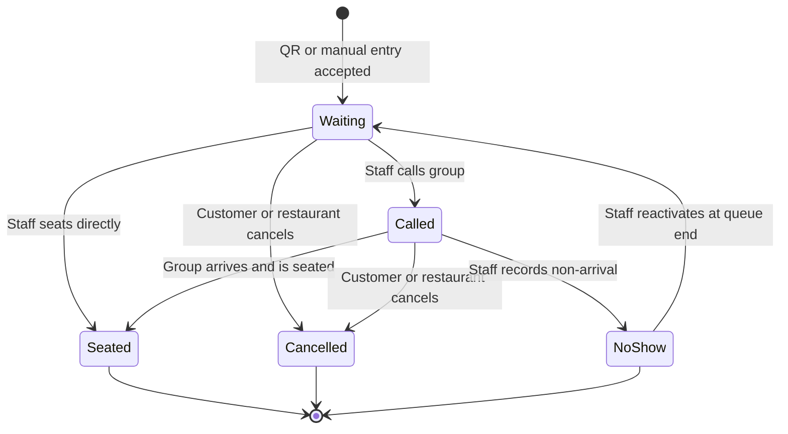
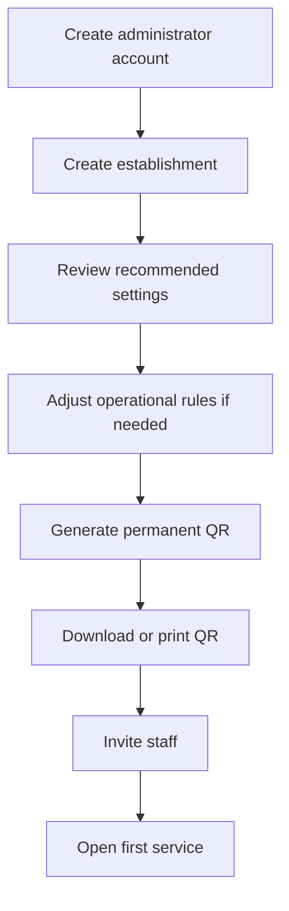
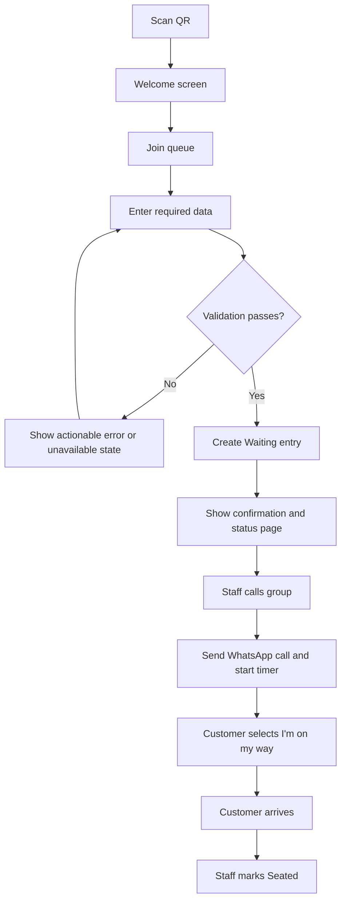
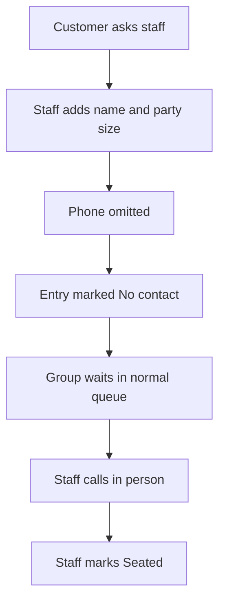
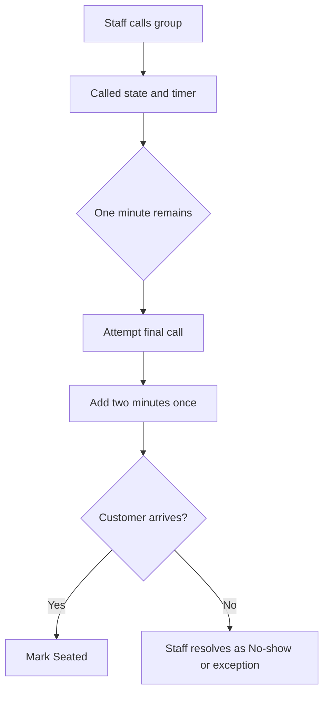
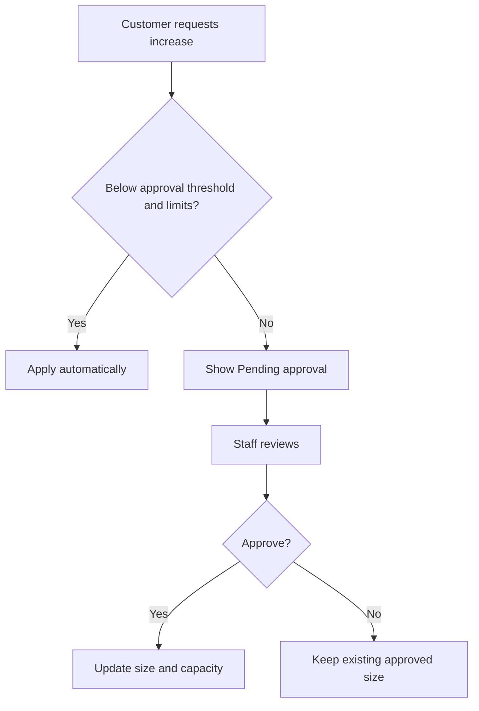
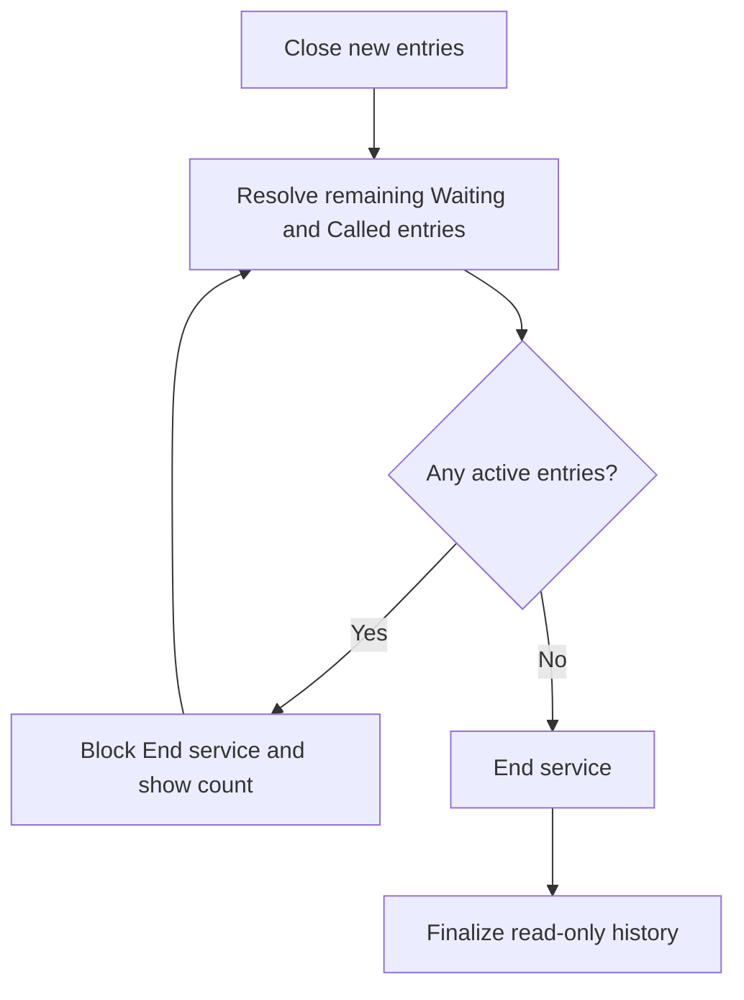

# MesaFlow — Product Requirements Document

**Document ID:** PROD-PRD-001  
**Product:** MesaFlow  
**Release:** MVP / Pilot Release  
**Status:** Approved product specification  
**Owner:** Product Management  
**Strategic authority:** CEO documentation in `docs/`  
**Version:** 1.0  
**Last updated:** 2026-07-10

---

## 1. Document purpose

This Product Requirements Document defines what the MesaFlow MVP must do, for whom, why it exists, how its principal workflows behave and where the product boundary lies.

It is intended to provide a shared product specification for:

- Software Architecture;
- UX/UI Design;
- Engineering;
- Quality Assurance;
- Project Management;
- Codex and other implementation agents;
- pilot onboarding and product operations.

This document does not prescribe technologies, application architecture, database design, infrastructure, APIs or implementation frameworks.

Detailed user stories, business rules, acceptance criteria, non-functional requirements and edge cases will be maintained in their dedicated documents. This PRD establishes the canonical product model and feature identifiers that those documents must reference.

---

## 2. Source documents and approved context

This PRD is derived from and must remain consistent with:

- `docs/VISION.md`;
- `docs/MISSION.md`;
- `docs/BUSINESS_MODEL.md`;
- `docs/POSITIONING.md`;
- `docs/GOALS.md`;
- `docs/COMPETITIVE_ANALYSIS.md`;
- `docs/DECISION_PRINCIPLES.md`;
- `docs/NORTH_STAR.md`;
- `docs/CEO_BRAIN.md`;
- `docs/PRIORITIES.md`;
- `docs/CEO_NOTES.md`;
- `docs/PRODUCT_PHILOSOPHY.md`;
- founder decisions recorded during Product Management discovery.

The CEO documentation remains the source of company strategy. This PRD specifies the approved product response.

---

## 3. Executive summary

MesaFlow is a B2B SaaS product for small and medium-sized restaurants that replaces informal walk-in waiting lists with a focused digital queue.

The MVP allows:

1. a restaurant administrator to configure one establishment;
2. staff to open a queue service;
3. customers to join by scanning a permanent on-site QR code;
4. staff to add customers manually when necessary;
5. customers to see confirmation and relative position without installing an app;
6. staff to operate the queue from a shared dashboard;
7. staff to call a customer with one clear action;
8. customers to receive the call through WhatsApp and respond that they are on the way;
9. staff to resolve each entry as seated, cancelled or no-show;
10. administrators to review basic service history and message consumption.

The MVP intentionally excludes reservations, table maps, POS, CRM, loyalty, marketplace, customer application, automatic paid fallback channels and predictive wait times.

### 3.1 Product objective

> Allow any restaurant to replace a paper waiting list in minutes, eliminating queue chaos without requiring customers to install an application or remain at the door trying to hear the staff call them. The call reaches the customer directly in their pocket.

### 3.2 Product shorthand

> The queue follows the customer, not the other way around.

### 3.3 Category

> Digital waitlist software for restaurants.

---

## 4. Problem definition

## 4.1 Current restaurant behavior

Many target restaurants manage walk-in demand using one or more of:

- a paper notebook;
- handwritten names;
- staff memory;
- a verbal list;
- customers waiting physically near the entrance;
- manual phone calls;
- improvised WhatsApp messages;
- a broad reservation or POS product that is not optimized for the queue.

## 4.2 Staff problems

During busy service, staff experience:

- repeated questions about position and waiting time;
- difficulty reading or preserving names;
- uncertainty about which colleague has called a group;
- lack of visibility into how long each group has waited;
- temptation to keep seating easy, smaller groups while a large group is forgotten;
- manual communication work;
- crowded entrances;
- no useful record after the service;
- mistrust of software that requires too many steps.

## 4.3 Customer problems

Waiting customers experience:

- uncertainty about whether they are on the list;
- fear of losing their turn;
- pressure to remain within hearing distance;
- unclear or changing order;
- no private way to review status;
- frustration when the restaurant appears disorganized;
- missed calls in noisy environments;
- unnecessary app or account requirements in some digital products.

## 4.4 Buyer problems

Owners and managers experience:

- potential walk-away customers;
- staff stress;
- inconsistent service quality at the entrance;
- no proof of queue volume or outcomes;
- concern that new software will not be adopted;
- concern about another recurring subscription;
- concern about variable message costs.

## 4.5 Why current alternatives remain strong

Paper is free, familiar and immediately available. A digital product loses when it requires more effort than the perceived value it creates.

The MVP must therefore provide value that paper cannot provide while remaining nearly as fast:

- customer self-entry;
- shared live state;
- clear confirmation;
- relative queue visibility;
- automated table-ready calls;
- fairness signals;
- basic operational history.

---

## 5. Product goals

## 5.1 Primary MVP goal

Enable a pilot restaurant to run a real walk-in waiting list without paper for an entire service.

## 5.2 Product goals

| Goal ID | Goal | Evidence of success |
|---|---|---|
| GOAL-P01 | Replace the paper list | Staff use MesaFlow as the operational queue during real service |
| GOAL-P02 | Reduce front-door uncertainty | Customers receive immediate confirmation and can review status |
| GOAL-P03 | Move the call into the customer’s pocket | Staff calls trigger clear WhatsApp notifications |
| GOAL-P04 | Reduce staff coordination errors | Multiple staff devices show the same current queue state |
| GOAL-P05 | Protect queue fairness | Long waits and pass-overs are visible |
| GOAL-P06 | Preserve operational flexibility | Staff can choose compatible groups without being blocked |
| GOAL-P07 | Validate willingness to pay | Pilot restaurants convert and continue using the product |
| GOAL-P08 | Understand messaging economics | Message attempts and outcomes are measured by restaurant |

## 5.3 Business validation goals

The MVP supports these approved business targets:

- at least 5 active 30-day pilots;
- 5 paying restaurants within 90 days;
- at least 2 usable testimonials;
- at least 1 strong case study;
- evidence of use during peak hours;
- evidence that staff prefer or accept MesaFlow over paper;
- validation of the initial 29€/month pricing hypothesis;
- validation of WhatsApp cost sustainability;
- 50 paying restaurants as the 12-month target.

## 5.4 Non-goals

The MVP does not aim to:

- become a complete restaurant-management platform;
- manage reservations;
- guarantee increased revenue;
- optimize table combinations automatically;
- predict exact waiting time;
- generate marketplace demand;
- provide customer loyalty or CRM;
- support complex enterprise permissions;
- support multiple establishments in the initial product interface;
- support multiple simultaneous queues per establishment;
- replace the restaurant’s POS.

---

## 6. Product hypotheses to validate

| Hypothesis ID | Hypothesis | Validation method |
|---|---|---|
| HYP-001 | Staff will use MesaFlow during peak service if it is faster and clearer than paper | Observe pilot services and active usage |
| HYP-002 | Customers will scan an on-site QR and complete the form without staff assistance | Measure QR-to-entry completion and collect staff feedback |
| HYP-003 | Immediate confirmation reduces customer uncertainty | Interview customers and staff; observe repeated status questions |
| HYP-004 | WhatsApp table-ready calls allow customers to move away from the entrance | Observe behavior and call outcomes |
| HYP-005 | Owners value less chaos and professionalism enough to pay | Pilot-to-paid conversion |
| HYP-006 | 29€/month is acceptable for the initial target segment | Conversion and pricing conversations |
| HYP-007 | Messaging cost remains compatible with the initial offer | Cost per active restaurant and per successful call |
| HYP-008 | Fairness signals reduce the risk that large groups are ignored | Review pass-over patterns and staff feedback |
| HYP-009 | Founder-led setup can activate restaurants quickly | Time to first service and support needs |
| HYP-010 | One queue and a small role model cover initial pilot needs | Pilot exceptions and feature requests |

The product must measure enough behavior to evaluate these hypotheses without turning the MVP into an analytics product.

---

## 7. Target market and users

## 7.1 Initial customer profile

Initial geographic focus:

- Barreiro;
- Setúbal;
- potentially Seixal.

Initial restaurant characteristics:

- busy walk-in demand;
- visible dinner peaks;
- popular marisqueiras;
- tourist restaurants;
- tascas and grelhados;
- small and medium-sized independent operations;
- current use of paper or informal queue management;
- owner or manager able to approve a low-cost monthly SaaS subscription.

## 7.2 Primary personas

### PER-001 — Restaurant Administrator

Typical roles:

- owner;
- general manager;
- operations manager.

Primary jobs:

- configure the establishment;
- define operational queue rules;
- invite staff;
- deploy the QR;
- understand service usage;
- control costs;
- decide whether to continue paying.

### PER-002 — Staff Member

Typical roles:

- host;
- receptionist;
- front-of-house employee;
- waiter managing arrivals;
- floor manager.

Primary jobs:

- add groups quickly;
- see who is waiting;
- identify a compatible group;
- call the customer;
- manage exceptions;
- resolve the entry;
- coordinate with colleagues.

### PER-003 — Waiting Customer

Primary jobs:

- join quickly;
- know the entry was accepted;
- understand relative position;
- move away from the entrance;
- receive the call;
- communicate that they are returning;
- leave when plans change.

### PER-004 — Assisted Customer

Examples:

- elderly customer;
- customer without a smartphone;
- customer with low digital confidence;
- customer who does not want to provide a phone number.

Primary need:

- receive the same queue treatment through manual staff entry.

---

## 8. Jobs to be done

## 8.1 Administrator jobs

- When I decide to test MesaFlow, help me configure a usable queue quickly so that the pilot does not become another project.
- When my staff starts using MesaFlow, let me control the rules that materially affect service without exposing unnecessary settings.
- When the pilot ends, show me evidence of use and outcomes so that I can decide whether the subscription is worthwhile.
- When messaging has a cost, show enough consumption information to avoid surprises.

## 8.2 Staff jobs

- When a walk-in arrives, let me register the group in seconds.
- When a table becomes available, help me identify suitable groups while showing who has waited longest.
- When I call a group, notify the customer and make the remaining response time obvious.
- When something goes wrong, let me recover without losing the entry.
- When colleagues use other devices, keep us coordinated.

## 8.3 Customer jobs

- When I arrive without a reservation, let me join without installing anything.
- When I submit, reassure me that the restaurant has my group.
- While I wait, let me know my relative position without making a false promise.
- When my table is ready, notify me where I already pay attention.
- When I need to change my details or leave, let me do so safely.

---

## 9. MVP scope summary

## 9.1 In scope

- administrator account and establishment setup;
- individual staff accounts;
- one establishment per account in the MVP interface;
- one active queue per establishment;
- explicit service sessions;
- permanent on-site QR;
- mobile web welcome and entry flow;
- required name, phone and party size;
- optional seating-related information;
- manual staff entry with optional phone;
- duplicate active-entry prevention;
- weighted queue capacity;
- configurable maximum QR party size;
- queue-full state;
- shared staff dashboard;
- chronological default order;
- party-size filtering;
- large-group indication;
- elapsed wait and pass-over count;
- long-wait protection;
- call workflow with 3, 5 or 10-minute timer;
- final call and two-minute grace period;
- multiple simultaneous calls;
- “I’m on my way” response;
- WhatsApp call messages;
- message status and retry;
- private customer status page;
- approved customer self-service changes;
- entry outcomes and correction during active service;
- basic service history;
- message-consumption tracking;
- discreet MesaFlow branding;
- tablet and desktop staff experience.

## 9.2 Out of scope

- reservations;
- table map;
- formal table numbering requirement;
- automatic table assignment;
- POS integration;
- payments;
- CRM;
- loyalty;
- marketplace;
- reviews;
- customer native application;
- automatic SMS fallback;
- automatic voice calls;
- predictive waiting time;
- advanced analytics;
- multi-location management in the MVP UI;
- multiple simultaneous queues;
- complex role customization;
- staff scheduling;
- digital menus.

---

## 10. Canonical product concepts

## 10.1 Account

The commercial product relationship through which an administrator accesses MesaFlow. In the MVP interface, an account manages one establishment.

## 10.2 Establishment

The physical restaurant using MesaFlow. It owns:

- public identity;
- QR code;
- queue configuration;
- staff membership;
- services;
- message templates;
- history.

## 10.3 User

An authenticated internal restaurant user.

MVP roles:

- Administrator;
- Staff.

Customers are not internal users and do not create accounts.

## 10.4 Service

A bounded operating session for a waiting list, such as lunch or dinner.

A service has:

- opening time;
- intake status;
- active entries;
- closure time;
- service metrics;
- immutable closed history, except through future approved administrative procedures outside the MVP.

## 10.5 Queue entry

The operational representation of one waiting group.

Core attributes include:

- customer display name;
- phone when available;
- approved party size;
- source: QR or manual;
- entry time;
- current lifecycle state;
- optional customer preferences;
- internal notes;
- weighted slot value;
- pass-over count;
- long-wait condition;
- call timing when called;
- message status;
- “I’m on my way” status;
- outcome reason;
- action history.

## 10.6 Queue capacity slot

The unit used to limit waiting-list load. A group may consume one or two slots according to the restaurant’s configured size cutoff.

## 10.7 Customer status page

A private mobile web page associated with one queue entry through an unguessable link.

## 10.8 Message attempt

A recorded attempt to send an approved operational message. Message attempts are counted and may expose provider-supported status.

---

## 11. Roles and permissions

## 11.1 Administrator

The Administrator can:

- create and edit establishment details;
- complete onboarding;
- configure queue rules;
- configure approved message fields;
- generate, download and regenerate the QR;
- invite and manage staff accounts;
- open and operate services;
- perform all Staff actions;
- view service history;
- view message consumption;
- correct completed outcomes during the active service.

## 11.2 Staff

Staff can:

- open a service;
- close or reopen new entries;
- end a service when eligible;
- add groups manually;
- edit operational entry details;
- add internal notes;
- call groups;
- retry messages;
- grant additional time;
- mark seated;
- cancel with reason;
- mark no-show;
- reactivate a no-show at the queue end.

Staff cannot:

- change structural queue settings;
- regenerate the public QR;
- manage staff accounts;
- change administrator-only message configuration;
- edit closed-service history.

## 11.3 Individual accountability

Each internal user has an individual account. Shared staff PINs are outside the MVP.

Material actions must be attributable to the user who performed them.

---

## 12. Service lifecycle

## 12.1 Service states

A service operates through these conceptual conditions:

1. **Not open** — no active service accepts entries.
2. **Open** — new entries are accepted subject to capacity and QR party-size rules.
3. **Intake closed** — active entries remain operational, but new entries are rejected.
4. **Ended** — no active entries remain and the record is read-only.

## 12.2 Opening a service

When an authorized user opens a service:

- a new operational session begins;
- the permanent QR points to the open-service welcome experience;
- the configured rules apply;
- the staff dashboard shows the active service;
- history is separated from previous services.

## 12.3 Closing new entries

An authorized user may close new entries at any time.

Effects:

- existing Waiting and Called entries remain active;
- staff can continue all operational actions;
- the QR welcome page explains that the queue is temporarily closed;
- no new QR entry is accepted;
- no new manual entry is accepted until intake is reopened.

Closing new entries means that the restaurant has stopped accepting new waiting groups through every entry path. Existing active groups remain fully operational.

## 12.4 Reopening new entries

An authorized user may reopen intake during the same active service. Capacity and other validation rules resume.

## 12.5 Ending a service

A service may end only when no entry remains in Waiting or Called.

If active entries exist, the product must:

- prevent closure;
- show how many active entries remain;
- direct staff to resolve them.

After closure:

- the service appears in history;
- service metrics are finalized;
- entries are read-only;
- the QR shows the no-active-service state until another service opens.

## 12.6 Service across midnight

A service is a business session, not a calendar-day partition. A service that crosses midnight remains one service until explicitly ended.

---

## 13. Queue-entry lifecycle

## 13.1 States

| State | Meaning | Active | Consumes capacity |
|---|---|---:|---:|
| Waiting | Group is waiting and has not been called | Yes | Yes |
| Called | Restaurant has called the group and an individual timer is active | Yes | Yes |
| Seated | Group has been seated | No | No |
| Cancelled | Group was removed by customer or restaurant | No | No |
| No-show | Group did not present or was resolved as absent | No | No |

## 13.2 State diagram

## 13.3 Direct seating from Waiting

The product may allow staff to mark a Waiting entry as Seated without first sending a call. This supports customers who remain at the entrance or manual no-contact entries.

The action must remain attributable and produce the same terminal history as a Called-to-Seated transition.

## 13.4 No Paused state

The MVP does not include a generic Paused state. Temporary context is represented through internal notes and staff judgment.

## 13.5 Correction during active service

An Administrator may correct a terminal outcome during the same active service.

A correction must preserve:

- original action;
- corrected action;
- actor;
- timestamp;
- resulting capacity recalculation;
- resulting service-metric recalculation.

After service closure, correction is unavailable in the MVP.

---

## 14. Queue ordering and customer position

## 14.1 Default order

Waiting entries are displayed in chronological order of accepted entry time.

Staff cannot drag entries into a permanently different canonical order in the MVP.

## 14.2 Operational selection

Staff may call or seat any suitable group. MesaFlow does not assume strict first-in, first-out seating because table compatibility and physical constraints vary.

## 14.3 Customer-facing position

The customer sees:

> There are X groups ahead of you.

Supporting explanation:

> The order may vary depending on party size and available tables.

The MVP does not display an exact wait-time estimate.

## 14.4 Position recalculation

The relative position updates when:

- an earlier active entry becomes terminal;
- an entry is reactivated at the end;
- an approved change affects the active set;
- a new entry is accepted behind the customer.

The product must avoid representing the relative count as a guaranteed seating sequence.

---

## 15. Fairness and large-group protection

## 15.1 Problem

A large group may wait substantially longer because smaller tables become available more often. Without visibility, staff may repeatedly seat smaller later groups and unintentionally ignore the larger group.

## 15.2 Staff-visible fairness information

Each Waiting entry displays:

- entry time;
- elapsed waiting time;
- approved party size;
- source;
- contact availability;
- optional needs indicators;
- pass-over count;
- long-wait warning;
- large-group label when applicable.

## 15.3 Long-wait configuration

The Administrator selects one of:

- 20 minutes;
- 30 minutes;
- 45 minutes;
- 60 minutes.

The recommended default for the first setup may be established in UX copy, but must remain one of these approved values.

## 15.4 Pass-over definition

A pass-over occurs when a later-arriving group reaches Seated while an earlier active group remains Waiting or Called.

The dedicated Business Rules document must define any excluded transitions precisely. At minimum, a later group’s cancellation or no-show does not count as a pass-over.

## 15.5 Protected entry

An entry becomes protected when it meets the approved fairness condition, including at least the configured long-wait threshold. Future specifications may combine threshold and pass-over count, but the MVP must not make the condition so complex that staff cannot understand it.

## 15.6 Protected pass-over reason

When staff attempts to seat or call a later group ahead of a protected entry, the product requests a quick reason.

Approved reason options:

- table incompatible with earlier group;
- seating-zone preference;
- accessibility need;
- operational decision;
- other.

Requirements:

- selecting a reason must be quick;
- the action remains allowed;
- the reason is logged;
- “other” may allow a short optional note without requiring long text during service.

---

## 16. Weighted capacity

## 16.1 Purpose

A queue limit based only on group count can underrepresent the operational load of very large parties. MesaFlow therefore uses weighted slots.

## 16.2 Default rule

Default initial configuration:

- groups up to 6 people consume 1 slot;
- groups of 7 or more consume 2 slots.

## 16.3 Configurability

The Administrator may change the party-size cutoff that causes a group to consume 2 slots.

The MVP should not introduce more than two weight levels.

## 16.4 Capacity consumption

Only Waiting and Called entries consume slots.

Seated, Cancelled and No-show entries consume zero active slots.

## 16.5 Maximum capacity

The Administrator defines the maximum active queue slots.

When current weighted usage equals or exceeds the limit:

- QR self-entry is blocked;
- the welcome page explains that the queue is full;
- the customer is asked to wait until a place becomes available;
- opening the form does not reserve capacity;
- accepted active entries remain unchanged.

## 16.6 Capacity recalculation

Capacity is recalculated when:

- an entry is created;
- approved party size changes across the weighting cutoff;
- an entry becomes terminal;
- a no-show is reactivated;
- configuration changes.

If an Administrator lowers capacity below current usage:

- existing active entries remain valid;
- no new QR entry is accepted until usage falls below the limit;
- the product must show the over-capacity condition to staff.

## 16.7 Manual operational override

Staff may need to add an exceptional manual entry even while QR intake is blocked. The exact override interaction must be explicit in UX and auditable. The product must not silently bypass the limit.

---

## 17. Maximum QR party size

The Administrator configures the maximum party size accepted through self-entry.

When the entered size exceeds the limit:

- no QR entry is created;
- the customer is instructed to speak directly with staff;
- staff may decide whether to create a manual entry;
- the rule does not imply the restaurant rejects the group entirely.

This protects the restaurant from receiving an unexpectedly large group through an unattended digital path.

---

## 18. Customer QR experience

## 18.1 QR characteristics

The establishment has one permanent public QR code for the MVP.

The QR:

- remains valid across services;
- opens the establishment’s current public queue experience;
- reflects open, full, intake-closed and no-active-service states;
- can be downloaded for printing;
- can be regenerated by an Administrator;
- is intended initially for on-site use.

## 18.2 Welcome screen

Scanning the QR opens a welcome screen before the entry form.

Required elements:

- restaurant identity;
- clear current queue state;
- primary action “Join the queue” when available;
- concise explanation that no app is needed;
- discreet MesaFlow branding.

The MVP must not show an unvalidated wait-time estimate.

## 18.3 Public queue states

### Open and available

Show the join action.

### Open but full

Show that the queue is currently full and ask the customer to wait until a slot becomes available.

### Intake closed

Show that new entries are temporarily closed and direct the customer to staff for questions.

### No active service

Show that the waiting list is not currently open and direct the customer to restaurant staff.

### QR invalidated

An old regenerated QR should show a clear invalid or updated-link state rather than a generic technical error, when feasible.

## 18.4 Entry form

Required fields:

- name;
- phone number;
- party size.

Optional fields:

- interior or terrace preference;
- baby chair;
- accessibility need;
- customer note.

Requirements:

- the form is mobile-first;
- fields have clear labels;
- validation is immediate and understandable;
- optional fields do not visually dominate the primary form;
- submission revalidates service status and capacity;
- the phone number is not displayed publicly.

## 18.5 Entry acceptance

A QR submission is accepted only when:

- a service is open for intake;
- required fields are valid;
- weighted capacity is available;
- party size does not exceed the QR maximum;
- the phone does not already have an active entry in the same queue.

## 18.6 Duplicate active entry

When the same phone already has an active entry in the same queue:

- the product does not create a second active entry;
- the customer receives a clear message;
- where secure and feasible, the product directs the customer to the existing status experience;
- the product does not disclose other customer information merely because a phone was entered.

---

## 19. Manual staff entry

## 19.1 Purpose

Manual entry ensures that QR use is not a condition of receiving service.

## 19.2 Required manual fields

- name or practical display identifier;
- party size.

## 19.3 Optional manual fields

- phone number;
- interior or terrace preference;
- baby chair;
- accessibility need;
- customer-facing note where appropriate;
- internal staff note.

## 19.4 No-contact behavior

When phone is absent:

- the entry is accepted;
- the dashboard clearly shows “No contact”;
- no automated message is attempted;
- staff understands that an in-person call is required;
- customer status access is not assumed.

## 19.5 Queue treatment

Manual entries participate in the same:

- chronological order;
- capacity calculation;
- fairness signals;
- states;
- outcomes;
- history.

They must not be treated as lower priority because they were not created through QR.

---

## 20. Customer confirmation and status page

## 20.1 Immediate confirmation

After accepted QR entry, the product immediately shows:

- confirmation that the group is in the queue;
- customer name or group identifier;
- approved party size;
- number of groups ahead;
- explanation that order may vary;
- waiting time elapsed from entry;
- how the customer will be called;
- private status-page access;
- action to leave the queue.

## 20.2 Unique access link

Each customer-accessible entry has an unguessable unique link.

Requirements:

- phone number is not included in the URL;
- link access does not require a customer account;
- the customer may close and reopen the page;
- the link remains valid through the active entry and can show the final outcome after completion according to retention policy;
- access to another entry must not be derivable from the link.

## 20.3 Status-page information

The page shows, as applicable:

- current state;
- groups ahead;
- elapsed waiting time;
- call countdown;
- final-call status;
- “I’m on my way” status;
- message or action guidance;
- current party size;
- current preferences;
- restaurant instruction for where to report.

## 20.4 Customer-editable fields

Customer may directly edit:

- name;
- optional preferences;
- optional customer note, subject to product limits.

Customer may not directly change phone number. Staff intervention is required.

## 20.5 Leave queue

The customer can leave the queue.

Requirements:

- the first action opens a confirmation step;
- the confirmation explains that the place will be released;
- only explicit confirmation changes the state;
- the outcome is recorded as Cancelled by customer;
- capacity and positions recalculate;
- the customer sees final confirmation.

---

## 21. Party-size changes

## 21.1 Purpose

Party size may change while waiting. The product should reduce staff work for low-risk changes while protecting the restaurant from disruptive increases.

## 21.2 Decrease

A decrease is applied automatically.

Effects:

- approved party size changes;
- weighted capacity recalculates;
- large-group label may change;
- staff devices update;
- the change is logged.

## 21.3 Increase below approval threshold

The Administrator configures the increase that requires staff approval.

Default:

- +1 person is automatic;
- +2 or more requires approval.

An increase below the threshold applies automatically if it remains within allowed product constraints.

## 21.4 Increase requiring approval

When the increase meets or exceeds the threshold:

- the customer submits a request;
- the active approved size remains unchanged until decision;
- staff sees a pending request;
- staff can approve or reject;
- the customer sees pending and final status;
- approval recalculates capacity and labels;
- decision is logged.

## 21.5 Increase above QR maximum

A request that results in a party size above the self-entry maximum requires staff decision, even when the numeric increase would otherwise be automatic.

## 21.6 Capacity conflict

If approval would push active usage beyond configured capacity, the product must clearly show the conflict. It must not silently approve and hide the over-capacity condition.

The final approval policy will be stated in `BUSINESS_RULES.md`; at minimum, staff must consciously decide rather than the product applying an invisible override.

---

## 22. Staff dashboard

## 22.1 Device targets

The operational dashboard is designed for:

- tablet;
- desktop.

A staff phone experience may remain usable, but phone optimization is not the primary staff requirement unless separately approved.

## 22.2 Primary sections

The active-service dashboard contains:

1. **Waiting**;
2. **Called**;
3. **Recently completed**.

## 22.3 Waiting section

Each entry should expose the most operationally useful information without opening a detailed record:

- customer name;
- party size;
- entry time;
- elapsed wait;
- number of groups ahead or queue index as staff context;
- contact/no-contact status;
- optional-needs indicators;
- large-group label;
- pass-over count;
- long-wait warning;
- pending party-size change;
- internal note indicator;
- primary call action.

## 22.4 Called section

Each Called entry shows:

- customer name;
- party size;
- call start time;
- remaining time;
- final-call state;
- delivery state;
- “I’m on my way” state;
- contact/no-contact state;
- actions to seat, add time, retry, cancel or mark no-show.

Multiple entries may be Called simultaneously, each with its own timer.

## 22.5 Recently completed

Recently completed entries provide short-term visibility during the current service.

They include:

- outcome;
- completion time;
- responsible staff member;
- correction action when allowed.

The section should not overwhelm the active queue. The exact display limit may be a UX decision, provided current-service Administrator corrections remain practical.

## 22.6 Filtering

Staff can filter Waiting entries by party size or useful size range.

Filtering must not change the canonical chronological order or customer-facing position.

## 22.7 No permanent manual reorder

Staff cannot drag entries to redefine the permanent queue order in the MVP.

Staff expresses operational choice by calling or seating a specific group.

## 22.8 Multi-device state

Changes made on one active staff device must propagate rapidly to other active devices without normal manual refresh.

The product must protect against:

- duplicate call creation;
- conflicting terminal outcomes;
- stale-device overwrites;
- inconsistent timers.

The detailed quality target is defined in `NON_FUNCTIONAL_REQUIREMENTS.md`.

---

## 23. Call workflow

## 23.1 Call action

Staff selects “Call group” for a Waiting entry.

Before completing the action, the product may require a protected-pass-over reason according to fairness rules.

On successful call:

- state becomes Called;
- an individual timer begins;
- the table-ready message is attempted when phone exists;
- staff devices update;
- customer status page updates;
- the entry continues consuming capacity.

## 23.2 Call duration

The Administrator selects:

- 3 minutes;
- 5 minutes;
- 10 minutes.

One value applies as the establishment’s standard call duration.

## 23.3 Final call

One minute before the original call deadline:

- the system attempts the final-call message;
- exactly two minutes are added;
- staff and customer see the revised deadline;
- the extension occurs once;
- retrying the message does not add another two minutes.

## 23.4 Manual additional time

Staff may grant additional time when appropriate.

Requirements:

- the new deadline is visible to all staff devices;
- the customer page updates;
- the action is logged;
- the product does not allow customer self-extension.

## 23.5 “I’m on my way”

A Called customer can select “I’m on my way” on the status page.

Effects:

- staff sees the acknowledgement;
- the timer continues;
- no automatic time is added;
- repeated taps do not create repeated events or extensions;
- staff may still make the final operational decision.

## 23.6 Expiry

Timer expiry does not silently delete the entry.

The entry remains visible for staff resolution according to the final business rule. Staff must be able to mark No-show, Seat, Cancel or extend as appropriate.

Automatic no-show without staff confirmation is not assumed by this PRD.

---

## 24. Messaging

## 24.1 Primary channel

WhatsApp is the primary automated customer-call channel in the MVP.

The product must remain operable when the channel fails.

## 24.2 Message types

| Message ID | Message | MVP criticality |
|---|---|---|
| MSG-001 | Queue-entry confirmation | Required as on-screen confirmation; external send depends on economics |
| MSG-002 | Table-ready call | Critical |
| MSG-003 | Final call with two-minute extension | Critical |
| MSG-004 | Cancellation/removal notice | Required where contact and channel permit |

## 24.3 Templates

The product provides predefined templates with limited personalization.

Configurable elements may include:

- restaurant name;
- greeting;
- where the customer should report;
- a short approved instruction.

The product should preserve mandatory operational meaning.

## 24.4 Message status

Where supported, staff sees a truthful status such as:

- requested/queued;
- sent;
- delivered;
- failed.

The exact labels must reflect available provider evidence. The product must not claim delivery without confirmation.

## 24.5 Failure behavior

When a message fails:

- the queue entry remains valid;
- state remains Waiting or Called as applicable;
- the timer continues unless staff changes it;
- staff sees the failure;
- staff can retry;
- staff can view the phone for manual contact;
- no automatic paid fallback is triggered.

## 24.6 No-contact entry

No automated attempt is made when the entry lacks a phone. The dashboard must not display a misleading failed-message state.

## 24.7 Consumption measurement

The product records at least:

- message type;
- attempt time;
- establishment;
- associated entry;
- provider-supported outcome;
- retry relationship where applicable.

The purpose is to validate usage and future packaging. The PRD does not define final billing behavior.

---

## 25. Entry outcomes

## 25.1 Seated

Staff may mark Waiting or Called as Seated.

Effects:

- entry becomes terminal;
- active capacity is released;
- customer positions recalculate;
- entry appears in Recently completed;
- wait and call timing contribute to service history;
- status page shows the completed outcome.

## 25.2 Cancelled

When staff removes a group, staff selects:

- Cancelled by customer;
- Cancelled by restaurant.

Customer self-exit records Cancelled by customer automatically.

Effects:

- capacity is released;
- positions recalculate;
- reason is retained for history;
- customer receives a cancellation notice when applicable and economically supported.

## 25.3 No-show

Staff marks No-show when the group does not present.

Effects:

- capacity is released;
- entry becomes terminal;
- outcome is included in service metrics;
- customer status page shows the final condition according to approved UX.

## 25.4 Reactivation

Staff may reactivate a No-show during the active service.

Effects:

- state becomes Waiting;
- the group receives a new active position at the end of the queue;
- current time establishes the reactivation order for active sequencing;
- capacity is consumed again;
- the previous No-show remains in audit history;
- the group does not recover the previous chronological place.

This protects customers who remained available while allowing staff to correct real situations.

---

## 26. Internal notes and preferences

## 26.1 Customer preferences

Optional customer inputs include:

- interior;
- terrace;
- baby chair;
- accessibility need;
- short customer note.

These are requests, not guarantees.

## 26.2 Internal notes

Staff can add internal notes for temporary operational context.

Examples:

- customer waiting nearby;
- speak to floor manager;
- group requested a little more time;
- special seating context.

Internal notes:

- are not shown to the customer;
- must not create a new queue state;
- should be handled in accordance with privacy and retention rules;
- should not be used for inappropriate sensitive profiling.

---

## 27. Onboarding and establishment configuration

## 27.1 Account creation

The first user creates the account and becomes Administrator.

## 27.2 Required establishment data

- restaurant name;
- address;
- restaurant phone;
- primary language;
- time zone.

Optional:

- logo;
- website;
- social links;
- short description.

Only information used in the approved experience should be requested during MVP onboarding.

## 27.3 Required guided configuration

The onboarding includes:

- maximum queue slots;
- call duration: 3, 5 or 10 minutes;
- long-wait threshold: 20, 30, 45 or 60 minutes;
- maximum party size accepted through QR;
- party-size cutoff for consuming two slots;
- party-size increase requiring staff approval;
- where called customers should report;
- customer-facing restaurant/message name.

Recommended defaults are preselected.

## 27.4 Completion

Onboarding is complete when:

- required establishment data is saved;
- queue rules are valid;
- permanent QR is generated;
- the Administrator can open a service.

Inviting staff may be encouraged but must not prevent a founder-operated pilot.

---

## 28. QR management

## 28.1 Permanent QR

One permanent QR is associated with the establishment’s public queue entry point.

## 28.2 Download

The Administrator can download a printable QR asset with sufficient identification so that the restaurant can deploy it on-site.

The exact print design is a UX/brand deliverable, not a technical requirement.

## 28.3 Regeneration

Only an Administrator can regenerate the QR.

Before regeneration:

- the product warns that the old QR will stop accepting new entries;
- the Administrator explicitly confirms.

After regeneration:

- existing accepted entries remain valid;
- existing customer status links remain valid for their entries;
- the old public QR entry link is invalid;
- the new QR is available for download;
- the action is logged.

---

## 29. History and reporting

## 29.1 History unit

History is organized by closed service.

## 29.2 Required service summary

Each service includes:

- service opening and closure time;
- total accepted groups;
- groups seated;
- cancellations by customer;
- cancellations by restaurant;
- no-shows;
- average waiting time for relevant completed groups;
- maximum waiting time;
- total pass-overs;
- messages attempted;
- messages failed;
- manual entries;
- QR entries.

The exact metric definitions must be canonical in the analytics or business-rules specification.

## 29.3 Purpose

The history exists to:

- prove operational usage;
- support pilot reviews;
- help the owner evaluate value;
- validate messaging economics;
- support testimonials and case studies;
- inform future product decisions.

## 29.4 Not included

The MVP history is not an advanced BI dashboard and does not include:

- revenue attribution;
- forecasting;
- benchmark comparisons;
- complex custom reports;
- AI recommendations.

---

## 30. Auditability

The product preserves material operational events, including:

- entry creation and source;
- staff edits;
- party-size requests and decisions;
- call action;
- message attempts and retries;
- final-call extension;
- manual time extension;
- “I’m on my way” acknowledgement;
- state changes;
- cancellation reason;
- no-show reactivation;
- protected pass-over reason;
- outcome correction;
- service opening, intake closure, reopening and ending;
- QR regeneration;
- structural configuration changes.

Audit data supports trust and debugging. It should not make the live interface feel like an enterprise log viewer.

---

## 31. Feature catalogue for the MVP

The following identifiers are canonical and must be reused in the dedicated feature, user-story and acceptance-criteria documents.

### EPIC-A — Account, establishment and access

| Feature ID | Feature | Priority |
|---|---|---|
| FEAT-001 | Administrator account creation | P0 |
| FEAT-002 | Establishment profile | P0 |
| FEAT-003 | Guided operational setup | P0 |
| FEAT-004 | Individual staff invitation and access | P0 |
| FEAT-005 | Administrator and Staff permissions | P0 |

### EPIC-B — QR and public entry

| Feature ID | Feature | Priority |
|---|---|---|
| FEAT-006 | Permanent establishment QR | P0 |
| FEAT-007 | QR download | P0 |
| FEAT-008 | QR regeneration | P0 |
| FEAT-009 | Public welcome and queue-state screen | P0 |
| FEAT-010 | Customer queue-entry form | P0 |
| FEAT-011 | Optional seating needs and preferences | P0 |
| FEAT-012 | Duplicate active-entry prevention | P0 |
| FEAT-013 | Maximum QR party-size handling | P0 |
| FEAT-014 | Queue-full and intake-closed public states | P0 |

### EPIC-C — Manual entry and queue capacity

| Feature ID | Feature | Priority |
|---|---|---|
| FEAT-015 | Manual staff entry | P0 |
| FEAT-016 | No-contact entry handling | P0 |
| FEAT-017 | Weighted queue capacity | P0 |
| FEAT-018 | Configurable maximum active slots | P0 |
| FEAT-019 | Capacity recalculation | P0 |

### EPIC-D — Service operation

| Feature ID | Feature | Priority |
|---|---|---|
| FEAT-020 | Open service | P0 |
| FEAT-021 | Close and reopen new entries | P0 |
| FEAT-022 | Safe service closure | P0 |
| FEAT-023 | Waiting dashboard section | P0 |
| FEAT-024 | Called dashboard section | P0 |
| FEAT-025 | Recently completed section | P0 |
| FEAT-026 | Party-size filtering | P0 |
| FEAT-027 | Multi-device queue synchronization | P0 |

### EPIC-E — Fairness and prioritization

| Feature ID | Feature | Priority |
|---|---|---|
| FEAT-028 | Elapsed wait display | P0 |
| FEAT-029 | Large-group label | P0 |
| FEAT-030 | Pass-over counting | P0 |
| FEAT-031 | Configurable long-wait warning | P0 |
| FEAT-032 | Protected pass-over reason | P0 |

### EPIC-F — Calling and messaging

| Feature ID | Feature | Priority |
|---|---|---|
| FEAT-033 | Call group action | P0 |
| FEAT-034 | Individual call countdown | P0 |
| FEAT-035 | Automatic final call | P0 |
| FEAT-036 | Automatic two-minute grace period | P0 |
| FEAT-037 | Manual additional time | P0 |
| FEAT-038 | WhatsApp operational messages | P0 |
| FEAT-039 | Message-template personalization | P0 |
| FEAT-040 | Message delivery visibility | P0 |
| FEAT-041 | Message retry | P0 |
| FEAT-042 | Message-consumption measurement | P0 |

### EPIC-G — Customer status and self-service

| Feature ID | Feature | Priority |
|---|---|---|
| FEAT-043 | Private customer status page | P0 |
| FEAT-044 | Groups-ahead position | P0 |
| FEAT-045 | Customer name and preference edit | P0 |
| FEAT-046 | Party-size change workflow | P0 |
| FEAT-047 | Customer leave-queue confirmation | P0 |
| FEAT-048 | “I’m on my way” acknowledgement | P0 |

### EPIC-H — Outcomes, correction and history

| Feature ID | Feature | Priority |
|---|---|---|
| FEAT-049 | Mark Seated | P0 |
| FEAT-050 | Cancel with actor/reason | P0 |
| FEAT-051 | Mark No-show | P0 |
| FEAT-052 | Reactivate No-show at queue end | P0 |
| FEAT-053 | Internal staff notes | P0 |
| FEAT-054 | Current-service outcome correction | P0 |
| FEAT-055 | Material action audit trail | P0 |
| FEAT-056 | Closed-service history | P0 |

### EPIC-I — Brand and responsive experience

| Feature ID | Feature | Priority |
|---|---|---|
| FEAT-057 | Discreet MesaFlow customer-page branding | P0 |
| FEAT-058 | Tablet and desktop staff experience | P0 |
| FEAT-059 | Mobile-first customer experience | P0 |

---

## 32. Detailed feature requirements

This section states the minimum product outcome for each canonical feature. Detailed acceptance cases will be expanded in `ACCEPTANCE_CRITERIA.md`.

### FEAT-001 — Administrator account creation

**Problem:** The restaurant needs an accountable owner of setup and access.  
**Requirement:** A first internal user can create an account and becomes Administrator.  
**Boundary:** No custom role creation in MVP.

### FEAT-002 — Establishment profile

**Problem:** Public and operational experiences require a restaurant context.  
**Requirement:** Administrator stores required restaurant identity, contact, language and time-zone information.  
**Boundary:** One establishment in MVP UI.

### FEAT-003 — Guided operational setup

**Problem:** A configuration-heavy setup would prevent activation.  
**Requirement:** The product provides recommended defaults and collects only approved queue settings.  
**Success:** Administrator can reach an openable queue without product training.

### FEAT-004 — Individual staff invitation and access

**Problem:** Shared access removes accountability.  
**Requirement:** Administrator invites individual Staff users.  
**Boundary:** No shared PIN workflow.

### FEAT-005 — Permissions

**Problem:** Structural settings should not be changed accidentally during service.  
**Requirement:** Administrator and Staff permissions follow Section 11.

### FEAT-006 — Permanent establishment QR

**Problem:** Restaurant needs a reusable entry point.  
**Requirement:** One permanent public QR points to the current establishment queue state.

### FEAT-007 — QR download

**Problem:** Restaurant must deploy the QR physically.  
**Requirement:** Administrator can obtain a printable asset.

### FEAT-008 — QR regeneration

**Problem:** Public access may be misused or exposed.  
**Requirement:** Administrator can invalidate the old entry link and issue a new QR after warning and confirmation.

### FEAT-009 — Public welcome and state screen

**Problem:** Customers need trust and context before entering data.  
**Requirement:** Show restaurant identity, current queue state and appropriate next action.

### FEAT-010 — Customer queue-entry form

**Problem:** Customer self-entry must remove staff work.  
**Requirement:** Collect name, phone and party size with mobile-friendly validation.

### FEAT-011 — Optional seating needs

**Problem:** Some groups have relevant constraints.  
**Requirement:** Capture approved optional preferences without making them mandatory.

### FEAT-012 — Duplicate prevention

**Problem:** Accidental duplicate entries distort capacity and fairness.  
**Requirement:** Block a second active entry for the same phone in the same queue.

### FEAT-013 — Maximum QR party size

**Problem:** Oversized groups need direct staff assessment.  
**Requirement:** Block self-entry above the configured size and direct the customer to staff.

### FEAT-014 — Full and closed states

**Problem:** Customers need a clear explanation when they cannot join.  
**Requirement:** Show distinct no-service, intake-closed and queue-full states.

### FEAT-015 — Manual entry

**Problem:** QR cannot be mandatory.  
**Requirement:** Staff can add a group with name and party size; phone is optional.

### FEAT-016 — No-contact handling

**Problem:** Staff must not assume a manual group received a message.  
**Requirement:** Clearly label no-contact entries and suppress automated attempts.

### FEAT-017 — Weighted capacity

**Problem:** Large groups create more queue load.  
**Requirement:** Use one- or two-slot weighting with a configurable cutoff.

### FEAT-018 — Maximum slots

**Problem:** Restaurant needs to cap waiting-list load.  
**Requirement:** Administrator sets maximum active slots.

### FEAT-019 — Capacity recalculation

**Problem:** State and party-size changes alter availability.  
**Requirement:** Recalculate consistently and update public intake state.

### FEAT-020 — Open service

**Problem:** Queue activity needs a bounded operational session.  
**Requirement:** Authorized staff opens a new service.

### FEAT-021 — Close/reopen entries

**Problem:** Restaurant may stop intake while serving current groups.  
**Requirement:** Toggle customer self-entry without resolving existing groups.

### FEAT-022 — Safe service closure

**Problem:** Ending with active groups would orphan customers.  
**Requirement:** Block closure until no Waiting or Called entries remain.

### FEAT-023 — Waiting section

**Problem:** Staff needs a trusted view of active waiting groups.  
**Requirement:** Show chronological list and approved operational indicators.

### FEAT-024 — Called section

**Problem:** Active calls require focused timing and delivery visibility.  
**Requirement:** Show independent timers and call actions.

### FEAT-025 — Recently completed

**Problem:** Staff needs short-term awareness and error correction.  
**Requirement:** Show current-service terminal entries without dominating active work.

### FEAT-026 — Party-size filtering

**Problem:** Staff needs to find groups compatible with an available table.  
**Requirement:** Filter without changing canonical order.

### FEAT-027 — Multi-device synchronization

**Problem:** Multiple employees must not act on stale queue data.  
**Requirement:** Propagate queue changes rapidly and prevent conflicting valid transitions.

### FEAT-028 — Elapsed wait

**Problem:** Arrival time alone is hard to interpret under pressure.  
**Requirement:** Show continuously understandable elapsed wait.

### FEAT-029 — Large-group label

**Problem:** Operationally difficult groups need visibility.  
**Requirement:** Apply label according to configured weighting cutoff or approved large-group rule.

### FEAT-030 — Pass-over count

**Problem:** Later seating can silently disadvantage earlier groups.  
**Requirement:** Count qualifying later-seated groups.

### FEAT-031 — Long-wait warning

**Problem:** Long-wait entries may be overlooked.  
**Requirement:** Highlight at one of four configured thresholds.

### FEAT-032 — Protected pass-over reason

**Problem:** Flexibility needs accountability.  
**Requirement:** Require a quick reason in protected cases without blocking the action.

### FEAT-033 — Call group

**Problem:** Staff needs one clear action to indicate table readiness.  
**Requirement:** Move entry to Called, begin timer and attempt notification.

### FEAT-034 — Individual countdown

**Problem:** Multiple called groups need independent deadlines.  
**Requirement:** Show synchronized remaining time per entry.

### FEAT-035 — Final call

**Problem:** A last warning reduces missed returns.  
**Requirement:** Attempt the final-call message one minute before the original deadline.

### FEAT-036 — Grace period

**Problem:** Final call should provide a consistent opportunity to return.  
**Requirement:** Add two minutes exactly once.

### FEAT-037 — Manual additional time

**Problem:** Staff needs to handle real exceptions.  
**Requirement:** Staff extends a timer and all views update.

### FEAT-038 — WhatsApp messages

**Problem:** Customer should not remain at the door.  
**Requirement:** Use WhatsApp for approved operational calls where contact exists.

### FEAT-039 — Template personalization

**Problem:** Restaurant identity and reporting instruction vary.  
**Requirement:** Allow constrained approved fields, not unlimited automation.

### FEAT-040 — Delivery visibility

**Problem:** Hidden failure destroys trust.  
**Requirement:** Show truthful provider-supported status.

### FEAT-041 — Retry

**Problem:** Transient failure must be recoverable.  
**Requirement:** Staff retries without duplicating grace periods or state transitions.

### FEAT-042 — Consumption measurement

**Problem:** Pricing and margins depend on actual usage.  
**Requirement:** Count message attempts and outcomes per establishment.

### FEAT-043 — Private status page

**Problem:** Customer needs access without an account.  
**Requirement:** Provide an unguessable entry-specific web link.

### FEAT-044 — Groups-ahead position

**Problem:** Customer needs clarity without false waiting-time precision.  
**Requirement:** Show groups ahead and the order-variation explanation.

### FEAT-045 — Customer edit

**Problem:** Minor mistakes should not require staff.  
**Requirement:** Allow name and preference edits; phone remains staff-controlled.

### FEAT-046 — Party-size change

**Problem:** Group attendance changes while waiting.  
**Requirement:** Apply reductions and low-risk increases automatically; route larger increases for approval.

### FEAT-047 — Confirmed leave

**Problem:** Accidental exit would create a poor experience.  
**Requirement:** Require explicit confirmation before customer cancellation.

### FEAT-048 — “I’m on my way”

**Problem:** Staff benefits from knowing that the customer saw the call.  
**Requirement:** Record acknowledgement without extending time.

### FEAT-049 — Mark Seated

**Problem:** Successful outcome must free capacity and complete the loop.  
**Requirement:** Allow from Waiting or Called and update all dependent information.

### FEAT-050 — Cancel with actor/reason

**Problem:** Customer and restaurant cancellations have different meaning.  
**Requirement:** Preserve cancellation source.

### FEAT-051 — Mark No-show

**Problem:** Absent groups must stop consuming capacity.  
**Requirement:** Staff explicitly resolves the entry as No-show.

### FEAT-052 — Reactivate No-show

**Problem:** Staff may need to correct or accommodate a returning group.  
**Requirement:** Return it to Waiting at the queue end.

### FEAT-053 — Internal notes

**Problem:** Temporary context should not create more states.  
**Requirement:** Staff can add non-customer-visible operational notes.

### FEAT-054 — Outcome correction

**Problem:** Human errors occur during service.  
**Requirement:** Permit an Administrator to correct a completed outcome during the current service, with recalculation and audit.

### FEAT-055 — Audit trail

**Problem:** Trust and diagnosis require action history.  
**Requirement:** Preserve material events and actors.

### FEAT-056 — Closed-service history

**Problem:** Owner needs proof of use and basic outcomes.  
**Requirement:** Provide the approved summary and read-only records.

### FEAT-057 — Discreet branding

**Problem:** MesaFlow benefits from organic awareness without disrupting restaurant identity.  
**Requirement:** Show small MesaFlow branding on customer pages in the initial plan.

### FEAT-058 — Tablet and desktop staff experience

**Problem:** Restaurants commonly operate on both.  
**Requirement:** Primary staff workflows are fully usable on both form factors.

### FEAT-059 — Mobile-first customer experience

**Problem:** QR entry happens primarily on phones.  
**Requirement:** All public and status flows are designed for common mobile screens.

---

## 33. Primary end-to-end flows

## FLOW-001 — First restaurant activation

Success condition: the restaurant can accept a real customer entry.

## FLOW-002 — Customer joins and is seated

## FLOW-003 — Manual no-contact customer

## FLOW-004 — Call and final-call expiry

## FLOW-005 — Party-size increase requiring approval

## FLOW-006 — Safe service closure

---

## 34. Empty, loading and error-state expectations

The detailed UX specification will define copy, but the product must support the following conditions.

## 34.1 Staff empty states

- no active service;
- active service with no waiting groups;
- no called groups;
- no recently completed entries;
- filter returns no groups;
- no service history.

Each empty state should identify the expected next action where relevant.

## 34.2 Public error states

- invalid required field;
- duplicate active entry;
- queue became full before submission;
- intake closed before submission;
- party size above QR limit;
- status link invalid or expired;
- customer action conflicts with a staff action;
- temporary inability to load current status.

## 34.3 Staff operational errors

- message failed;
- retry failed;
- state changed on another device;
- party-size approval conflicts with capacity;
- service closure blocked;
- stale device reconnects;
- permission denied;
- QR regeneration fails;
- customer page update delayed.

Errors must preserve the last known valid state and provide a safe next action.

---

## 35. Notifications and visible events

The product should avoid excessive internal alerts. Events that require clear staff visibility include:

- new manual or QR entry;
- pending party-size approval;
- message failure;
- “I’m on my way” acknowledgement;
- call timer nearing or reaching expiry;
- protected long-wait condition;
- another device changed the entry currently being viewed;
- queue capacity reached;
- service cannot close because entries remain.

The exact visual or audible treatment is a UX decision. The product must not assume loud audio is appropriate in every restaurant.

---

## 36. Product metrics

## 36.1 North Star

**Customers successfully called through MesaFlow per restaurant per week.**

The canonical definition of “successfully called” must be finalized in the analytics specification. It should represent a real call workflow, not merely a button click with immediate failure.

## 36.2 Activation metrics

- administrator account created;
- establishment configured;
- QR downloaded;
- first service opened;
- first customer joined;
- first group called;
- first group seated;
- first complete service run.

## 36.3 Usage metrics

- active service days per restaurant per week;
- QR entries;
- manual entries;
- groups called;
- groups seated;
- peak-hour usage;
- average active queue size;
- weighted capacity reached;
- customer self-service actions;
- “I’m on my way” acknowledgements.

## 36.4 Quality metrics

- message-failure rate;
- retry success rate;
- duplicate-action conflicts;
- synchronization failures;
- abandoned QR forms;
- customer-entry validation failure rate;
- outcome corrections;
- service-closure blocks;
- support incidents during peak service.

## 36.5 Fairness metrics

- long-wait entries per service;
- pass-overs per entry;
- protected pass-over reasons;
- maximum wait by party-size band;
- no-show and cancellation rates by wait duration.

These metrics are for product learning and should not automatically judge staff performance without context.

## 36.6 Business metrics

- pilots started;
- pilots activated;
- pilot restaurants with weekly use;
- pilot-to-paid conversion;
- paying restaurants;
- MRR;
- churn;
- active after 60 and 90 paid days;
- message cost per restaurant;
- gross margin after message cost.

## 36.7 Qualitative evidence

- receptionist says it is easier than paper;
- staff do not return to paper during peak service;
- customers understand the QR flow;
- owner sees reduced confusion or improved professionalism;
- reasons for non-use;
- objections to payment;
- requested features and underlying problems.

---

## 37. Pilot readiness criteria

The product is ready for a live pilot only when:

1. Administrator can configure a restaurant and open a service.
2. QR entry works on common customer phones.
3. Manual entry works without phone.
4. Accepted entries reliably appear on the staff dashboard.
5. Queue capacity and duplicate validation behave consistently.
6. Multiple staff devices do not create normal duplicate transitions.
7. Call, timer, final call and grace period work as specified.
8. Message failure is visible and recoverable.
9. Customer status link remains private and usable.
10. Customer exit requires confirmation.
11. Party-size change rules behave consistently.
12. Staff can resolve all active entries.
13. Service cannot close with active entries.
14. Closed-service history is available and read-only.
15. Critical product events can be diagnosed.
16. No P0 known defect risks losing an entry or calling the wrong group.

---

## 38. MVP success and failure criteria

## 38.1 Product success

The MVP demonstrates product value when pilot restaurants:

- deploy the QR;
- use MesaFlow during real peak periods;
- process repeated queue entries;
- call customers through the product;
- do not maintain paper as the primary parallel system;
- report lower confusion or better customer communication;
- continue using after the novelty period;
- agree to pay or provide a clear actionable reason not to.

## 38.2 Product failure signals

- staff repeatedly revert to paper because entry or calling is slower;
- customers require staff help for most QR entries;
- notification economics make the initial offer unsustainable;
- message failures are frequent enough that staff do not trust the call;
- restaurants use the product only during demos;
- owners like the concept but will not pay;
- the queue is too simple to create retained value;
- setup requires continuous founder intervention;
- fairness logic creates more disputes than clarity.

Failure signals should lead to focused learning, not automatic feature expansion.

---

## 39. Dependencies and unresolved decisions

The following are not product-specification gaps in the core workflow, but require later owner, commercial, legal, UX or technical decisions.

| Open ID | Topic | Owner/domain | Product constraint |
|---|---|---|---|
| OPEN-001 | WhatsApp provider and exact capabilities | Architecture/Engineering/Business | Must support approved message behavior or expose limitations |
| OPEN-002 | Exact message pricing and allowances | CEO/Business | Product must measure usage and avoid surprise cost |
| OPEN-003 | External entry-confirmation message at launch | CEO/Product after cost validation | On-screen confirmation remains mandatory |
| OPEN-004 | Data-retention periods | Legal/Product/Business | Must satisfy operational need and privacy obligations |
| OPEN-005 | Final Portuguese customer copy | Product/UX | Must preserve approved meaning |
| OPEN-006 | Default long-wait threshold | Product during pilot setup | Must use approved constrained options |
| OPEN-007 | Default maximum queue slots | Restaurant-specific onboarding | Must be explicit and editable by Administrator |
| OPEN-008 | Manual over-capacity entry policy | Product | Must be conscious and auditable, not silent |
| OPEN-009 | Definition of “successfully called” | Product/Analytics | Must support North Star integrity |
| OPEN-010 | Customer status after terminal outcome and retention window | Product/Legal/UX | Must not expose data indefinitely |
| OPEN-011 | Exact staff action when call timer expires | Product/UX | No silent deletion; staff resolution remains required |
| OPEN-012 | Supported initial languages | CEO/Product | Localization readiness required |

A downstream contributor must not invent a strategic answer to these items without recording the decision.

---

## 40. Risks and product mitigations

| Risk ID | Risk | Product mitigation |
|---|---|---|
| RISK-001 | Staff prefer paper | Minimize steps, use defaults, optimize active-service dashboard |
| RISK-002 | Customers resist QR | On-site welcome, short form, manual fallback |
| RISK-003 | Customer misses call | WhatsApp call, final call, status page, visible delivery failure |
| RISK-004 | Messaging cost harms margin | Track usage, avoid automatic paid fallback, preserve packaging flexibility |
| RISK-005 | Large groups are ignored | Elapsed wait, pass-over count, warning and protected reason |
| RISK-006 | Software creates queue disputes | Honest “groups ahead” language and staff control |
| RISK-007 | Multiple staff create conflicts | Shared live state, individual accounts and concurrency-safe outcomes |
| RISK-008 | Product expands too early | Explicit out-of-scope list and expansion gate |
| RISK-009 | Restaurant feels product is too simple to pay for | Demonstrate completed operational value and case-study evidence |
| RISK-010 | Over-configuration slows onboarding | Constrained settings and recommended defaults |
| RISK-011 | Wrong customer data prevents contact | Editable staff data, visible phone, status-page fallback |
| RISK-012 | Historical data becomes untrustworthy | Current-service corrections with audit; closed-service lock |

---

## 41. Future product opportunities

The following are future opportunities, not approved MVP work.

## 41.1 Predictive wait time

Potential value:

- improve customer expectations;
- help staff communicate;
- differentiate the product.

Entry gate:

- sufficient reliable service history;
- measurable accuracy;
- confidence or range display;
- no false precision.

## 41.2 Reservations

Potential value:

- connect planned and walk-in demand.

Entry gate:

- retained paid queue product;
- validated restaurant problem;
- no marketplace dependency required.

## 41.3 Table management

Potential value:

- stronger compatibility suggestions;
- visibility into table turnover.

Entry gate:

- demonstrated willingness to maintain table data;
- value exceeds setup burden;
- does not make simple restaurants unusable.

## 41.4 Multiple queues

Potential value:

- separate terraces, rooftops, events or service types.

Entry gate:

- repeated real use case not adequately solved by preferences.

## 41.5 Multiple establishments

Potential value:

- restaurant groups and shared administration.

Entry gate:

- paying multi-location demand.

## 41.6 Owner reports

Potential value:

- deeper operational insight and retention.

Entry gate:

- owners use the basic service history and ask repeatable questions.

---

## 42. Traceability overview

| Strategic requirement | Product response | Primary features |
|---|---|---|
| Replace paper | Fast QR/manual entry and shared queue | FEAT-010, 015, 023, 027 |
| Customer self-entry | Mobile QR form | FEAT-006, 009, 010 |
| Immediate confirmation | Status page and on-screen confirmation | FEAT-043, 044 |
| Show position | Groups-ahead model | FEAT-044 |
| Staff manual fallback | Manual entry and no-contact handling | FEAT-015, 016 |
| One clear call action | Call workflow | FEAT-033, 034 |
| WhatsApp in MVP | Operational messages | FEAT-038–042 |
| No app | Mobile web and private link | FEAT-043, 059 |
| Easier than paper | Guided setup and focused dashboard | FEAT-003, 023–026, 058 |
| Do not ignore large groups | Fairness features | FEAT-028–032 |
| Avoid complex platform | Explicit MVP boundary | Entire scope model |
| Validate real usage | Service history and North Star data | FEAT-042, 055, 056 |

---

## 43. Definition of product-complete specification

The Product Management phase for the MVP is complete only when the following documents exist and use the canonical identifiers in this PRD:

- `PRODUCT_PHILOSOPHY.md`;
- `PRD.md`;
- `PERSONAS.md`;
- `USER_JOURNEYS.md`;
- `USER_STORIES.md`;
- `BUSINESS_RULES.md`;
- `MVP_SCOPE.md`;
- `PRODUCT_BACKLOG.md`;
- `FEATURE_CATALOG.md`;
- `FEATURE_PRIORITIES.md`;
- `ACCEPTANCE_CRITERIA.md`;
- `NON_FUNCTIONAL_REQUIREMENTS.md`;
- `EDGE_CASES.md`;
- `OUT_OF_SCOPE.md`;
- `PRODUCT_DECISIONS.md`.

Downstream work may begin from approved iterations, but no document should silently contradict this canonical product model.

---

## 44. Final MVP statement

MesaFlow MVP is successful when a busy restaurant can place a QR code at the entrance, open a service, let customers join without installing an app, manage every waiting group from a shared staff view, call customers through WhatsApp, preserve visibility and fairness during real service pressure, and close the service with a trustworthy record — all with less operational chaos than the paper list it replaces.
