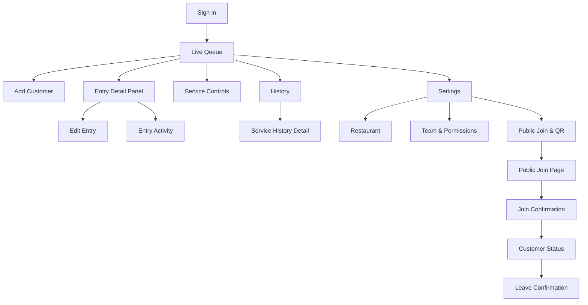

> **Product:** MesaFlow  
> **Phase:** UX/UI Design  
> **Baseline:** MVP / Pilot Release  
> **Date:** 2026-07-10  
> **Owner:** Principal UX/UI Designer

# Screen Map

## MVP screen catalogue
| ID | Screen | Audience | Purpose |
|---|---|---|---|
| S01 | Sign in | Staff | authenticate |
| S02 | Password recovery | Staff | recover access |
| S03 | No active service | Staff | open service |
| S04 | Live queue | Staff | operate queue |
| S05 | Add customer | Staff | create entry |
| S06 | Entry detail panel | Staff | inspect/actions/history |
| S07 | Edit entry | Staff | update allowed fields |
| S08 | Service controls | Manager | intake/service lifecycle |
| S09 | History list | Authorised staff | locate past service/entry |
| S10 | Service history detail | Authorised staff | inspect completed service |
| S11 | Restaurant settings | Admin | supported restaurant data |
| S12 | Team and permissions | Admin | memberships/capabilities |
| S13 | Public join and QR | Admin | access QR/link |
| S14 | Public join | Customer | self-register |
| S15 | Join confirmation | Customer | immediate acknowledgement |
| S16 | Customer status | Customer | current lifecycle/instructions |
| S17 | Leave queue confirmation | Customer | exit safely |
| S18 | Access denied | All | explain capability restriction |
| S19 | Offline/reconnecting overlay | Staff | communicate degraded state |
| S20 | Expired/invalid public link | Customer | safe terminal guidance |
