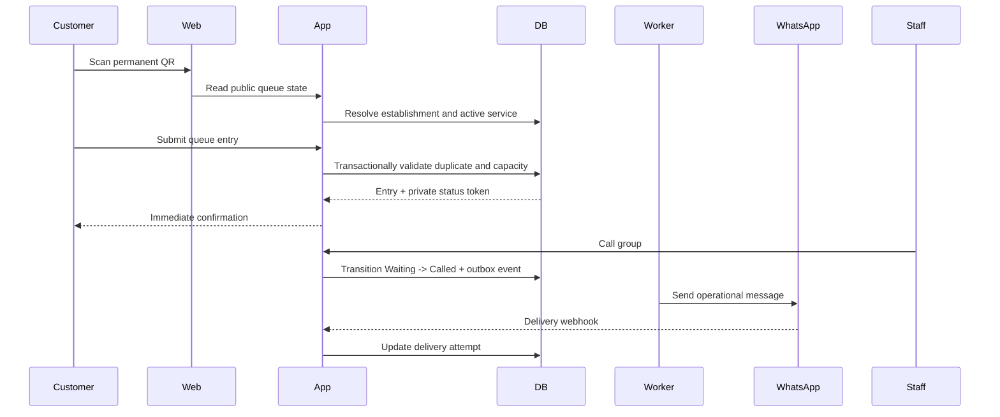

> **Product:** MesaFlow  
> **Architecture baseline:** MVP / Pilot Release  
> **Status:** Proposed architecture baseline  
> **Owner:** Software Architecture  
> **Date:** 2026-07-10  
> **Source baseline:** repository commit `583167147b626b370246dafc440eb961483bda63`

# System Context

## Actors

| Actor | Responsibility |
|---|---|
| Administrator | Creates the restaurant context, configures operations, invites staff, corrects current-service outcomes and reviews history |
| Staff | Operates the live waiting list |
| Customer | Joins by QR, follows a private status link and performs approved self-service actions |
| Support operator | Future operational role; no product access is assumed in MVP |

## External systems

| System | Purpose | Failure posture |
|---|---|---|
| WhatsApp Business provider | Operational customer messages | Queue continues; failure is visible and retryable |
| Email provider | Staff invitations and account recovery | Retry asynchronously |
| Authentication service | Staff identity and sessions | Existing sessions continue according to provider capability |
| Observability platform | Error, log and uptime monitoring | Product continues; telemetry may be delayed |
| Hosting platform | Runtime, networking and deployment | Multi-zone managed service preferred |

## System boundary

MesaFlow owns restaurant configuration, service lifecycle, queue entries, customer status tokens, capacity calculations, fairness signals, calls, outcomes, audit records and basic history.

MesaFlow does not own restaurant reservations, table inventory, POS data, payments, customer accounts, CRM or predictive waiting-time models in the MVP.

## Principal flows

