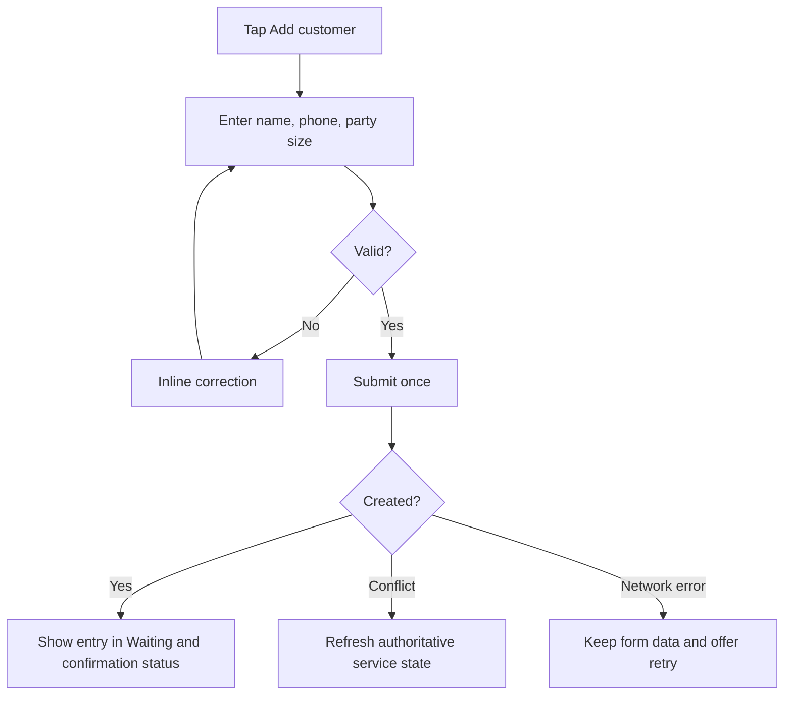

> **Product:** MesaFlow  
> **Phase:** UX/UI Design  
> **Baseline:** MVP / Pilot Release  
> **Date:** 2026-07-10  
> **Owner:** Principal UX/UI Designer

# Task Flows

## Task inventory and optimisation
| Task | Primary actor | Frequency | Target actions | Expected time | Main errors | UX treatment |
|---|---|---:|---:|---:|---|---|
| Add customer | Host | Very high | 2–3 | 15–25s | invalid phone, duplicate, double submit | short form, defaults, inline validation, idempotency |
| Call customer | Host | Very high | 1 | <3s | wrong entry, repeated click | row action, pending lock, clear identity |
| Seat customer | Host | Very high | 1 | <3s | stale state | optimistic feedback + reconciliation |
| Mark no-show | Host | High | 2 | <6s | accidental action | confirmation sheet + No-show reactivation when eligible |
| View entry details | Staff | High | 1 | <2s | context loss | side panel, retain queue position |
| Edit entry | Staff | Medium | 2–3 | <20s | concurrent edit | version conflict message, preserve input |
| Retry message | Staff | Low | 2 | <8s | provider unavailable | non-blocking retry and status |
| Close intake | Manager | Low | 2 | <10s | accidental closure | explicit effect + confirmation |
| Close service | Manager | Once/shift | 2–3 | <20s | unresolved entries | pre-close checklist |
| Leave queue | Customer | Low | 2 | <10s | accidental exit | confirm and final state |

## Add customer task flow

## Call-next task flow
Queue → verify first waiting party → tap Call → row locks/pends → state changes to Called → delivery badge updates asynchronously.

## Complexity rule
Any frequent task requiring more than three deliberate actions must be reviewed before implementation. Administrative tasks may exceed three actions when necessary for safety or clarity.
