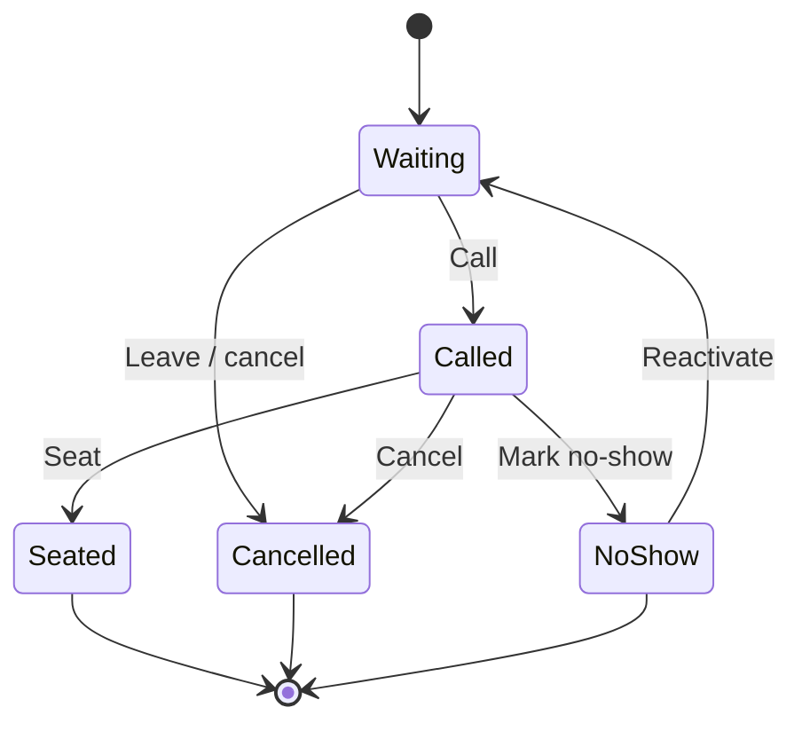

> **Product:** MesaFlow  
> **Phase:** UX/UI Design  
> **Baseline:** MVP / Pilot Release  
> **Date:** 2026-07-10  
> **Owner:** Principal UX/UI Designer

# User Flows

## Actors
- Restaurant administrator
- Manager / shift lead
- Receptionist / host
- General staff member with queue permission
- Walk-in customer
- System and WhatsApp provider

## UF-01 — Start service
**Goal:** make the queue operational.  
**Initial state:** authenticated authorised staff; no active service.  
**Flow:** open Queue → review service summary → select **Open service** → system creates active service → empty queue appears.  
**Exceptions:** permission denied; another service already active; request conflict; offline.  
**Result:** one active service is visible to all authorised devices.

## UF-02 — Add customer manually
**Goal:** place a walk-in party in the queue.  
**Initial state:** service open and intake active.  
**Steps:** Add customer → enter name, phone, party size and optional note → submit → entry appears in Waiting → confirmation status appears.  
**Decisions:** valid contact? duplicate phone warning? intake closed?  
**Exceptions:** invalid fields, stale service state, double submission, WhatsApp failure.  
**Result:** entry created once; queue remains usable even if message fails.

## UF-03 — Customer self-joins via QR
Scan QR → public join page → enter minimum data → accept privacy notice → submit → receive browser confirmation and status token → optional WhatsApp confirmation. Invalid/expired QR or closed intake returns a clear blocked state without exposing restaurant internals.

## UF-04 — Call customer
From Waiting entry → Call → optimistic pending state → entry becomes Called → delivery status shown separately. Double click is idempotent. If the entry changed on another device, refresh row and explain the conflict.

## UF-05 — Seat customer
From Called entry → Seat → entry becomes Seated and leaves active waiting workload. If business rules permit seating directly from Waiting, present it under secondary actions and record the transition.

## UF-06 — Mark no-show
From Called entry → No-show → confirmation sheet describing effect → confirm → entry becomes No-show → Reactivate remains available only where approved for current-service No-show entries.

## UF-07 — Reactivate no-show
Open eligible No-show entry actions → Reactivate → system validates eligibility → entry returns to Waiting at the queue end → audit trail records actor and time. Cancelled entries are terminal in the MVP and cannot be reactivated.

## UF-08 — Customer checks status
Open tokenised status URL → view restaurant, party reference, current state and instructions → refresh automatically → leave queue action available. No position or time promise is shown unless explicitly approved by product rules.

## UF-09 — Customer leaves queue
Public status → Leave queue → confirmation → entry becomes Cancelled/Left → staff queue updates. Repeated submission shows final state, not an error.

## UF-10 — Close intake and service
Manager selects service menu → Close intake prevents new entries but preserves operations → later Close service → confirmation including unresolved entries → system closes only when rules permit or requires explicit resolution.

## UF-11 — Realtime degradation
Connection indicator changes to **Reconnecting** → local command controls prevent unsafe duplication → automatic reconciliation fetches authoritative state → changed rows are highlighted briefly.

## UF-12 — WhatsApp failure
Entry action succeeds → message badge shows **Not delivered** → staff can view reason and retry where allowed → queue lifecycle is unaffected.

