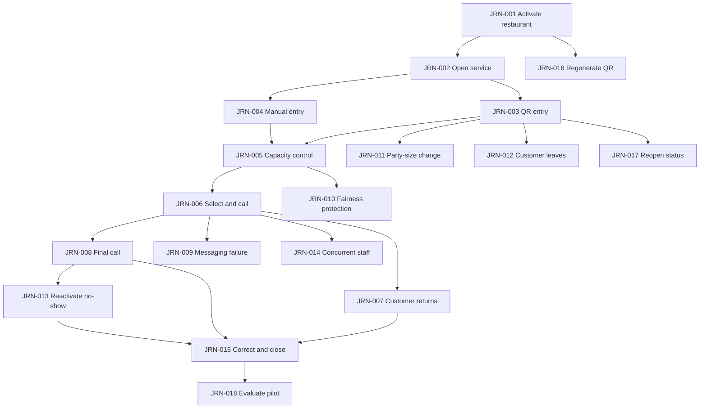

# MesaFlow — User Journeys

**Document ID:** PROD-JRN-001  
**Product:** MesaFlow  
**Release:** MVP / Pilot Release  
**Status:** Approved end-to-end journey specification  
**Owner:** Product Management  
**Version:** 1.0  
**Last updated:** 2026-07-10

---

## 1. Purpose

This document defines the complete journeys that MesaFlow must support.

A journey is broader than a screen and broader than a feature. It describes:

- the user’s starting situation;
- the intended outcome;
- product states and handoffs;
- decisions;
- failure or exception paths;
- trust signals;
- completion evidence.

A feature is not complete when it works in isolation but breaks the journey.

---

## 2. Journey inventory

| Journey ID | Journey | Primary persona | Canonical features |
|---|---|---|---|
| JRN-001 | First restaurant activation | PER-001 | FEAT-001–FEAT-008 |
| JRN-002 | Open a service | PER-002 | FEAT-020–FEAT-023 |
| JRN-003 | Customer joins through QR | PER-003 | FEAT-006, FEAT-009–FEAT-014, FEAT-043 |
| JRN-004 | Staff adds an assisted customer | PER-002 / PER-004 | FEAT-015–FEAT-016 |
| JRN-005 | Queue reaches weighted capacity | PER-002 / PER-003 | FEAT-017–FEAT-019, FEAT-014 |
| JRN-006 | Staff selects and calls a group | PER-002 | FEAT-023–FEAT-034 |
| JRN-007 | Customer receives call and returns | PER-003 | FEAT-034–FEAT-048 |
| JRN-008 | Final call and no response | PER-002 / PER-003 | FEAT-035–FEAT-037, FEAT-051 |
| JRN-009 | Messaging failure | PER-002 | FEAT-038–FEAT-042 |
| JRN-010 | Large group is repeatedly passed | PER-002 / PER-003 | FEAT-028–FEAT-032 |
| JRN-011 | Customer changes party size | PER-003 / PER-002 | FEAT-046, FEAT-017–FEAT-019 |
| JRN-012 | Customer leaves the queue | PER-003 | FEAT-047, FEAT-050 |
| JRN-013 | No-show is reactivated | PER-002 | FEAT-051–FEAT-052 |
| JRN-014 | Two staff members act concurrently | PER-002 | FEAT-027, FEAT-055 |
| JRN-015 | Correct outcome and close service | PER-001 / PER-002 | FEAT-022, FEAT-054–FEAT-056 |
| JRN-016 | QR is regenerated during operations | PER-001 | FEAT-006–FEAT-008, FEAT-043 |
| JRN-017 | Customer reopens private status | PER-003 | FEAT-043–FEAT-045 |
| JRN-018 | Restaurant evaluates the pilot | PER-005 | FEAT-042, FEAT-055–FEAT-056 |

---

## 3. Journey relationship map

---

## 4. JRN-001 — First restaurant activation

### Objective

Allow an Administrator to create a usable MesaFlow environment and prepare the first real service without technical assistance.

### Preconditions

- The restaurant has decided to test MesaFlow.
- No establishment context exists yet.
- The user is authorized to act for the restaurant.

### Happy path

1. User creates the first internal account.
2. MesaFlow assigns Administrator.
3. Administrator creates the establishment.
4. Required fields are entered:
   - restaurant name;
   - address;
   - phone;
   - primary language;
   - time zone.
5. Administrator enters the guided setup.
6. MesaFlow presents recommended defaults.
7. Administrator accepts or adjusts:
   - maximum active slots;
   - call duration;
   - long-wait threshold;
   - QR maximum party size;
   - two-slot cutoff;
   - party-size approval threshold;
   - reporting instruction;
   - message identity fields.
8. MesaFlow confirms that the queue is ready to open.
9. Permanent QR is generated.
10. Administrator downloads the QR.
11. Administrator invites Staff using individual accounts.
12. Administrator or Staff proceeds to service opening.

### Trust signals

- every setting explains its operational effect;
- constrained choices reduce fear of a wrong setup;
- the QR is clearly permanent;
- Staff permissions are clearly narrower than Administrator permissions;
- no table map or technical configuration is required.

### Failure and recovery

| Situation | Expected behavior |
|---|---|
| Required establishment field missing | Explain the field and preserve completed input |
| Administrator exits before completion | Preserve safe progress where product policy allows |
| Invalid or expired staff invitation | Allow Administrator to issue a new invitation |
| QR download fails | QR remains valid and download can be retried |
| Administrator wants to change defaults later | Structural settings remain available to Administrator |

### Completion evidence

- one Administrator exists;
- one establishment exists;
- setup is valid;
- one current permanent QR exists;
- at least one service can be opened;
- invited Staff can receive individual access.

### Journey failure

The journey fails if the restaurant needs engineering help, must configure tables or cannot understand what a rule changes.

---

## 5. JRN-002 — Open a service

### Objective

Start one bounded operational waiting-list session.

### Preconditions

- establishment setup is complete;
- user is Administrator or Staff;
- no active service exists.

### Happy path

1. User opens the service.
2. MesaFlow creates the current service boundary.
3. Public QR state changes to available intake.
4. Staff dashboard displays:
   - Waiting;
   - Called;
   - Recently completed.
5. All active staff devices recognize the same service.
6. The restaurant begins accepting QR and manual entries.

### Variants

- Staff may immediately close new entries if the service is being prepared but the restaurant is not yet ready to accept customers.
- A service may cross midnight and remains one service until explicitly closed.

### Failure and recovery

- A second active service cannot be opened.
- A stale device must reconcile to the already active service.
- Opening the service must not create an entry or message.

### Completion evidence

Public intake state and all staff devices refer to the same active service.

---

## 6. JRN-003 — Customer joins through QR

### Objective

Create one valid queue entry without Staff assistance or application installation.

### Preconditions

- active service exists;
- intake is open;
- weighted capacity is available;
- party size is within QR maximum;
- phone has no active duplicate entry.

### Happy path

1. Customer scans permanent QR.
2. Welcome screen identifies the restaurant.
3. Current queue state is available.
4. Customer selects “Join the queue”.
5. Form asks for:
   - name;
   - phone;
   - party size.
6. Customer may add approved optional needs.
7. Customer submits.
8. MesaFlow rechecks service, intake, duplicate and capacity.
9. Entry is accepted.
10. Accepted time is recorded.
11. Entry appears in Waiting.
12. Weighted capacity updates.
13. Customer sees clear confirmation.
14. Private status link is created.
15. Where commercially enabled, confirmation may also be sent.
16. Customer is free to move away from the entrance.

### Public unavailable branches

#### No active service

The customer sees that the restaurant is not currently accepting a waiting list.

#### Intake closed

The customer sees that new entries are temporarily closed while the restaurant handles the current queue.

#### Queue full

The customer sees that the waiting list has reached its configured capacity and should try again when a slot becomes available.

#### Party too large

The customer is asked to speak directly with Staff.

#### Duplicate active phone

A second active entry is not created.

### Trust signals

- restaurant identity is primary;
- no exact waiting-time promise;
- confirmation is explicit;
- private access is entry-specific;
- optional preferences do not appear guaranteed.

### Completion evidence

Exactly one active entry exists and the customer has a safe route back to its status.

---

## 7. JRN-004 — Staff adds an assisted customer

### Objective

Include a customer who does not use QR in the same operational queue.

### Preconditions

- active service exists;
- user has operational access.

### Happy path

1. Staff selects Add group.
2. Staff enters name and party size.
3. Staff optionally adds phone and customer preferences.
4. Staff may add an internal note.
5. MesaFlow checks capacity.
6. Entry is accepted.
7. Accepted time is recorded.
8. Entry appears in chronological Waiting order.
9. If phone is absent, No contact is shown.
10. The entry receives the same fairness signals as QR entries.

### Key rule

Manual entry is not a lower-priority or informal queue path.

### Failure and recovery

- If capacity is full, Staff receives a clear conflict rather than silent acceptance.
- Staff may correct a mistaken phone or party size during the active service.
- No automated message is attempted without phone.

### Completion evidence

The customer exists as a normal active queue entry and can reach any approved terminal outcome.

---

## 8. JRN-005 — Queue reaches weighted capacity

### Objective

Prevent the restaurant from accepting more active waiting load than configured.

### Preconditions

- active service;
- configured maximum slots;
- active entries with one-slot and two-slot weights.

### Happy path

1. New entries are accepted while current weighted usage remains below maximum.
2. An accepted group changes current usage.
3. When usage reaches the maximum, public self-entry changes to Queue full.
4. Existing active entries remain unchanged.
5. A group becomes Seated, Cancelled or No-show.
6. Weighted usage is recalculated.
7. If usage falls below maximum and intake is open, public joining becomes available again.

### Concurrent submission branch

If two customers submit for the last available capacity at nearly the same time:

- only submissions that fit the committed capacity are accepted;
- later conflicting submission receives Queue full;
- the product must not overbook silently.

### Configuration-change branch

If Administrator lowers the limit below current usage:

- no active entry is removed;
- public intake remains blocked;
- availability returns only when usage falls below the configured limit.

### Completion evidence

Staff and public views use one consistent approved-capacity truth.

---

## 9. JRN-006 — Staff selects and calls a group

### Objective

Use real restaurant judgement while preserving fairness visibility.

### Preconditions

- one or more Waiting entries;
- staff knows a suitable table or seating opportunity exists.

### Happy path

1. Staff reviews chronological Waiting list.
2. Staff sees:
   - party size;
   - elapsed wait;
   - preferences;
   - contact state;
   - pass-over count;
   - long-wait warning;
   - large-group label.
3. Staff may filter by party size.
4. Staff selects a suitable group.
5. If a protected earlier group is being bypassed, MesaFlow asks for a quick reason.
6. Staff chooses reason.
7. MesaFlow does not block the decision.
8. Selected group changes to Called.
9. Independent timer starts.
10. WhatsApp call is attempted when contact exists.
11. Called section updates on all staff devices.
12. Customer status page updates.

### Direct seating variant

Staff may mark a Waiting group Seated directly when the situation does not require a remote call.

### Failure and recovery

- A stale attempt to call a group already resolved is rejected clearly.
- A failed message does not undo Called state.
- No-contact group remains callable operationally but must be called in person.
- Staff may call more than one group.

### Completion evidence

One valid Called state and one timer exist for the selected entry.

---

## 10. JRN-007 — Customer receives call and returns

### Objective

Allow the customer to return without remaining at the restaurant door.

### Preconditions

- entry is Called;
- customer has phone contact or private status access.

### Happy path

1. Customer receives table-ready message.
2. Message says where to report.
3. Customer opens private status page if needed.
4. Remaining time is visible.
5. Customer selects “I’m on my way”.
6. Staff sees acknowledgement.
7. Timer continues unchanged.
8. Customer returns.
9. Staff marks Seated.
10. Capacity is freed.
11. Queue-derived values recalculate.
12. Entry moves to Recently completed.

### Important boundaries

- no table number is required;
- acknowledgement does not guarantee the table indefinitely;
- acknowledgement does not extend time;
- staff remains responsible for the final outcome.

### Completion evidence

The group reaches Seated and all active devices reflect the same terminal state.

---

## 11. JRN-008 — Final call and no response

### Objective

Give one predictable last opportunity without allowing indefinite waiting.

### Preconditions

- entry is Called;
- timer is active;
- original call period has one minute remaining.

### Happy path

1. Final-call event occurs.
2. Final message is attempted when phone exists.
3. Two minutes are added exactly once.
4. Revised deadline appears to Staff and customer.
5. Customer does not return.
6. Timer reaches expiry.
7. MesaFlow does not automatically create No-show.
8. Staff assesses the real situation.
9. Staff marks No-show.
10. Capacity is freed.
11. Entry moves to Recently completed.

### Variants

- Staff may grant further manual time.
- Final-call message may fail; grace period still applies.
- Customer may acknowledge late; no automatic reactivation occurs.

### Completion evidence

The automatic grace period is applied once, and the terminal outcome remains a human Staff decision.

---

## 12. JRN-009 — Messaging failure

### Objective

Keep the queue operational when the external communication path fails.

### Preconditions

- valid phone contact;
- operational message attempt.

### Happy failure path

1. MesaFlow attempts message.
2. Provider returns failure or an equivalent unavailable outcome.
3. Entry state remains unchanged.
4. Timer continues when already Called.
5. Staff sees Message not delivered or truthful supported equivalent.
6. Staff can:
   - retry;
   - call manually;
   - call in person;
   - grant extra time when appropriate.
7. Retry is recorded as another message attempt.
8. Retry does not duplicate state transition or grace period.

### No provider-status branch

If the provider cannot confirm delivery, MesaFlow shows only the truthful state available and does not invent read or delivery certainty.

### Completion evidence

The team can continue service without losing the entry or assuming successful contact.

---

## 13. JRN-010 — Large group is repeatedly passed

### Objective

Prevent a difficult-to-seat group from becoming invisible.

### Preconditions

- large group remains Waiting;
- smaller later groups are compatible with available tables.

### Happy operational path

1. Large group enters chronologically.
2. Large-group label is visible.
3. A later small group is Seated.
4. Large group’s pass-over count increases.
5. Elapsed wait continues.
6. Long-wait threshold is reached.
7. Entry receives prominent warning.
8. Staff considers the group during each seating opportunity.
9. If bypassing a protected group again, Staff records a quick reason.
10. The product preserves the action and reason.
11. Eventually Staff calls or seats the large group, or resolves it with another explicit outcome.

### Product stance

MesaFlow does not promise that a twelve-person group will be seated before every two-person group. It ensures the delay is visible and accountable.

### Completion evidence

The group cannot be repeatedly passed with no visible count, elapsed wait or protected-state response.

---

## 14. JRN-011 — Customer changes party size

### Objective

Keep the queue entry accurate without forcing Staff to approve harmless changes.

### Reduction path

1. Customer opens private status.
2. Customer changes party size downward.
3. Change applies immediately.
4. Weight and large-group label recalculate.
5. Capacity may become available.
6. Staff dashboard updates.

### Small increase path

1. Customer requests an increase below configured approval threshold.
2. Change applies automatically.
3. Capacity and labels recalculate.
4. Staff sees updated party size.

### Approval-required increase path

1. Customer requests an increase at or above threshold.
2. Current approved party size remains active.
3. Request appears pending to Staff.
4. Staff approves or rejects.
5. On approval, capacity and labels recalculate.
6. On rejection, current party size remains unchanged.

### Capacity-conflict branch

If approval would cause a configured capacity conflict, Staff receives a clear decision context and the product does not silently corrupt capacity.

### Completion evidence

Only approved party size affects current operational calculations.

---

## 15. JRN-012 — Customer leaves the queue

### Objective

Allow self-service departure without accidental removal.

### Happy path

1. Customer opens private status.
2. Customer selects Leave queue.
3. MesaFlow asks for explicit confirmation.
4. Customer confirms.
5. Entry becomes Cancelled by customer.
6. Capacity is freed.
7. Groups-ahead values recalculate.
8. Staff sees the outcome.
9. Approved cancellation notice may be shown or sent.

### Accidental-tap branch

If the customer does not confirm, the entry remains active.

### Completion evidence

The terminal outcome clearly identifies customer cancellation.

---

## 16. JRN-013 — No-show is reactivated

### Objective

Correct a mistaken or exceptional no-show without restoring unfair priority.

### Preconditions

- No-show occurred during current active service;
- staff identifies a valid reason to restore.

### Happy path

1. Staff opens Recently completed.
2. Staff selects Reactivate.
3. MesaFlow explains that the group will return at the end.
4. Staff confirms.
5. Capacity is checked.
6. Entry becomes Waiting.
7. New current queue position is assigned at the end.
8. Original no-show and reactivation remain in audit.
9. Customer may be called again later.

### Completion evidence

The group is active again without regaining its old position.

---

## 17. JRN-014 — Two staff members act concurrently

### Objective

Prevent contradictory valid outcomes in a multi-device restaurant environment.

### Example conflict

- Staff A selects Call.
- Staff B selects Cancel or Seat at nearly the same moment.

### Expected journey

1. Both devices begin from the same visible state.
2. One valid action is accepted first.
3. Current entry state changes.
4. The incompatible later action is rejected or reconciled.
5. Both devices update.
6. The user whose action did not apply receives understandable feedback.
7. Audit contains the accepted action, not two contradictory final truths.

### Reconnection variant

A temporarily offline device must not overwrite newer state when it reconnects.

### Completion evidence

At any moment, an entry has one valid current lifecycle state.

---

## 18. JRN-015 — Correct outcome and close service

### Objective

Allow human error correction before preserving a final read-only service record.

### Happy path

1. Staff mistakenly marks No-show instead of Seated.
2. Administrator opens Recently completed during the active service.
3. Administrator corrects terminal outcome.
4. MesaFlow logs previous and new outcomes.
5. Capacity and metrics recalculate.
6. Remaining active entries are resolved.
7. Staff selects End service.
8. MesaFlow confirms there are no Waiting or Called entries.
9. Service closes.
10. History is generated.
11. Records become read-only.

### Blocked branch

If any active entry remains, End service is unavailable and the product identifies the unresolved work.

### Completion evidence

The final service history reflects corrected truth and cannot be edited through the normal product after closure.

---

## 19. JRN-016 — QR is regenerated during operations

### Objective

Replace a compromised public entry point without harming accepted customers.

### Preconditions

- Administrator access;
- current QR exists;
- active or inactive service.

### Happy path

1. Administrator selects Regenerate QR.
2. MesaFlow warns that prior printed QR will stop accepting new entries.
3. Administrator confirms.
4. New permanent QR is created.
5. Old public QR becomes invalid for new intake.
6. Existing accepted entries remain active.
7. Existing customer private status links remain valid.
8. Regeneration is logged.
9. Administrator downloads replacement QR.

### Completion evidence

Public entry rotates; accepted queue state does not.

---

## 20. JRN-017 — Customer reopens private status

### Objective

Let the customer recover current information after closing the page.

### Happy path

1. Customer follows saved or messaged private link.
2. MesaFlow validates the link.
3. Current entry state is displayed.
4. Customer sees:
   - groups ahead while Waiting;
   - elapsed wait;
   - Called countdown when applicable;
   - final outcome after completion.
5. Allowed self-service actions match current state.

### Expired or closed-service branch

The product shows a safe final or expired view and does not expose other entries.

### Completion evidence

The customer can resume the journey without logging in or revealing phone in the URL.

---

## 21. JRN-018 — Restaurant evaluates the pilot

### Objective

Turn operational use into a continuation decision.

### Preconditions

- one or more closed services;
- Administrator or owner review.

### Review path

1. Restaurant reviews service history.
2. MesaFlow shows:
   - groups received;
   - seated;
   - cancellations;
   - no-shows;
   - average wait;
   - maximum wait;
   - pass-overs;
   - messages sent;
   - messages failed.
3. Product team combines history with interviews and observed service behavior.
4. Restaurant assesses:
   - whether paper was replaced;
   - whether staff trusted it;
   - whether customers moved away from the entrance;
   - whether message cost is acceptable;
   - whether the team wants to continue.
5. Feedback, testimonial and case-study potential are recorded outside the core product as part of pilot operations.

### Completion evidence

The pilot decision is based on real service behavior rather than account creation or a product demo.

---

## 22. Cross-journey invariants

The following must remain true across every journey:

1. One entry has one current lifecycle state.
2. Only approved party size affects current capacity.
3. Customer position is not a guaranteed seating order.
4. A message failure never deletes an entry.
5. Timer expiry never creates a silent no-show.
6. A retry never repeats a state transition or automatic grace period.
7. Closed services are read-only.
8. Manual and QR entries share the same queue fairness.
9. Staff judgement remains available.
10. Customer access never depends on app installation.
11. Phone is not exposed in the private URL.
12. Multiple devices cannot create two contradictory valid truths.

---

## 23. Journey validation in pilot

Each journey should be validated through:

- scripted pre-pilot walkthrough;
- live-service observation;
- staff interview;
- customer confusion report;
- event and outcome data;
- support incidents;
- post-service review.

A journey is considered validated only when the intended user can complete it under realistic restaurant conditions.

---

## 24. Journey change control

A journey must be revised when a change:

- adds or removes a lifecycle state;
- changes a persona or permission;
- changes the capacity model;
- changes the customer-facing meaning of queue position;
- changes call timing;
- adds a communication channel;
- permits new customer self-service;
- changes closure or correction;
- introduces multiple queues or establishments.

A visual change that preserves the sequence and meaning does not require a new journey identifier.
