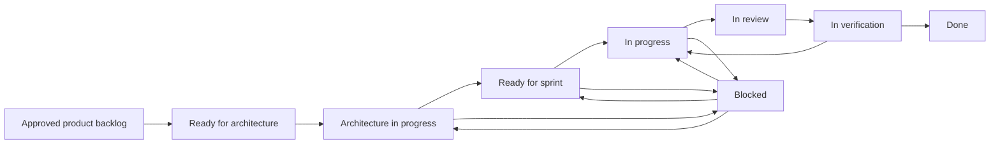

# MesaFlow — Delivery Workflow

**Document ID:** PM-WORKFLOW-001  
**Product:** MesaFlow  
**Release:** MVP / Pilot Release  
**Status:** Project planning baseline  
**Owner:** Project Management  
**Version:** 1.0  
**Last updated:** 2026-07-10

---

## 1. Purpose

This document defines the operating workflow for project intake, decomposition, delivery, verification, release and change control.

This document organizes execution only. It does not redefine strategy, product scope, approved behavior, technology or architecture.

## 2. Workflow states

| State | Meaning | Exit requirement |
|---|---|---|
| Approved product backlog | Product outcome is approved | Project sequencing begins |
| Ready for architecture | Product packet is complete | Architect accepts decomposition work |
| Architecture in progress | Technical design/decomposition underway | Review passes without behavior conflict |
| Ready for sprint | Task meets DoR and dependencies are available | Team commits within capacity |
| In progress | Active implementation/test work | Reviewable integrated increment exists |
| In review | Code/design/test/architecture review | Review findings resolved |
| In verification | Acceptance, edge case and NFR checks underway | Required evidence passes |
| Blocked | Work cannot progress safely | Dependency/decision is resolved |
| Done | Applicable DoD passes | Included in integrated regression |
| Released to pilot | M7 go decision recorded | Pilot monitoring begins |

## 3. Standard path

## 4. Ceremonies and controls

| Event | Purpose | Required outputs |
|---|---|---|
| Architecture review | Validate design against approved behavior and P0 NFRs | Decisions, decomposition, risks, unresolved product questions |
| Backlog refinement | Confirm Ready packets and dependencies | Ordered, estimable items with test references |
| Sprint planning | Commit to one integrated goal | Sprint goal, capacity, owners, demo and risks |
| Daily coordination | Surface blockers and cross-workstream changes | Updated blocker/owner status |
| Weekly project review | Review critical path, risks and milestone forecast | Decisions, escalations and changed forecast |
| Sprint review | Demonstrate working integrated behavior | Acceptance evidence and Product feedback |
| Retrospective | Improve delivery process | Small owned actions for next sprint |
| Milestone gate | Decide whether dependent work/release may proceed | Recorded pass/fail and residual risks |

## 5. Defect workflow

Severity follows `FEATURE_PRIORITIES.md`:

- **S0:** operational/data-integrity blocker; immediate triage; affected gate closed.
- **S1:** core-flow blocker; highest sprint priority; affected scenario cannot release.
- **S2:** serious trust/adoption issue; resolve before broad pilot unless explicitly bounded.
- **S3:** non-blocking refinement; scheduled without displacing integrity work.

Every defect references affected `FEAT`, acceptance/rule/NFR/edge identifier and reproducible evidence.

## 6. Blocker workflow

1. Mark item Blocked; do not hide status as “in progress”.
2. Record affected gate and critical-path impact.
3. Assign one resolution owner.
4. Classify as product decision, architecture, engineering, external or operational.
5. Escalate product ambiguity immediately.
6. Review until closed; then return item to the appropriate prior state.

## 7. Scope-change workflow

1. Record request and user/problem evidence.
2. Check `OUT_OF_SCOPE.md` and `PRODUCT_DECISIONS.md`.
3. Identify impact on states, roles, settings, messages, cost, privacy and simplicity.
4. Product Management approves, defers or rejects.
5. If approved, update all affected canonical documents before execution planning changes.
6. Project Manager updates roadmap, dependencies, risks and gates.

No engineer or project participant may approve scope by implementation convenience.

## 8. Release workflow

- build release candidate;
- run full regression and PBI-060–PBI-068 rehearsals;
- complete performance, security, accessibility and device matrices;
- reconcile history and message evidence;
- review risks/exceptions;
- verify pilot operations and support readiness;
- record M6 then M7 go/no-go decision;
- begin pilot monitoring and incident review.

## 9. Documentation workflow

Documentation is updated in the same work item when behavior, metric definition, operational procedure or known limitation changes. Canonical IDs are never renumbered for convenience.
